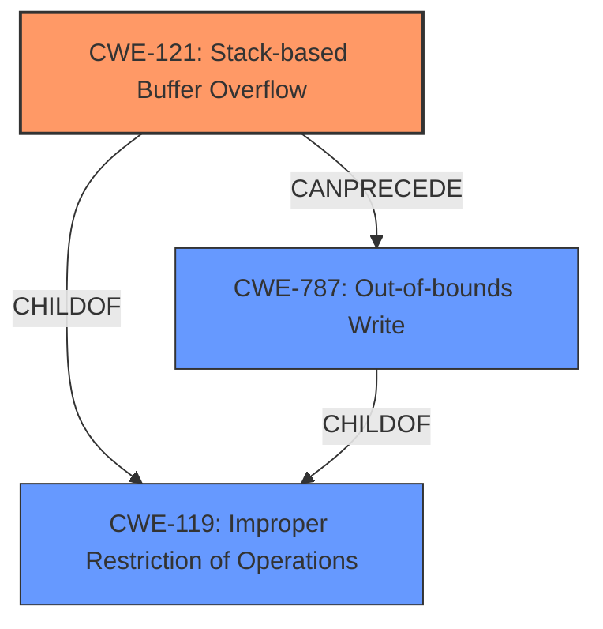

# Analysis for CVE-2024-42969

# Summary
| CWE ID | CWE Name | Confidence | CWE Abstraction Level | CWE Vulnerability Mapping Label | CWE-Vulnerability Mapping Notes |
|---|---|---|---|---|---|
| CWE-121 | Stack-based Buffer Overflow | 1.0 | Variant | Allowed | Primary CWE. The vulnerability description explicitly states a "stack overflow". |
| CWE-787 | Out-of-bounds Write | 0.7 | Base | Allowed | The stack overflow leads to an out-of-bounds write. |
| CWE-119 | Improper Restriction of Operations within the Bounds of a Memory Buffer | 0.6 | Class | Allowed | CWE-119 is a parent of CWE-121 and CWE-787. |

## Evidence and Confidence

*   **Confidence Score:** 0.9
*   **Evidence Strength:** HIGH

## Relationship Analysis

The primary weakness is a stack-based buffer overflow (CWE-121). This is a specific type of buffer overflow where the buffer resides on the stack. The overflow results in an out-of-bounds write (CWE-787), as the write operation goes beyond the allocated buffer size. Both CWE-121 and CWE-787 are children of CWE-119, which represents the more general class of improper restriction of operations within the bounds of a memory buffer.

## Vulnerability Chain

The vulnerability chain starts with the **stack overflow** (CWE-121), caused by **improper** use of `sprintf` without proper bounds checking. This leads to an out-of-bounds write (CWE-787), which can result in a denial-of-service (DoS) due to the overwritten stack.

## Summary of Analysis

The analysis is based on the vulnerability description and the provided CVE reference link content summary. The description clearly indicates a **stack overflow** vulnerability. The CVE reference provides the root cause by saying "A stack buffer overflow exists in the `fromSafeUrlFilter` function due to the use of `sprintf` with a user-controlled `page` parameter without proper bounds checking.".
The retriever results also list CWE-121 as the top candidate.
The CWE-121 is at the Variant level, which is the preferred level of abstraction.
CWE-787 is included because the overflow leads to an out-of-bounds write.
CWE-119 is included as the parent class, but is not the primary cause.

Relevant CWE Information:

# Enhanced Context (25 CWEs)
The following CWEs were identified as potentially relevant to this vulnerability:

## CWE-121: Stack-based Buffer Overflow
**Abstraction Level**: Variant
**Similarity Score**: 0.74
**Source**: dense

**Description**:
A stack-based buffer overflow condition is a condition where the buffer being overwritten is allocated on the stack (i.e., is a local variable or, rarely, a parameter to a function).

**Mapping Guidance**:
- Usage: Allowed
- Rationale: This CWE entry is at the Variant level of abstraction, which is a preferred level of abstraction for mapping to the root causes of vulnerabilities.

## CWE-134: Use of Externally-Controlled Format String
This was considered, but the root cause is not directly related to a format string vulnerability, but the lack of bounds checking when using `sprintf`.

## CWE-790: Improper Filtering of Special Elements
Not relevant, as the issue is not about filtering special elements.

## CWE-755: Improper Handling of Exceptional Conditions
Too generic, not the primary cause.

## CWE-425: Direct Request ('Forced Browsing')
Not relevant, as this is not an authorization issue.

## CWE-78: Improper Neutralization of Special Elements used in an OS Command ('OS Command Injection')
Not relevant, as this is not about OS command injection.

## CWE-113: Improper Neutralization of CRLF Sequences in HTTP Headers ('HTTP Request/Response Splitting')
Not relevant, as this is not about HTTP header manipulation.

## CWE-193: Off-by-one Error
Not applicable, as the vulnerability is not specifically an off-by-one error.

## CWE-131: Incorrect Calculation of Buffer Size
This could be related, but the immediate cause is the use of sprintf without checking input size.

## CWE-1285: Improper Validation of Specified Index, Position, or Offset in Input
Not the primary cause.

## CWE-190: Integer Overflow or Wraparound
Not directly related, but an integer overflow could potentially lead to a buffer overflow. However, the root cause is the use of sprintf without bounds checking.

## CWE-1284: Improper Validation of Specified Quantity in Input
Could be considered, but the root cause is the use of sprintf without checking input size.

## CWE-125: Out-of-bounds Read
Not directly involved, as the issue is primarily an out-of-bounds write.

## CWE-122: Heap-based Buffer Overflow
Not applicable, as the overflow is stack-based.

## CWE-128: Wrap-around Error
Not applicable.

## CWE-120: Buffer Copy without Checking Size of Input ('Classic Buffer Overflow')
While related, CWE-121 is more specific as it is stack-based.

## CWE-770: Allocation of Resources Without Limits or Throttling
Not applicable.

## CWE-787: Out-of-bounds Write
A result of CWE-121.

## CWE-123: Write-what-where Condition
Potentially applicable if the attacker has some control over what is being written and where. However, the provided information does not confirm that.

## CWE-134: Use of Externally-Controlled Format String
Not directly applicable, the **vulnerability** is not about a format string **weakness** itself, but rather the `sprintf` usage.

## CWE-124: Buffer Underwrite ('Buffer Underflow')
Not applicable.

## CWE-130: Improper Handling of Length Parameter Inconsistency
Not the primary cause.