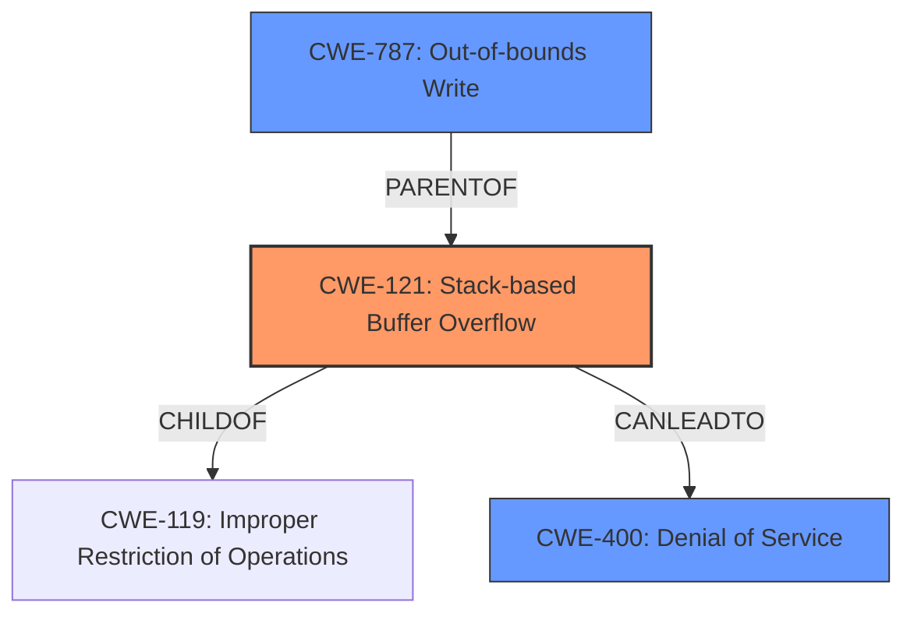

# Raw Analyzer Response for CVE-2024-42977

# Summary
| CWE ID | CWE Name | Confidence | CWE Abstraction Level | CWE Vulnerability Mapping Label | CWE-Vulnerability Mapping Notes |
|---|---|---|---|---|---|
| CWE-121 | Stack-based Buffer Overflow | 1.0 | Variant | Primary | Allowed |
| CWE-787 | Out-of-bounds Write | 0.7 | Base | Secondary | Allowed |
| CWE-400 | Denial of Service | 0.5 | Class | Secondary | Allowed-with-Review |

## Evidence and Confidence

*   **Confidence Score:** 0.8
*   **Evidence Strength:** MEDIUM

## Relationship Analysis
The primary weakness is CWE-121 Stack-based Buffer Overflow, a variant of CWE-119 Improper Restriction of Operations within the Bounds of a Memory Buffer. CWE-787 Out-of-bounds Write is a parent of CWE-121 and a common result of buffer overflows. CWE-400 Denial of Service is the impact of the vulnerability.

## Vulnerability Chain
The vulnerability chain starts with a crafted POST request that triggers a **stack overflow** (CWE-121) in the qos parameter of the fromqossetting function. This **stack overflow** leads to an out-of-bounds write (CWE-787), ultimately resulting in a denial of service (CWE-400).

## Summary of Analysis
The vulnerability description clearly states that a **stack overflow** exists in the qos parameter of the fromqossetting function of the Tenda FH1206 router. The **stack overflow** is triggered by a crafted POST request and results in a denial of service.

The primary CWE is CWE-121 Stack-based Buffer Overflow, as it directly reflects the **weakness** described in the vulnerability description. The **Vulnerability Description Key Phrases** section confirms this with the entry "**weakness:** **stack overflow**".

CWE-787 Out-of-bounds Write is included as a secondary CWE because a **stack overflow** typically leads to overwriting adjacent memory locations.

CWE-400 Denial of Service is included as a secondary CWE because the vulnerability description states that the impact of the **stack overflow** is a denial of service.

The retriever results also support the selection of CWE-121 as the primary CWE, with a score of 1.0.

Other CWEs considered but not used:

*   CWE-190 Integer Overflow or Wraparound: While present in the retriever results, there is no evidence in the description to suggest an integer overflow is involved.
*   CWE-1284 Improper Validation of Specified Quantity in Input: This could be a contributing factor, but the core issue is the buffer overflow itself, not necessarily the lack of validation.
*   CWE-770 Allocation of Resources Without Limits or Throttling: This is not directly related to the described vulnerability.
* CWE-125: Out-of-bounds Read. There is no evidence of an out-of-bounds read.
* CWE-131: Incorrect Calculation of Buffer Size. There is no evidence of an incorrect calculation of buffer size.

Relevant CWE Information:

# Enhanced Context (25 CWEs)
The following CWEs were identified as potentially relevant to this vulnerability:

## CWE-121: Stack-based Buffer Overflow
**Abstraction Level**: Variant
**Similarity Score**: 0.72
**Source**: dense

**Description**:
A stack-based buffer overflow condition is a condition where the buffer being overwritten is allocated on the stack (i.e., is a local variable or, rarely, a parameter to a function).

**Mapping Guidance**:
- Usage: Allowed
- Rationale: This CWE entry is at the Variant level of abstraction, which is a preferred level of abstraction for mapping to the root causes of vulnerabilities.

## CWE-190: Integer Overflow or Wraparound
**Abstraction Level**: Base
**Similarity Score**: 463.81
**Source**: sparse

**Description**:
The product performs a calculation that can
         produce an integer overflow or wraparound when the logic
         assumes that the resulting value will always be larger than
         the original value. This occurs when an integer value is
         incremented to a value that is too large to store in the
         associated representation. When this occurs, the value may
         become a very small or negative number.

**Mapping Guidance**:
- Usage: Allowed
- Rationale: This CWE entry is at the Base level of abstraction, which is a preferred level of abstraction for mapping to the root causes of vulnerabilities.

## CWE-787: Out-of-bounds Write
**Abstraction Level**: base
**Similarity Score**: 2.28
**Source**: graph

**Description**:
CWE-787: Out-of-bounds Write

**Mapping Guidance**:
- Usage: Allowed
- Rationale: This CWE entry is at the Base level of abstraction, which is a preferred level of abstraction for mapping to the root causes of vulnerabilities.