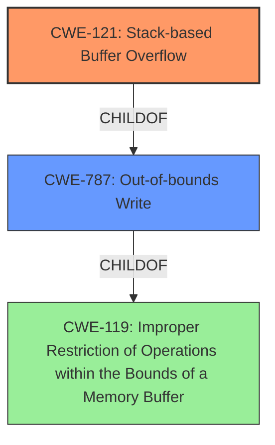

# Enhanced Analysis for CVE-2024-42981

# Summary
| CWE ID  | CWE Name                                                            | Confidence | CWE Abstraction Level | CWE Vulnerability Mapping Label | CWE-Vulnerability Mapping Notes |
|---------|---------------------------------------------------------------------|------------|-----------------------|-----------------------------------|-----------------------------------|
| CWE-121 | Stack-based Buffer Overflow                                         | 0.9        | Variant               | Primary                           | Allowed                           |
| CWE-787 | Out-of-bounds Write                                                 | 0.7        | Base                  | Secondary                         | Allowed                           |

## Evidence and Confidence

*   **Confidence Score:** 0.8
*   **Evidence Strength:** HIGH

## Relationship Analysis

The primary weakness is a stack-based buffer overflow (CWE-121). This is a specific type of out-of-bounds write (CWE-787) where the buffer is located on the stack. CWE-121 is a variant of CWE-787, offering a more precise classification in this case. Therefore, CWE-121 is chosen as the primary CWE, and CWE-787 is considered a secondary, more general classification.



## Vulnerability Chain

The vulnerability chain starts with the **improper use of sprintf** without proper bounds checking. This leads to an out-of-bounds write on the stack, specifically a **stack overflow** (CWE-121), which ultimately results in a denial of service (DoS).

## Summary of Analysis

The vulnerability description clearly indicates a **stack overflow** in the `fromPptpUserSetting` function due to the use of `sprintf` without proper bounds checking when handling the `delno` parameter. The `delno` parameter is user-supplied.

The evidence for the stack buffer overflow is:
- "Tenda FH1206 v02.03.01.35 was discovered to contain a **stack overflow** via the delno parameter in the fromPptpUserSetting function."
- "**Root cause of vulnerability:** The vulnerability is caused by a stack-based buffer overflow in the `fromPptpUserSetting` function."
- "**Weaknesses/vulnerabilities present:** The `sprintf` function is used to format a string using a user-supplied input (`delno`) without proper bounds checking."
- "If the `delno` parameter is too long, it will overflow the buffer `v9`."

Given the specific nature of the overflow occurring on the stack, CWE-121 (Stack-based Buffer Overflow) is the most accurate and specific classification. While CWE-787 (Out-of-bounds Write) is a valid, more general classification, CWE-121 provides greater precision. The retriever results also support CWE-121 as a primary candidate.

CWE-121 is at the "Variant" level of abstraction, which is preferred.

Other CWEs Considered and Rejected:

*   CWE-120 (Buffer Copy without Checking Size of Input): While related to buffer overflows, this CWE is more specific to buffer copy operations, which is not the primary issue here. The root cause is the lack of bounds checking with `sprintf`, not necessarily a buffer copy operation.
*   CWE-190 (Integer Overflow or Wraparound): This CWE is not relevant as the vulnerability is related to string manipulation and buffer overflows, not integer calculations.
*   CWE-134 (Use of Externally-Controlled Format String): Although the vulnerability involves user-supplied input, the core issue is the buffer overflow caused by `sprintf`, not directly related to format string vulnerabilities.
*   CWE-78 (Improper Neutralization of Special Elements used in an OS Command ('OS Command Injection')): This CWE is not relevant as the vulnerability does not involve OS command injection.
*   CWE-125 (Out-of-bounds Read): The vulnerability involves writing past the end of the buffer.


## CWE Relationship Analysis

Current CWEs represent these abstraction levels: .


### Vulnerability Chain Analysis

**Chain starting from CWE-121:**
- 121 (Stack-based Buffer Overflow) - ROOT


**Chain starting from CWE-125:**
- 125 (Out-of-bounds Read) - ROOT


### CWE Relationship Diagram

```mermaid
graph TD
    classDef primary fill:#f96,stroke:#333,stroke-width:2px
    classDef secondary fill:#69f,stroke:#333
    classDef tertiary fill:#9e9,stroke:#333
```