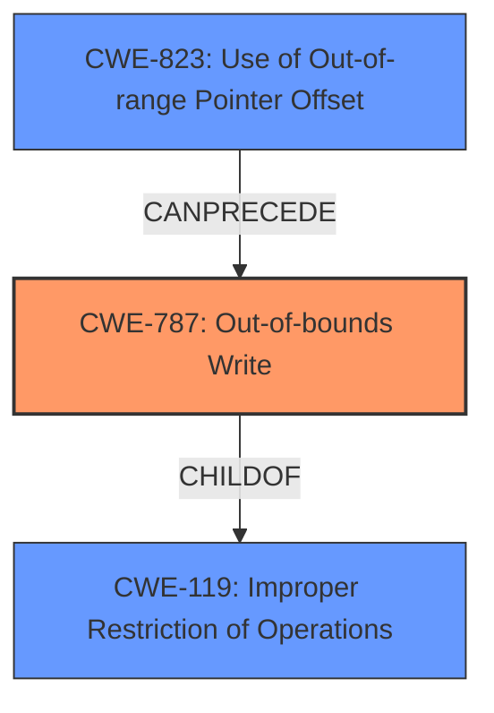

# Analysis Report for CVE-2024-43058

# Vulnerability Analysis Report: CVE-2024-43058

## Description

**Memory corruption while processing IOCTL calls**.

## Vulnerability Description Key Phrases

- **Rootcause:** Memory corruption while processing IOCTL calls

## Analysis (with Relationship Data)

# Summary
| CWE ID | CWE Name | Confidence | CWE Abstraction Level | CWE Vulnerability Mapping Label | CWE-Vulnerability Mapping Notes |
|---|---|---|---|---|---|
| CWE-787 | Out-of-bounds Write | 0.8 | Base | Allowed | Primary CWE. Memory corruption indicates a write operation outside the intended memory region. |

## Evidence and Confidence

*   **Confidence Score:** 0.8
*   **Evidence Strength:** MEDIUM

## Relationship Analysis
The primary CWE, CWE-787 (Out-of-bounds Write), is a base-level CWE that directly addresses the **memory corruption** aspect mentioned in the vulnerability description. There are no explicit child or parent relationships that significantly influenced the selection in this case due to limited details. However, it's important to note that CWE-787 is a child of CWE-119 (Improper Restriction of Operations within the Bounds of a Memory Buffer), indicating a broader class of memory safety issues. The "CANPRECEDE" relationships of CWE-823 (Use of Out-of-range Pointer Offset) to CWE-787 show a potential path.



## Vulnerability Chain
The vulnerability chain starts with the **memory corruption while processing IOCTL calls**, leading directly to an out-of-bounds write.

## Summary of Analysis
The analysis is based on the provided vulnerability description and the retriever results. The vulnerability description clearly indicates **memory corruption** during IOCTL processing. The retriever results strongly suggest CWE-787 (Out-of-bounds Write) as the most relevant CWE, which aligns with the concept of **memory corruption**.

The selection of CWE-787 is based on the direct evidence of **memory corruption** and the high similarity score in the retriever results. The relationship analysis reinforces this choice, as CWE-787 is a base-level CWE that specifically addresses the issue of writing outside the intended memory boundaries. The abstraction level is optimal because it is at the base level and accurately represents the weakness.

Relevant CWE Information:
- CWE-787 (Out-of-bounds Write) - Directly relates to **memory corruption**, where data is written beyond the intended buffer boundaries.

Other CWEs Considered but Not Used:

*   CWE-782: Exposed IOCTL with Insufficient Access Control - While IOCTLs are involved, there's no specific mention of access control issues.
*   CWE-479: Signal Handler Use of a Non-reentrant Function - Not relevant as signals are not mentioned.
*   CWE-415: Double Free - No indication of double freeing memory.
*   CWE-823: Use of Out-of-range Pointer Offset - While related to memory access, it is less direct than CWE-787, which describes the result of the out-of-range access.
*   CWE-197: Numeric Truncation Error - No evidence of truncation errors in the provided description.
*   CWE-190: Integer Overflow or Wraparound - No evidence of integer overflow.
*   CWE-839: Numeric Range Comparison Without Minimum Check - No evidence of range comparison issues.
*   CWE-781: Improper Address Validation in IOCTL with METHOD_NEITHER I/O Control Code - While IOCTLs are involved, there's no specific mention of address validation issues with METHOD_NEITHER.
*   CWE-123: Write-what-where Condition - While a possibility, the description doesn't provide enough detail to confirm this condition specifically.


## CWE Relationship Analysis

Current CWEs represent these abstraction levels: .


### Vulnerability Chain Analysis

**Chain starting from CWE-839:**
- 839 (Numeric Range Comparison Without Minimum Check) - ROOT


**Chain starting from CWE-123:**
- 123 (Write-what-where Condition) - ROOT


### CWE Relationship Diagram

```mermaid
graph TD
    classDef primary fill:#f96,stroke:#333,stroke-width:2px
    classDef secondary fill:#69f,stroke:#333
    classDef tertiary fill:#9e9,stroke:#333
```


*Report generated on 2025-07-13 14:32:07*
