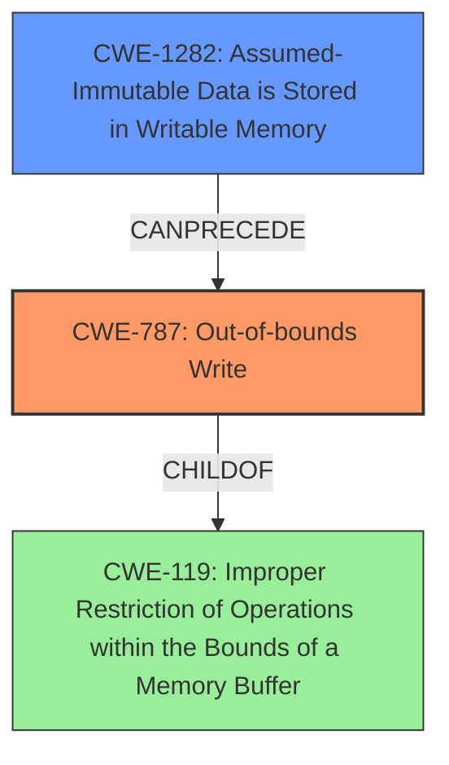

# Analysis for CVE-2024-43067

# Summary

| CWE ID | CWE Name | Confidence | CWE Abstraction Level | CWE Vulnerability Mapping Label | CWE-Vulnerability Mapping Notes |
|---|---|---|---|---|---|
| CWE-787 | Out-of-bounds Write | 0.9 | Base | Allowed | Primary CWE: Memory corruption during EEPROM data copy. |
| CWE-1282 | Assumed-Immutable Data is Stored in Writable Memory | 0.6 | Base | Allowed | Secondary Candidate: IO config exposed as shared memory. |

## Evidence and Confidence

*   **Confidence Score:** 0.75
*   **Evidence Strength:** MEDIUM

## Relationship Analysis

The primary relationship considered is the hierarchical structure where CWE-787 (Out-of-bounds Write) is a base-level CWE, indicating a specific type of memory error. The relationship between CWE-787 and its parent CWEs (like CWE-119: Improper Restriction of Operations within the Bounds of a Memory Buffer) was considered, but CWE-787 was selected due to its higher specificity. CWE-1282 is a peer that explains how data that should not be writable is.

## Vulnerability Chain

The vulnerability chain starts with the **IO configuration being exposed as shared memory**, which leads to potential **memory corruption** due to an **out-of-bounds write** during data copying.

Vulnerability Chain:
1.  **CWE-1282:** Assumed-Immutable Data is Stored in Writable Memory (IO config exposed as shared memory)
2.  **CWE-787:** Out-of-bounds Write (Memory corruption during data copy)

## Summary of Analysis

The primary assessment is based on the provided vulnerability description, which explicitly mentions **memory corruption** during data copying. The key phrase "**IO configuration is exposed as shared memory**" suggests that a memory region is inappropriately accessible.

CWE-787 (Out-of-bounds Write) is selected as the primary CWE because it directly addresses the **memory corruption** mentioned in the description. The retriever results also ranked CWE-787 as the top candidate.

CWE-1282 (Assumed-Immutable Data is Stored in Writable Memory) is included as a secondary CWE because the description specifies that the IO configuration, which should likely be immutable, is exposed as shared memory. This exposure allows for potential modification, which could lead to the **memory corruption**.

Other CWEs from the retriever results were considered but not used because they did not directly align with the provided information. For example, race condition CWEs (CWE-367, CWE-362, CWE-364) were not selected because there was no explicit mention of concurrency issues in the description. Similarly, CWE-190 (Integer Overflow or Wraparound) was not selected due to the absence of any calculation-related information in the vulnerability description.