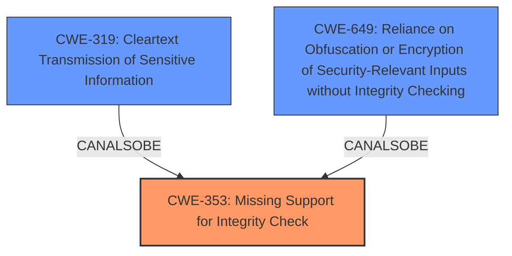

# Analysis Report for CVE-2024-43108

# Vulnerability Analysis Report: CVE-2024-43108

## Description

The goTenna Pro ATAK Plugin uses AES CTR type encryption for short, encrypted messages without any additional integrity checking mechanisms. This leaves messages malleable to an attacker that can access the message. It is advised to continue to use encryption in the plugin and update to the current release for enhanced encryption protocols.

## Vulnerability Description Key Phrases

- **Rootcause:** lack of message integrity checking
- **Impact:** ['integrity', 'malleable encrypted messages']
- **Attacker:** attacker with access to message
- **Product:** goTenna Pro ATAK Plugin

## Analysis (with Relationship Data)

# Summary
| CWE ID  | CWE Name | Confidence | CWE Abstraction Level | CWE Vulnerability Mapping Label | CWE-Vulnerability Mapping Notes |
|---|---|---|---|---|---|
| CWE-353 | Missing Support for Integrity Check | 1.0 | Base | Allowed | Primary CWE. The vulnerability description explicitly mentions the **lack of message integrity checking**. |
| CWE-319 | Cleartext Transmission of Sensitive Information | 0.7 | Base | Allowed | Secondary Candidate. Although encryption is used, the **lack of integrity checking** makes it similar to sending a clear text message, so an attacker can manipulate it. |
| CWE-649 | Reliance on Obfuscation or Encryption of Security-Relevant Inputs without Integrity Checking | 0.6 | Base | Allowed | Secondary Candidate. The plugin uses AES CTR encryption, but without any integrity checks, which is similar to using encryption without integrity checking. |

## Evidence and Confidence

*   **Confidence Score:** 0.9
*   **Evidence Strength:** HIGH

## Relationship Analysis
The primary weakness is the **lack of integrity checking**, which directly leads to the vulnerability.
  - CWE-353 (Missing Support for Integrity Check) is the root cause.
  - CWE-319 (Cleartext Transmission of Sensitive Information) is related because the **lack of integrity** allows attackers to modify the message without detection, similar to cleartext.
  - CWE-649 (Reliance on Obfuscation or Encryption of Security-Relevant Inputs without Integrity Checking) is also relevant as the encryption is present but the **lack of integrity checks** negates its effectiveness.



## Vulnerability Chain
The vulnerability chain starts with the **lack of integrity checking (CWE-353)**. This allows an attacker with access to the message to modify it, leading to compromised data integrity. The use of encryption without integrity (potentially linking to CWE-649) then effectively turns the encrypted communication into something similar to **cleartext transmission (CWE-319)** from a data integrity perspective.

## Summary of Analysis
The primary CWE is CWE-353 (Missing Support for Integrity Check), because that is the root cause weakness. The **lack of integrity checking** on encrypted messages allows for message malleability, compromising data integrity. This is explicitly stated in the vulnerability description: "The goTenna Pro ATAK Plugin uses AES CTR type encryption for short, encrypted messages without any additional integrity checking mechanisms. This leaves messages malleable to an attacker that can access the message."

CWE-319 (Cleartext Transmission of Sensitive Information) is a secondary consideration because while encryption is used, the **lack of integrity** means an attacker can modify the message, effectively making it as vulnerable as cleartext from an integrity perspective. "impact: integrity and malleable encrypted messages"

CWE-649 (Reliance on Obfuscation or Encryption of Security-Relevant Inputs without Integrity Checking) is a secondary consideration because the vulnerability is caused by the **lack of integrity checking**, not the encryption mechanism itself. The encryption is present, but the failure to ensure integrity makes the encryption less effective.

The retriever results and graph relationships influenced the selection, highlighting the importance of integrity checking. CWE-353 is a base level CWE, which is preferred, and accurately represents the weakness.


## CWE Relationship Analysis

Current CWEs represent these abstraction levels: .


### Vulnerability Chain Analysis

**Chain starting from CWE-319:**
- 319 (Cleartext Transmission of Sensitive Information) - ROOT


**Chain starting from CWE-649:**
- 649 (Reliance on Obfuscation or Encryption of Security-Relevant Inputs without Integrity Checking) - ROOT


### CWE Relationship Diagram

```mermaid
graph TD
    classDef primary fill:#f96,stroke:#333,stroke-width:2px
    classDef secondary fill:#69f,stroke:#333
    classDef tertiary fill:#9e9,stroke:#333
```


*Report generated on 2025-07-13 14:35:22*
