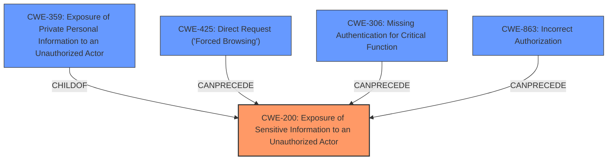

# Analysis for CVE-2024-43237

# Summary

| CWE ID | CWE Name | Confidence | CWE Abstraction Level | CWE Vulnerability Mapping Label | CWE-Vulnerability Mapping Notes |
|---|---|---|---|---|---|
| CWE-200 | Exposure of Sensitive Information to an Unauthorized Actor | 0.9 | Class | Primary CWE | Allowed-with-Review |
| CWE-359 | Exposure of Private Personal Information to an Unauthorized Actor | 0.7 | Base | Secondary Candidate | Allowed |
| CWE-425 | Direct Request ('Forced Browsing') | 0.6 | Base | Secondary Candidate | Allowed |
| CWE-306 | Missing Authentication for Critical Function | 0.5 | Base | Secondary Candidate | Allowed |
| CWE-863 | Incorrect Authorization | 0.5 | Class | Secondary Candidate | Allowed-with-Review |

## Evidence and Confidence

*   **Confidence Score:** 0.9
*   **Evidence Strength:** HIGH

## Relationship Analysis
The primary CWE selected is CWE-200, a Class-level weakness. While it's generally better to select a Base or Variant level CWE, the evidence strongly suggests this exposure, and more specific CWEs weren't as fitting. CWE-359 is a more specific Base level CWE, representing exposure of private personal information. CWE-425, CWE-306, and CWE-863 represent potential underlying causes for the exposure, related to missing authentication or authorization.

## Vulnerability Chain
The vulnerability chain starts with a **missing authentication** or **incorrect authorization**, leading to a **direct request** for sensitive information, and ultimately resulting in the **exposure of sensitive information to an unauthorized actor**.

## Summary of Analysis
The primary vulnerability is the exposure of sensitive information. The root cause appears to be a broken access control mechanism.
- The vulnerability description indicates "Exposure of Sensitive Information to an Unauthorized Actor vulnerability".
- The CVE Reference Links Content Summary states "Sensitive data exposure, where normally restricted information can be viewed by unauthorized users".
- It also notes the vulnerability falls under OWASP Top 10 category A1: Broken Access Control.
- The attacker requires no authentication.

Given this information, CWE-200 [CWE-200: Exposure of Sensitive Information to an Unauthorized Actor] is chosen as the primary CWE because it directly reflects the vulnerability's impact. CWE-359 [CWE-359: Exposure of Private Personal Information to an Unauthorized Actor] is a more specific candidate if the information exposed is confirmed to be private personal information. CWE-425 [CWE-425: Direct Request ('Forced Browsing')], CWE-306 [CWE-306: Missing Authentication for Critical Function] and CWE-863 [CWE-863: Incorrect Authorization] are considered as potential root causes, representing the **lack of access control** that leads to the information exposure. My assessment is strongly based on the provided evidence and the graph relationships influence the selection of potential root causes. The selected CWEs are at the optimal level of specificity based on the available information. The confidence level is high (0.9) due to the clear description of the vulnerability and the supporting information from the CVE reference.

CWE-79 [CWE-79: Improper Neutralization of Input During Web Page Generation ('Cross-site Scripting')] and CWE-352 [CWE-352: Cross-Site Request Forgery (CSRF)] were considered but rejected because the vulnerability is primarily related to information exposure due to broken access control, not input validation or request forgery. CWE-918 [CWE-918: Server-Side Request Forgery (SSRF)] was also considered but rejected as there is no evidence of the server making requests on behalf of the attacker.