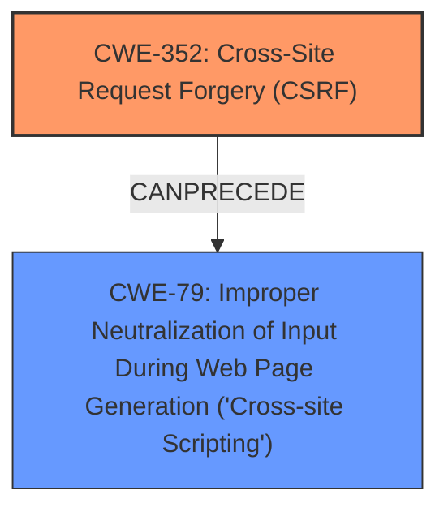

# Enhanced Analysis for CVE-2024-43301

# Summary
| CWE ID  | CWE Name                                                                 | Confidence | CWE Abstraction Level | CWE Vulnerability Mapping Label | CWE-Vulnerability Mapping Notes |
| :-------- | :----------------------------------------------------------------------- | :--------- | :-------------------- | :------------------------------ | :------------------------------ |
| CWE-352   | Cross-Site Request Forgery (CSRF)                                      | 1.0        | Compound              | Primary                         | Allowed                         |
| CWE-79    | Improper Neutralization of Input During Web Page Generation ('Cross-site Scripting') | 0.9        | Base                  | Secondary                       | Allowed                         |

## Evidence and Confidence

*   **Confidence Score:** 0.95
*   **Evidence Strength:** HIGH

## Relationship Analysis
The primary weakness is the **lack of CSRF protection** (CWE-352), which allows an attacker to induce users into performing actions they did not intend. The secondary weakness, Stored **XSS** (CWE-79), arises when malicious input isn't neutralized properly, leading to script injection. CWE-352 can be considered a prerequisite for Stored **XSS** in this scenario because a successful CSRF attack might be used to inject the malicious script. Both CWE-352 and CWE-79 are base-level weaknesses, providing an appropriate level of granularity.



## Vulnerability Chain
The vulnerability chain begins with the **lack of CSRF protection** (CWE-352). An attacker exploits this weakness to perform actions on behalf of a user, such as injecting malicious scripts. The injected script is then stored and executed, leading to Stored **XSS** (CWE-79).
  - CWE-352 (Root Cause): **Lack of CSRF protection** allows unauthorized requests.
  - CWE-79 (Impact): Stored **XSS** due to improper neutralization of input.

## Summary of Analysis
The primary focus is on the **lack of CSRF protection**, which is the root cause that enables the Stored **XSS** vulnerability. The description clearly states a Cross-Site Request Forgery (CSRF) vulnerability in Fonts Plugin Fonts allows Stored **XSS**. This indicates that the absence of CSRF protection is the initial flaw. The retriever results strongly suggest CWE-352 for the "lack of CSRF protection" keyphrase. I am also considering CWE-79 since the description says this leads to stored **XSS**.

The relationships show that CWE-352 can precede CWE-79. Because the description specifically mentions **lack of CSRF protection**, I am confident in selecting CWE-352 as the primary CWE.

Relevant evidence:
*   "ROOTCAUSE: '**lack of CSRF protection**'"
*   "Cross-Site Request Forgery (CSRF) vulnerability in Fonts Plugin Fonts allows Stored **XSS**."

CWE-434, CWE-116, CWE-89, CWE-862, CWE-1004, CWE-22 and CWE-611 were considered but do not accurately represent the root cause or the specific weakness described in the vulnerability. They were rejected because they address different types of vulnerabilities such as unrestricted file uploads, improper encoding, SQL injection, missing authorization, sensitive cookies, path traversal and XML external entity references. None of these match the given vulnerability description of CSRF leading to Stored XSS.

# Enhanced Context (25 CWEs)
The following CWEs were identified as potentially relevant to this vulnerability:

## CWE-352: Cross-Site Request Forgery (CSRF)
**Abstraction Level**: Compound
**Similarity Score**: 292.78
**Source**: dense

**Description**:
The web application does not, or can not, sufficiently verify whether a well-formed, valid, consistent request was intentionally provided by the user who submitted the request.

**Mapping Guidance**:
- Usage: Allowed
- Rationale: This is a well-known Composite of multiple weaknesses that must all occur simultaneously, although it is attack-oriented in nature.

## CWE-434: Unrestricted Upload of File with Dangerous Type
**Abstraction Level**: Base
**Similarity Score**: 219.69
**Source**: dense

**Description**:
The product allows the upload or transfer of dangerous file types that are automatically processed within its environment.

**Mapping Guidance**:
- Usage: Allowed
- Rationale: This CWE entry is at the Base level of abstraction, which is a preferred level of abstraction for mapping to the root causes of vulnerabilities.

## CWE-116: Improper Encoding or Escaping of Output
**Abstraction Level**: Class
**Similarity Score**: 210.99
**Source**: dense

**Description**:
The product prepares a structured message for communication with another component, but encoding or escaping of the data is either missing or done incorrectly. As a result, the intended structure of the message is not preserved.

**Mapping Guidance**:
- Usage: Allowed-with-Review
- Rationale: This CWE entry is a Class and might have Base-level children that would be more appropriate

## CWE-79: Improper Neutralization of Input During Web Page Generation ('Cross-site Scripting')
**Abstraction Level**: Base
**Similarity Score**: 205.19
**Source**: dense

**Description**:
The product does not neutralize or incorrectly neutralizes user-controllable input before it is placed in output that is used as a web page that is served to other users.

**Mapping Guidance**:
- Usage: Allowed
- Rationale: This CWE entry is at the Base level of abstraction, which is a preferred level of abstraction for mapping to the root causes of vulnerabilities.

## CWE-862: Missing Authorization
**Abstraction Level**: Base
**Similarity Score**: 193.26
**Source**: dense

**Description**:
The product does not perform an authorization check when an actor attempts to access a resource or perform an action.

**Mapping Guidance**:
- Usage: Allowed
- Rationale: This CWE entry is at the Base level of abstraction, which is a preferred level of abstraction for mapping to the root causes of vulnerabilities.

## CWE-1004: Sensitive Cookie Without 'HttpOnly' Flag
**Abstraction Level**: Base
**Similarity Score**: 154.93
**Source**: dense

**Description**:
The product uses a cookie to store sensitive information, but the cookie is not marked with the HttpOnly flag.

**Mapping Guidance**:
- Usage: Allowed
- Rationale: This CWE entry is at the Base level of abstraction, which is a preferred level of abstraction for mapping to the root causes of vulnerabilities.

## CWE-22: Improper Limitation of a Pathname to a Restricted Directory ('Path Traversal')
**Abstraction Level**: Base
**Similarity Score**: 71.44
**Source**: dense

**Description**:
The product uses external input to construct a pathname that is intended to identify a file or directory that is located underneath a restricted parent directory, but the product does not properly neutralize special elements within the pathname that can cause the pathname to resolve to a location that is outside of that restricted directory.

**Mapping Guidance**:
- Usage: Allowed
- Rationale: This CWE entry is at the Base level of abstraction, which is a preferred level of abstraction for mapping to the root causes of vulnerabilities.

## CWE-611: Improper Restriction of XML External Entity Reference
**Abstraction Level**: Base
**Similarity Score**: 70.74
**Source**: dense

**Description**:
The product processes an XML document that can contain XML entities with URIs that resolve to documents outside of the intended sphere of control, causing the product to embed incorrect documents into its output.

**Mapping Guidance**:
- Usage: Allowed
- Rationale: This CWE entry is at the Base level of abstraction, which is a preferred level of abstraction for mapping to the root causes of vulnerabilities.


## CWE Relationship Analysis

Current CWEs represent these abstraction levels: .


### Vulnerability Chain Analysis

**Chain starting from CWE-89:**
- 89 (Improper Neutralization of Special Elements used in an SQL Command ('SQL Injection')) - ROOT


**Chain starting from CWE-611:**
- 611 (Improper Restriction of XML External Entity Reference) - ROOT


### CWE Relationship Diagram

```mermaid
graph TD
    classDef primary fill:#f96,stroke:#333,stroke-width:2px
    classDef secondary fill:#69f,stroke:#333
    classDef tertiary fill:#9e9,stroke:#333
```