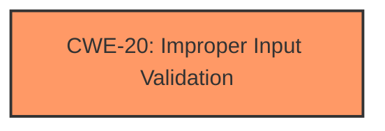

# Raw Analyzer Response for CVE-2024-43388

# Summary
| CWE ID | CWE Name | Confidence | CWE Abstraction Level | CWE Vulnerability Mapping Label | CWE-Vulnerability Mapping Notes |
|---|---|---|---|---|---|
| CWE-20 | Improper Input Validation | 0.9 | Class | Primary | Allowed-with-Review |

## Evidence and Confidence

*   **Confidence Score:** 0.9
*   **Evidence Strength:** HIGH

## Relationship Analysis
The primary CWE selected is CWE-20, which is a Class-level CWE. While it's generally preferred to select a more specific Base or Variant level CWE, in this case, the provided information doesn't allow for a more granular classification. CWE-20 is the root cause, as the **improper input validation** leads to the vulnerability.

## Vulnerability Chain
The vulnerability chain is simple:
1.  **Root Cause:** **Improper Input Validation** (CWE-20)
2.  **Impact:** Reconfiguring the SNMP service by a low-privileged attacker.

## Summary of Analysis
The vulnerability description clearly states that the root cause is **improper input validation**. This aligns directly with CWE-20, which is "Improper Input Validation". The impact is that a low-privileged remote attacker can reconfigure the SNMP service.

The retriever results list CWE-20 as the top combined result, further supporting this classification. While CWE-20 is a Class-level CWE and it's usually better to choose a Base or Variant level CWE, the information provided doesn't give enough details to choose a more specific CWE. The statement "**improper input validation**" does not give enough information to determine what specific validation is missing.

Other CWEs were considered but ultimately deemed less suitable. For example, CWE-269 (Improper Privilege Management) and CWE-285 (Improper Authorization) relate to privilege and authorization issues, but the root cause here is the lack of proper input validation, not a flaw in privilege management or authorization mechanisms.

Relevant CWE Information:

# Enhanced Context (25 CWEs)
The following CWEs were identified as potentially relevant to this vulnerability:

## CWE-20: Improper Input Validation
**Abstraction Level**: class
**Similarity Score**: 2.55
**Source**: graph

**Description**:
CWE-20: Improper Input Validation

**Mapping Guidance**:
- Usage: Discouraged
- Rationale: CWE-20 is commonly misused in low-information vulnerability reports when lower-level CWEs could be used instead, or when more details about the vulnerability are available [REF-1287]. It is not useful for trend analysis. It is also a level-1 Class (i.e., a child of a Pillar).

**Relationships**:
- CHILDOF -> CWE-707
- PEEROF -> CWE-345
- CANPRECEDE -> CWE-22
- CANPRECEDE -> CWE-41
- CANPRECEDE -> CWE-74