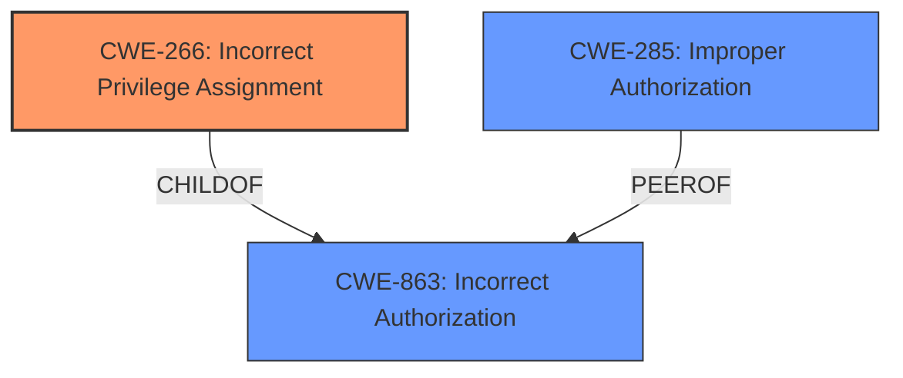

# Analysis Report for CVE-2024-43403

# Vulnerability Analysis Report: CVE-2024-43403

## Description

Kanister is a data protection workflow management tool. The kanister has a deployment called default-kanister-operator, which is bound with a ClusterRole called edit via ClusterRoleBinding. The edit ClusterRole is one of Kubernetes default-created ClusterRole, and it has the create/patch/udpate verbs of daemonset resources, create verb of serviceaccount/token resources, and impersonate verb of serviceaccounts resources. A malicious user can leverage access the worker node which has this component to make a cluster-level privilege escalation.

## Vulnerability Description Key Phrases

- **Impact:** cluster-level privilege escalation
- **Attacker:** malicious user
- **Product:** Kanister

## Analysis (with Relationship Data)

# Summary
| CWE ID | CWE Name | Confidence | CWE Abstraction Level | CWE Vulnerability Mapping Label | CWE-Vulnerability Mapping Notes |
|---|---|---|---|---|---|
| CWE-266 | Incorrect Privilege Assignment | 0.9 | Base | Primary CWE | Allowed |
| CWE-863 | Incorrect Authorization | 0.7 | Class | Secondary Candidate | Allowed-with-Review |

## Evidence and Confidence

*   **Confidence Score:** 0.9
*   **Evidence Strength:** HIGH

## Relationship Analysis
The primary relationship impacting the decision is the parent-child relationship where CWE-863 (Incorrect Authorization) is a class-level CWE, and CWE-266 (Incorrect Privilege Assignment) is a base-level CWE. Since the vulnerability stems from an incorrect privilege assignment, CWE-266 is more specific and preferred. CWE-285 is also considered but deemed less suitable than CWE-266, as the core issue isn't just a failed authorization check, but the initial misconfiguration of privileges.



## Vulnerability Chain
The vulnerability chain starts with the **incorrect privilege assignment** (CWE-266) where the `edit` ClusterRole, which grants broad permissions, is assigned to the Kanister operator by default. This leads to an **incorrect authorization** (CWE-863) scenario because the operator can now perform actions it should not be authorized to do. This ultimately leads to a cluster-level privilege escalation. The root cause is the initial privilege misconfiguration.

## Summary of Analysis
The analysis is primarily based on the provided vulnerability description and the CVE Reference Links Content Summary, which clearly indicate that the Kanister operator is assigned excessive privileges by default.

The evidence is strong: "The Kanister operator, when installed with default settings, is granted excessive cluster-wide permissions through the `edit` ClusterRole."

The graph relationships influenced the decision by highlighting that CWE-266 is a more specific child of CWE-863, making it a better fit for the root cause.

CWE-266 is selected because it directly addresses the root cause of the vulnerability: the **incorrect assignment of privileges**. This is at the optimal level of specificity (Base) according to CWE guidelines.

Relevant CWE Information:

# Enhanced Context (25 CWEs)
The following CWEs were identified as potentially relevant to this vulnerability:

## Vulnerability Description
Kanister is a data protection workflow management tool. The kanister has a deployment called default-kanister-operator, which is bound with a ClusterRole called edit via ClusterRoleBinding. The edit ClusterRole is one of Kubernetes default-created ClusterRole, and it has the create/patch/udpate verbs of daemonset resources, create verb of serviceaccount/token resources, and impersonate verb of serviceaccounts resources. A malicious user can leverage access the worker node which has this component to make a cluster-level privilege escalation.

### Vulnerability Description Key Phrases
- **impact:** cluster-level privilege escalation
- **attacker:** malicious user
- **product:** Kanister

## CVE Reference Links Content Summary
Based on the provided content, here's a breakdown of the vulnerability:

**Root Cause:**

The Kanister operator, when installed with default settings, is granted excessive cluster-wide permissions through the `edit` ClusterRole. This default ClusterRole allows manipulation of daemonsets, service accounts, and their tokens, and also permits impersonation of service accounts, enabling privilege escalation within the Kubernetes cluster.

**Weaknesses/Vulnerabilities:**

*   **Excessive Permissions:** The Kanister operator is granted the `edit` ClusterRole by default, which includes broad permissions that are not necessary for its functionality, including create/patch/udpate verbs of daemonset resources, create verb of serviceaccount/token resources, and impersonate verb of serviceaccounts resources.

### CWE-266 Technical Explanation:

*   **How the vulnerability's details match the CWE's characteristics:** The vulnerability explicitly describes a scenario where the Kanister operator is assigned the `edit` ClusterRole, which grants excessive privileges. This aligns directly with CWE-266's description of an **incorrect privilege assignment** leading to an unintended sphere of control.
*   **The security implications and potential impact:** The **incorrect privilege assignment** allows a malicious user to perform actions they should not be authorized to do, leading to cluster-level privilege escalation and potential takeover.
*   **Any parent-child relationships or chain patterns that influenced your mapping:** CWE-266 is a child of CWE-863 (Incorrect Authorization). The **incorrect privilege assignment** (CWE-266) leads to an **incorrect authorization** (CWE-863) scenario, resulting in privilege escalation.
*   **Whether the weakness is primary or secondary in the vulnerability:** The **incorrect privilege assignment** (CWE-266) is the primary weakness, as it is the root cause that enables the subsequent privilege escalation.
*   **How the official MITRE mapping guidance influenced your decision:** The MITRE mapping guidance emphasizes using CWE-266 for cases where the system assigns incorrect privileges to a user. This guidance supports the selection of CWE-266 as the primary CWE.

### CWE-863 Technical Explanation:

*   **How the vulnerability's details match the CWE's characteristics:** The vulnerability describes a situation where the Kanister operator, due to the **incorrect privilege assignment**, can perform actions it should not be authorized to do. This matches CWE-863's description of performing an authorization check incorrectly.
*   **The security implications and potential impact:** A malicious user can leverage the **incorrect authorization** to escalate privileges and potentially take over the cluster.
*   **Any parent-child relationships or chain patterns that influenced your mapping:** CWE-863 is a class-level CWE, and CWE-266 is a more specific child. The **incorrect privilege assignment** (CWE-266) leads to an **incorrect authorization** (CWE-863) scenario.
*   **Whether the weakness is primary or secondary in the vulnerability:** The **incorrect authorization** (CWE-863) is a secondary weakness, resulting from the primary weakness of **incorrect privilege assignment** (CWE-266).
*   **How the official MITRE mapping guidance influenced your decision:** The MITRE mapping guidance suggests using CWE-863 when an authorization check is performed incorrectly. However, since the root cause is the **incorrect privilege assignment**, CWE-266 is preferred as the primary CWE.

### CWEs Considered But Not Used:

*   CWE-285 (Improper Authorization): While **improper authorization** occurs, it is a consequence of the **incorrect privilege assignment**, making CWE-266 a more precise root cause.
*   CWE-306 (Missing Authentication for Critical Function): Authentication is not the primary issue; the problem is with the privileges granted to the authenticated operator.
*   CWE-732 (Incorrect Permission Assignment for Critical Resource): This CWE is similar, but it focuses more on incorrect permissions for specific resources. The issue here is broader, involving cluster-wide privileges granted to a component.
*   CWE-284 (Improper Access Control): This is too generic and doesn't capture the specific flaw of **incorrect privilege assignment**.


## CWE Relationship Analysis

Current CWEs represent these abstraction levels: .


### Vulnerability Chain Analysis

**Chain starting from CWE-863:**
- 863 (Incorrect Authorization) - ROOT


**Chain starting from CWE-732:**
- 732 (Incorrect Permission Assignment for Critical Resource) - ROOT


### CWE Relationship Diagram

```mermaid
graph TD
    classDef primary fill:#f96,stroke:#333,stroke-width:2px
    classDef secondary fill:#69f,stroke:#333
    classDef tertiary fill:#9e9,stroke:#333
```


*Report generated on 2025-07-13 14:48:47*
