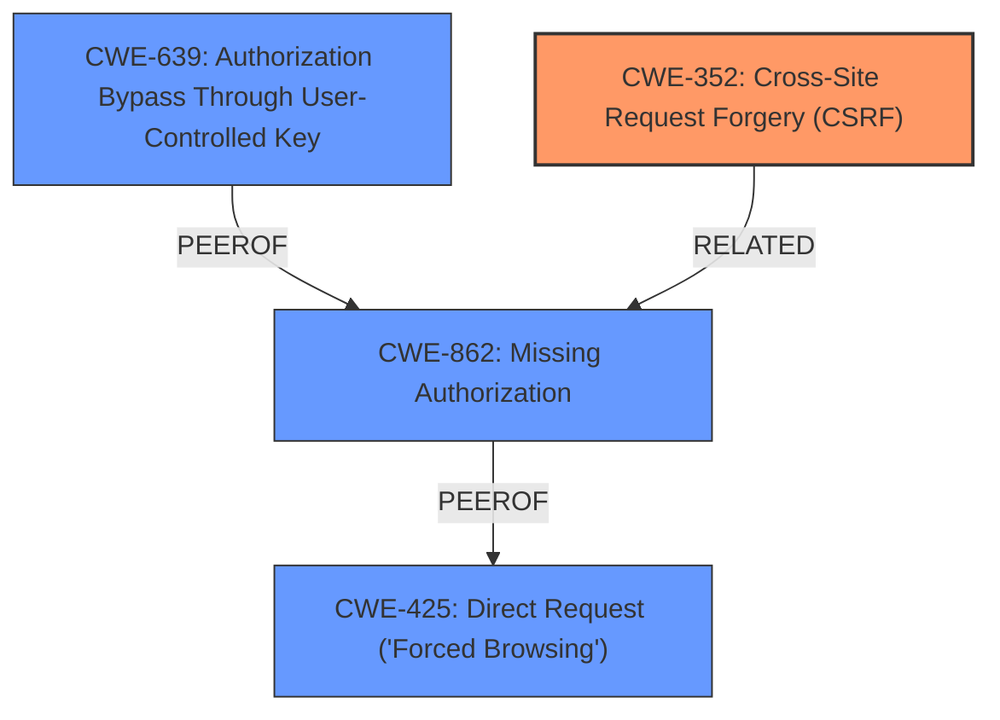

# Analysis Report for CVE-2024-4344

# Vulnerability Analysis Report: CVE-2024-4344

## Description

The Shield Security - Smart Bot Blocking & Intrusion Prevention Security plugin for WordPress is vulnerable to Cross-Site Request Forgery in all versions up to, and including, 19.1.13. This is due to **missing or incorrect nonce validation** on the exec function. This makes it possible for unauthenticated attackers to disable pin protection for the admin interface of the plugin via a forged request granted they can trick a site administrator into performing an action such as clicking on a link.

## Vulnerability Description Key Phrases

- **Rootcause:** missing or incorrect nonce validation
- **Weakness:** cross-site request forgery
- **Impact:** disable pin protection for admin interface
- **Vector:** forged request
- **Attacker:** unauthenticated attackers
- **Product:** Shield Security - Smart Bot Blocking & Intrusion Prevention Security plugin for WordPress
- **Version:** up to and including 19.1.13
- **Component:** exec function

## Analysis (with Relationship Data)

# Summary

| CWE ID  | CWE Name                                                                     | Confidence | CWE Abstraction Level | CWE Vulnerability Mapping Label | CWE-Vulnerability Mapping Notes |
| :-------- | :--------------------------------------------------------------------------- | :--------- | :-------------------- | :------------------------------ | :------------------------------ |
| CWE-352   | Cross-Site Request Forgery (CSRF)                                          | 1.0        | Compound              | Primary CWE                     | Allowed                       |
| CWE-862   | Missing Authorization                                                        | 0.7        | Class                 | Secondary Candidate             | Allowed-with-Review           |
| CWE-639   | Authorization Bypass Through User-Controlled Key                             | 0.6        | Base                 | Secondary Candidate             | Allowed                       |
| CWE-425   | Direct Request ('Forced Browsing')                                           | 0.5        | Base                 | Secondary Candidate             | Allowed                       |

## Evidence and Confidence

*   **Confidence Score:** 0.9
*   **Evidence Strength:** HIGH

## Relationship Analysis

The primary relationship influencing the CWE selection is the hierarchical structure where CWE-352 (Cross-Site Request Forgery) can result from **missing or incorrect nonce validation**. While CWE-352 is a compound weakness, it accurately captures the vulnerability's nature as a CSRF due to **missing or incorrect nonce validation**. The alternative classifications like CWE-862 (Missing Authorization) and CWE-425 (Direct Request) are related but don't fully capture the CSRF aspect, which is a critical component of the vulnerability. CWE-639 is considered because the **missing nonce validation** could be seen as a failure to properly control access using a user-controlled key.



## Vulnerability Chain

The vulnerability chain starts with the **missing or incorrect nonce validation** (leading to CWE-352). This allows an unauthenticated attacker to forge requests, ultimately disabling pin protection on the admin interface.

Root Cause: **Missing or incorrect nonce validation** (CWE-352).
Impact: Disabling pin protection for the admin interface.

## Summary of Analysis

The analysis is heavily based on the provided vulnerability description and the CVE reference links. The key evidence is the statement, "This is due to **missing or incorrect nonce validation** on the exec function." This clearly indicates a failure to properly implement CSRF protection. The retriever results also highlight CWE-352 as the top candidate. While other CWEs like CWE-862, CWE-639, and CWE-425 were considered, they were deemed less specific than CWE-352 in capturing the core issue of a CSRF vulnerability due to **missing nonce validation**. The selection of CWE-352 is at the Compound level, which is appropriate as it represents a combination of factors required for a CSRF vulnerability to exist.

**CWE Considerations and Justifications:**

*   **CWE-352 (Cross-Site Request Forgery (CSRF)):** This is the primary CWE because the vulnerability description explicitly states that the issue is due to **missing or incorrect nonce validation**, which is a common mechanism to prevent CSRF attacks. The impact of disabling pin protection further supports this classification. Confidence: 1.0

*   **CWE-862 (Missing Authorization):** Considered as a secondary CWE because the **missing nonce validation** effectively means that authorization checks are bypassed. However, CWE-352 is more specific to the nature of the attack. Confidence: 0.7

*   **CWE-639 (Authorization Bypass Through User-Controlled Key):** Considered because the nonce value is user-controlled, and the **missing validation** allows an attacker to bypass authorization checks. Confidence: 0.6

*   **CWE-425 (Direct Request ('Forced Browsing')):** Considered since the attacker can directly request the disabling of pin protection due to the **missing authorization**. Confidence: 0.5

**CWEs Considered But Not Used:**

*   **CWE-79 (Improper Neutralization of Input During Web Page Generation ('Cross-site Scripting')) and CWE-89 (Improper Neutralization of Special Elements used in an SQL Command ('SQL Injection')):** These were not selected because the vulnerability does not involve improper neutralization of input. The core issue is the **lack of proper validation** of the request origin.
*   **CWE-116 (Improper Encoding or Escaping of Output):** This was not selected as the vulnerability does not involve encoding or escaping of output.
*   **CWE-306 (Missing Authentication for Critical Function):** This was not selected because the issue is not a complete **lack of authentication**, but rather the **absence of proper CSRF protection**, which is a form of authorization.
*   **CWE-494 (Download of Code Without Integrity Check):** This was not selected as this vulnerability does not involve downloading code without an integrity check.


## CWE Relationship Analysis

Current CWEs represent these abstraction levels: .


### Vulnerability Chain Analysis

**Chain starting from CWE-89:**
- 89 (Improper Neutralization of Special Elements used in an SQL Command ('SQL Injection')) - ROOT


**Chain starting from CWE-116:**
- 116 (Improper Encoding or Escaping of Output) - ROOT


### CWE Relationship Diagram

```mermaid
graph TD
    classDef primary fill:#f96,stroke:#333,stroke-width:2px
    classDef secondary fill:#69f,stroke:#333
    classDef tertiary fill:#9e9,stroke:#333
```


*Report generated on 2025-07-13 14:50:22*
