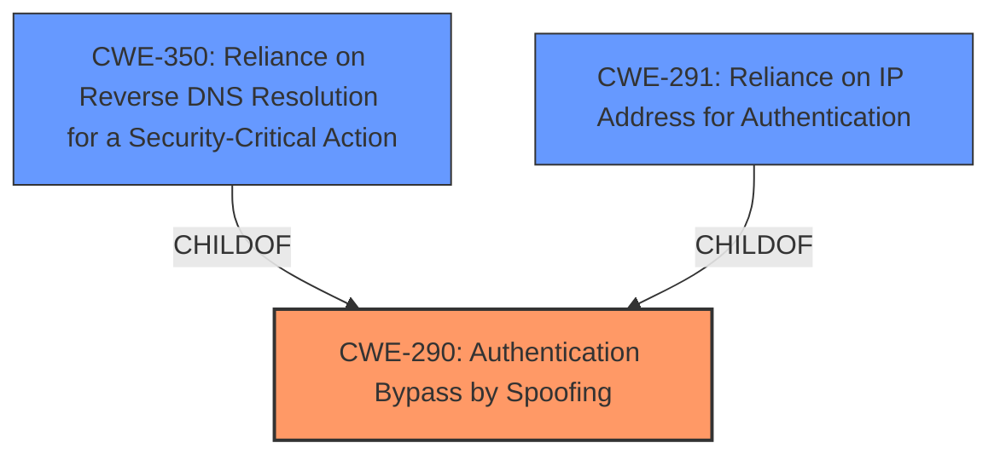

# Raw Analyzer Response for CVE-2024-43455

# Summary
| CWE ID | CWE Name | Confidence | CWE Abstraction Level | CWE Vulnerability Mapping Label | CWE-Vulnerability Mapping Notes |
|---|---|---|---|---|---|
| CWE-290 | Authentication Bypass by Spoofing | 0.7 | Base | Allowed | Primary CWE. The vulnerability is a spoofing vulnerability in the Remote Desktop Licensing Service, which indicates an authentication bypass. |

## Evidence and Confidence

*   **Confidence Score:** 0.7
*   **Evidence Strength:** LOW

## Relationship Analysis
The primary CWE is CWE-290 (Authentication Bypass by Spoofing), which is a base-level CWE. It has child CWEs like CWE-350 (Reliance on Reverse DNS Resolution for a Security-Critical Action) and CWE-291 (Reliance on IP Address for Authentication), but the provided information does not give enough details to narrow it down to a specific child CWE.

## Vulnerability Chain
The vulnerability chain starts with the **spoofing vulnerability** in the Remote Desktop Licensing Service, which leads to an authentication bypass. Thus, CWE-290 is the root cause.

## Summary of Analysis
The vulnerability description indicates a "**Spoofing Vulnerability**" in the Windows Remote Desktop Licensing Service. The retriever results suggest CWE-290 (Authentication Bypass by Spoofing) as a potential match. Since the vulnerability is described as a spoofing vulnerability, CWE-290 is the most appropriate primary CWE. The evidence is low because the CVE Reference Links Content Summary is unrelated.

CWEs considered but not used:
*   CWE-295 (Improper Certificate Validation): While certificate validation issues can lead to spoofing, the description doesn't explicitly mention certificates.
*   CWE-297 (Improper Validation of Certificate with Host Mismatch): Similar to CWE-295, this is related to certificate validation, which is not explicitly mentioned.
*   CWE-350 (Reliance on Reverse DNS Resolution for a Security-Critical Action): While this could be a potential attack vector for spoofing, there is no explicit mention of reverse DNS resolution.
*   CWE-291 (Reliance on IP Address for Authentication): Similar to CWE-350, this is a possible attack vector, but not explicitly mentioned.