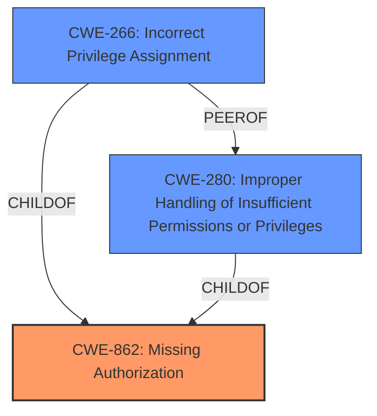

# Enhanced Analysis for CVE-2024-43460

# Summary

| CWE ID  | CWE Name                                                       | Confidence | CWE Abstraction Level | CWE Vulnerability Mapping Label | CWE-Vulnerability Mapping Notes |
| :------- | :------------------------------------------------------------- | :--------- | :-------------------- | :------------------------------ | :------------------------------ |
| CWE-862  | Missing Authorization                                          | 0.90       | Class                 | Primary                         | Allowed-with-Review           |
| CWE-266  | Incorrect Privilege Assignment                                 | 0.70       | Base                  | Secondary                       | Allowed                       |
| CWE-280  | Improper Handling of Insufficient Permissions or Privileges | 0.60       | Base                  | Secondary                       | Allowed                       |

## Evidence and Confidence

*   **Confidence Score:** 0.80
*   **Evidence Strength:** MEDIUM

## Relationship Analysis

The primary CWE is CWE-862, representing the **missing authorization**. This is a class-level CWE, and we considered its children but there was not enough information to pick a more specific option. CWE-266, Incorrect Privilege Assignment, and CWE-280, Improper Handling of Insufficient Permissions or Privileges, are potentially related as they represent specific scenarios of improper authorization. However, without further details, CWE-862 remains the most accurate high-level classification.



## Vulnerability Chain

The vulnerability chain starts with **improper authorization**, leading to privilege elevation. The chain can be represented as:

**Missing Authorization** (CWE-862) -> Privilege Elevation (Impact)

## Summary of Analysis

The vulnerability description indicates **improper authorization** leading to privilege elevation. The key phrase "Improper authorization" points to a problem with authorization checks.
The Retriever Results shows CWE-284, CWE-285, CWE-862, and CWE-863 as potential candidates.
CWE-862 (Missing Authorization) is the best fit because the description says **"improper authorization"** which suggests that there was no authorization check performed before elevating privileges, not that the check was incorrect (CWE-863).

The guidance specifically states:
*   **CWE-862**: *Missing Authorization* – the application doesn't check whether the user is authorized at all.

CWE-266, Incorrect Privilege Assignment, and CWE-280, Improper Handling of Insufficient Permissions or Privileges, were considered as secondary mappings. These could be the root cause of the **missing authorization**, but this is not confirmed by the evidence.

Relevant CWE Information:

# Enhanced Context (25 CWEs)

## CWE-266: Incorrect Privilege Assignment

**Abstraction Level**: Base
**Similarity Score**: 0.73
**Source**: dense

**Description**:
A product incorrectly assigns a privilege to a particular actor, creating an unintended sphere of control for that actor.

**Mapping Guidance**:
- Usage: Allowed
- Rationale: This CWE entry is at the Base level of abstraction, which is a preferred level of abstraction for mapping to the root causes of vulnerabilities.

## CWE-280: Improper Handling of Insufficient Permissions or Privileges

**Abstraction Level**: Base
**Similarity Score**: 0.73
**Source**: dense

**Description**:
The product does not handle or incorrectly handles when it has insufficient privileges to access resources or functionality as specified by their permissions. This may cause it to follow unexpected code paths that may leave the product in an invalid state.

**Mapping Guidance**:
- Usage: Allowed
- Rationale: This CWE entry is at the Base level of abstraction, which is a preferred level of abstraction for mapping to the root causes of vulnerabilities.

## CWE-862: Missing Authorization

**Abstraction Level**: Class
**Similarity Score**: 0.140

**Description**:
The product does not perform an authorization check at all before allowing an actor to access a resource or perform an action.

**Mapping Guidance**:
- Usage: Allowed-with-Review
- Rationale: This CWE entry is a Class and might have Base-level children that would be more appropriate

### CWE Selection Details

*   **CWE-862 [Confidence: 0.90]:** The vulnerability description explicitly states "**Improper authorization**," which aligns with the definition of CWE-862 i.e. the application doesn't check whether the user is authorized at all. The impact is privilege elevation, indicating a critical function is accessible without proper authorization. It is classified as a Class, but no child element is more relevant.
*   **CWE-266 [Confidence: 0.70]:** Incorrect Privilege Assignment may be a cause of the missing authorization.
*   **CWE-280 [Confidence: 0.60]:** Improper Handling of Insufficient Permissions or Privileges may be a cause of the missing authorization.

### CWEs Considered but Not Used:

*   **CWE-284 Improper Access Control:** This is a very general CWE and not as descriptive as CWE-862.
*   **CWE-285 Improper Authorization:** This is more relevant if the authorization was flawed, not missing.
*   **CWE-863 Incorrect Authorization:** This is more relevant if the authorization was flawed, not missing.


## CWE Relationship Analysis

Current CWEs represent these abstraction levels: .


### Vulnerability Chain Analysis

**Chain starting from CWE-863:**
- 863 (Incorrect Authorization) - ROOT


**Chain starting from CWE-280:**
- 280 (Improper Handling of Insufficient Permissions or Privileges ) - ROOT


### CWE Relationship Diagram

```mermaid
graph TD
    classDef primary fill:#f96,stroke:#333,stroke-width:2px
    classDef secondary fill:#69f,stroke:#333
    classDef tertiary fill:#9e9,stroke:#333
```