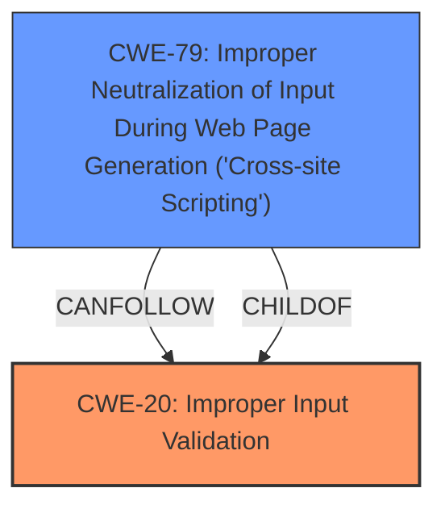

# Analysis for CVE-2024-4350

# Summary
| CWE ID  | CWE Name                                                                | Confidence | CWE Abstraction Level | CWE Vulnerability Mapping Label | CWE-Vulnerability Mapping Notes |
| :-------- | :---------------------------------------------------------------------- | :--------- | :-------------------- | :------------------------------ | :------------------------------ |
| CWE-20    | Improper Input Validation                                               | 0.9        | Class                 | Primary                         | Discouraged                   |
| CWE-79    | Improper Neutralization of Input During Web Page Generation ('Cross-site Scripting') | 0.9        | Base                 | Secondary                         | Allowed                   |

## Evidence and Confidence

*   **Confidence Score:** 0.9
*   **Evidence Strength:** HIGH

## Relationship Analysis
The primary weakness is **CWE-20 [Improper Input Validation]**, as the vulnerability description explicitly mentions **insufficient input validation** as the root cause. **CWE-79 [Improper Neutralization of Input During Web Page Generation ('Cross-site Scripting')]** is a consequence of the **improper input validation** and represents the specific type of vulnerability (**XSS**). **CWE-20 [Improper Input Validation]** is a Class-level CWE, while **CWE-79 [Improper Neutralization of Input During Web Page Generation ('Cross-site Scripting')]** is a Base-level CWE.

## Vulnerability Chain
The vulnerability chain starts with **CWE-20 [Improper Input Validation]**. Due to the **lack of validation**, malicious input is allowed. This leads to **CWE-79 [Improper Neutralization of Input During Web Page Generation ('Cross-site Scripting')]**, where the unvalidated input is used in a web page, resulting in **XSS**.

## Summary of Analysis
The analysis indicates that the primary cause of the vulnerability is **CWE-20 [Improper Input Validation]**. The description explicitly states that the vulnerability is due to **insufficient input validation**. Because of this root cause, an attacker can inject malicious code leading to **CWE-79 [Improper Neutralization of Input During Web Page Generation ('Cross-site Scripting')]**.

The relationship graph shows that **CWE-79 [Improper Neutralization of Input During Web Page Generation ('Cross-site Scripting')]** can follow **CWE-20 [Improper Input Validation]**.

The selection of **CWE-20 [Improper Input Validation]** and **CWE-79 [Improper Neutralization of Input During Web Page Generation ('Cross-site Scripting')]** is based on the evidence provided in the vulnerability description, emphasizing the **insufficient input validation** as the root cause and the resulting **XSS** vulnerability. The level of specificity is optimal because **CWE-20 [Improper Input Validation]** captures the general **lack of validation**, while **CWE-79 [Improper Neutralization of Input During Web Page Generation ('Cross-site Scripting')]** specifies the resulting **XSS** vulnerability.

CWEs like **CWE-22 [Improper Limitation of a Pathname to a Restricted Directory ('Path Traversal')]**, **CWE-347 [Improper Verification of Cryptographic Signature]**, and **CWE-434 [Unrestricted Upload of File with Dangerous Type]** were considered but not selected because they do not directly relate to the **insufficient input validation** and **XSS** nature of the vulnerability.

Relevant CWE Information: