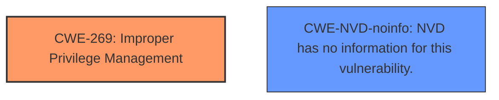

# Analysis for CVE-2024-43503

# Summary
| CWE ID      | CWE Name                                                                 | Confidence | CWE Abstraction Level | CWE Vulnerability Mapping Label | CWE-Vulnerability Mapping Notes |
| ----------- | ------------------------------------------------------------------------ | ---------- | --------------------- | ------------------------------- | ----------------------------- |
| CWE-269     | Improper Privilege Management                                            | 0.6        | Class                 | Primary CWE                     | Discouraged                   |
| CWE-NVD-noinfo | NVD has no information for this vulnerability.                       | 0.4        | N/A                  | Secondary Candidate                     | N/A                   |

## Evidence and Confidence

*   **Confidence Score:** 0.6
*   **Evidence Strength:** LOW

## Relationship Analysis
The primary relationship to consider is that CWE-269 is a Class-level CWE, and there might be more specific Base-level children that are more appropriate. However, without more details, it's difficult to select a more specific CWE.

## Vulnerability Chain
The vulnerability chain starts with **Improper Privilege Management** (CWE-269), leading to an Elevation of Privilege.

## Summary of Analysis
Based on the provided information, the vulnerability is a Microsoft SharePoint Elevation of Privilege Vulnerability. The key phrase is "Elevation of Privilege". The primary CWE match from similar CVE descriptions is CWE-NVD-noinfo, however, the top CWEs also listed CWE-269. Given the "Elevation of Privilege" impact, **Improper Privilege Management** (CWE-269) seems like a reasonable starting point, although it's a Class-level CWE. CWE-NVD-noinfo is a placeholder, indicating a lack of specific information. Due to the limited information and lack of rootcause details, the confidence is relatively low. The retriever results did not give a strong rootcause match.

CWEs considered but not used:

*   CWE-59, CWE-472, CWE-436, CWE-65, CWE-426, CWE-191, CWE-1204, CWE-732, CWE-98: These CWEs were considered but not used because they did not directly relate to the elevation of privilege aspect of the vulnerability. They appear to be false positives.

Relevant CWE Information:

# Enhanced Context (25 CWEs)
The following CWEs were identified as potentially relevant to this vulnerability:

## CWE-269: Improper Privilege Management
**Abstraction Level**: Class
**Similarity Score**: 1231.50
**Source**: sparse

**Description**:
The product does not properly assign, modify, track, or check privileges for an actor, creating an unintended sphere of control for that actor.

**Mapping Guidance**:
- Usage: Discouraged
- Rationale: CWE-269 is commonly misused. It can be conflated with "privilege escalation," which is a technical impact that is listed in many low-information vulnerability reports [REF-1287]. It is not useful for trend analysis.