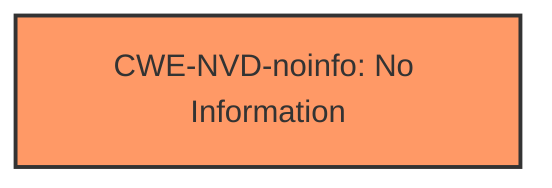

# Analysis Report for CVE-2024-43525

# Vulnerability Analysis Report: CVE-2024-43525

## Description

Windows Mobile Broadband Driver Remote Code Execution Vulnerability

## Vulnerability Description Key Phrases

- **Impact:** remote code execution
- **Product:** Windows Mobile
- **Component:** Broadband Driver

## Analysis (with Relationship Data)

# Summary

| CWE ID      | CWE Name                                                                  | Confidence | CWE Abstraction Level | CWE Vulnerability Mapping Label | CWE-Vulnerability Mapping Notes |
|-------------|---------------------------------------------------------------------------|------------|-----------------------|---------------------------------|---------------------------------|
| CWE-NVD-noinfo | No Information                                                            | 0.8        | N/A                   | Primary                           | N/A                            |

## Evidence and Confidence

*   **Confidence Score:** 0.8
*   **Evidence Strength:** LOW

## Relationship Analysis

Given the limited information, relationship analysis is not applicable. The primary mapping is based on the absence of vulnerability details.



## Vulnerability Chain

The vulnerability chain cannot be determined due to the lack of information. The only identified element is the impact: remote code execution.

## Summary of Analysis

The initial analysis, guided by the "CWE for similar CVE Descriptions," strongly suggests CWE-NVD-noinfo due to the absence of specific vulnerability details in the provided description and CVE Reference Links. The "Vulnerability Description Key Phrases" only specify the product, component, and impact, failing to provide any insight into the **root cause** or **weakness**.

The decision is heavily based on the absence of evidence. Without further information, selecting a more specific CWE would be speculative.

Relevant CWE Information:

# Enhanced Context (25 CWEs)

## Vulnerability Description
Windows Mobile Broadband Driver Remote Code Execution Vulnerability

### Vulnerability Description Key Phrases
- **impact:** remote code execution
- **product:** Windows Mobile
- **component:** Broadband Driver

### CWE for similar CVE Descriptions
### Primary CWE Match
CWE-NVD-noinfo

#### Top CWEs
- CWE-NVD-noinfo (Count: 361)
- CWE-190 (Count: 42)
- CWE-362 (Count: 41)

## CVE Reference Links Content Summary
UNRELATED

## Retriever Results

### Top Combined Results

| Rank | CWE ID | Name | Abstraction | Usage  | Retrievers | Individual Scores |
|------|--------|------|-------------|-------|------------|-------------------|
| 1 | 126 | Buffer Over-read | Variant | Allowed | sparse | 0.013 |
| 2 | 1285 | Improper Validation of Specified Index, Position, or Offset in Input | Base | Allowed | sparse | 0.013 |
| 3 | 367 | Time-of-check Time-of-use (TOCTOU) Race Condition | Base | Allowed | sparse | 0.012 |
| 4 | 362 | Concurrent Execution using Shared Resource with Improper Synchronization ('Race Condition') | Class | Allowed-with-Review | sparse | 0.011 |
| 5 | 787 | Out-of-bounds Write | Base | Allowed | sparse | 0.011 |
| 6 | 823 | Use of Out-of-range Pointer Offset | Base | Allowed | sparse | 0.011 |
| 7 | 755 | Improper Handling of Exceptional Conditions | Class | Discouraged | sparse | 0.010 |
| 8 | 833 | Deadlock | Base | Allowed | sparse | 0.010 |
| 9 | 782 | Exposed IOCTL with Insufficient Access Control | Variant | Allowed | dense | 0.549 |
| 10 | 781 | Improper Address Validation in IOCTL with METHOD_NEITHER I/O Control Code | Variant | Allowed | graph | 0.003 |

### Analysis of Candidate CWEs and Exclusion Rationale:

Given the lack of information, all other CWEs from the Retriever Results are excluded. There is no evidence to support any of them. For example, while **CWE-787 (Out-of-bounds Write)**, **CWE-1285 (Improper Validation of Specified Index, Position, or Offset in Input)**, and **CWE-362 (Concurrent Execution using Shared Resource with Improper Synchronization ('Race Condition'))** appear in the results, there's nothing in the description to indicate a buffer overflow, index validation issue, or concurrency problem.

### Final Conclusion:

Due to the lack of vulnerability details, the most appropriate mapping is **CWE-NVD-noinfo (No Information)**. This is consistent with the primary match from "CWE for similar CVE Descriptions".


## CWE Relationship Analysis

Current CWEs represent these abstraction levels: .


### Vulnerability Chain Analysis

**Chain starting from CWE-190:**
- 190 (Integer Overflow or Wraparound) - ROOT


**Chain starting from CWE-787:**
- 787 (Out-of-bounds Write) - ROOT


### CWE Relationship Diagram

```mermaid
graph TD
    classDef primary fill:#f96,stroke:#333,stroke-width:2px
    classDef secondary fill:#69f,stroke:#333
    classDef tertiary fill:#9e9,stroke:#333
```


*Report generated on 2025-07-13 14:56:44*
