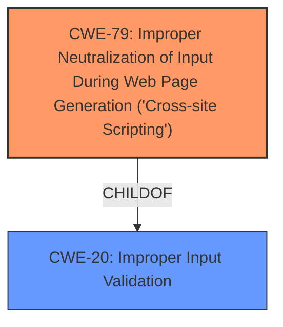

# Analysis Report for CVE-2024-4353

# Vulnerability Analysis Report: CVE-2024-4353

## Description

Concrete CMS versions 9.0.0 through 9.3.2 are affected by a stored **XSS vulnerability** in the generate dashboard board instance functionality. The Name input field **does not check the input sufficiently** letting a rogue administrator have the capability to inject malicious JavaScript code. The Concrete CMS security team gave this vulnerability a CVSS v3.1 score of 3.1 with a vector of AVN/ACH/PRH/UIR/SU/CL/IL/AN https//nvd.nist.gov/vuln-metrics/cvss/v3-calculator and a CVSS v4 score of 1.8 with a vector of CVSS4.0/AVN/ACH/ATN/PRH/UIA/VCL/VIL/VAN/SCN/SIN/SAN Concrete versions below 9 are not affected by this vulnerability. Thanks fhAnso for reporting.

## Vulnerability Description Key Phrases

- **Rootcause:** does not check the input sufficiently
- **Weakness:** ['XSS vulnerability', 'cross-site scripting']
- **Impact:** inject malicious JavaScript code
- **Attacker:** rogue administrator
- **Product:** Concrete CMS
- **Version:** 9.0.0 through 9.3.2
- **Component:** generate dashboard board instance functionality

## Analysis (with Relationship Data)

# Summary
| CWE ID | CWE Name | Confidence | CWE Abstraction Level | CWE Vulnerability Mapping Label | CWE-Vulnerability Mapping Notes |
|---|---|---|---|---|---|
| CWE-79 | Improper Neutralization of Input During Web Page Generation ('Cross-site Scripting') | 1.0 | Base | Primary | Allowed |
| CWE-20 | Improper Input Validation | 0.7 | Class | Secondary | Allowed-with-Review |

## Evidence and Confidence

*   **Confidence Score:** 0.9
*   **Evidence Strength:** HIGH

## Relationship Analysis
The primary weakness is CWE-79, which is a Base level CWE. A possible related CWE is CWE-20, which is a Class level CWE and a parent of CWE-79. The relationship here is that **improper input validation** (CWE-20) can lead to **cross-site scripting** (CWE-79) if user-supplied input is not properly neutralized before being used in a web page.



## Vulnerability Chain
The vulnerability chain starts with the **lack of input validation** (**does not check the input sufficiently**) on the Name input field, leading to the ability to **inject malicious JavaScript code**, which results in a stored **XSS vulnerability**. Therefore, **improper input validation** (CWE-20) leads to **improper neutralization of input during web page generation** (CWE-79), resulting in Cross-Site Scripting.

## Summary of Analysis
The vulnerability is a stored Cross-Site Scripting (XSS) issue due to **insufficient input validation**. The **Name** input field **does not check the input sufficiently** allowing an administrator to inject malicious JavaScript code. The primary CWE is CWE-79, as the core issue is the **improper neutralization of input during web page generation**. A secondary CWE is CWE-20 since the root cause appears to be a **lack of input validation**.

The provided evidence clearly points to a Cross-Site Scripting (XSS) vulnerability. The vulnerability description states that the "Name input field **does not check the input sufficiently** letting a rogue administrator have the capability to **inject malicious JavaScript code**," which directly aligns with the characteristics of CWE-79.

CWE-20 was considered because the root cause is that the input is not checked sufficiently. While this is true, the more precise weakness is CWE-79 since the **lack of input validation** leads directly to the **improper neutralization of input**, and the injected code is executed in the context of a web page.
CWE-434, CWE-22, CWE-347, CWE-352, CWE-116, and CWE-94 were considered but rejected because they do not directly address the specific vulnerability of improper neutralization of input leading to XSS.

Relevant CWE Information:
*   **CWE-79: Improper Neutralization of Input During Web Page Generation ('Cross-site Scripting')**
    *   The product does not neutralize or incorrectly neutralizes user-controllable input before it is placed in output that is used as a web page that is served to other users.
    *   This aligns directly with the vulnerability description, where the Name field does not sufficiently check input, allowing malicious JavaScript code to be injected.
*   **CWE-20: Improper Input Validation**
    *   The product receives input or data, but it does not validate or incorrectly validates that the input has the properties that are required to process the data safely and correctly.
    *   This is a general weakness that can lead to many different vulnerabilities, including XSS.


## CWE Relationship Analysis

Current CWEs represent these abstraction levels: .


### Vulnerability Chain Analysis

**Chain starting from CWE-116:**
- 116 (Improper Encoding or Escaping of Output) - ROOT


**Chain starting from CWE-94:**
- 94 (Improper Control of Generation of Code ('Code Injection')) - ROOT


### CWE Relationship Diagram

```mermaid
graph TD
    classDef primary fill:#f96,stroke:#333,stroke-width:2px
    classDef secondary fill:#69f,stroke:#333
    classDef tertiary fill:#9e9,stroke:#333
```


*Report generated on 2025-07-13 14:57:07*
