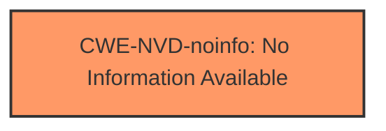

# Enhanced Analysis for CVE-2024-43538

# Summary
| CWE ID        | CWE Name                                                                                    | Confidence | CWE Abstraction Level | CWE Vulnerability Mapping Label | CWE-Vulnerability Mapping Notes |
|---------------|---------------------------------------------------------------------------------------------|------------|-----------------------|---------------------------------|-----------------------------------|
| CWE-NVD-noinfo | No Information Available                                                                     | 0.8        | N/A                   | N/A                             | N/A                               |

## Evidence and Confidence

*   **Confidence Score:** 0.8
*   **Evidence Strength:** LOW

## Relationship Analysis
Due to the lack of information, no relationship analysis can be performed. The primary mapping is based on the fact that no specific weakness or root cause is identified in the vulnerability description.



## Vulnerability Chain
The vulnerability chain cannot be determined due to the absence of information about the root cause or specific weaknesses. The identified impact is Denial of Service, but there is no detail on how it is achieved.

## Summary of Analysis
The analysis is heavily constrained by the lack of information provided in the vulnerability description and CVE Reference Links Content Summary. The primary CWE match, CWE-NVD-noinfo, reflects this limitation.

The decision to assign CWE-NVD-noinfo is based on the "Primary CWE Match" in the provided data, which states that CWE-NVD-noinfo is the best match for similar "Vulnerability Descriptions." The vulnerability description focuses on the impact (Denial of Service) without detailing the underlying **weakness** or **root cause**. The retriever results suggest multiple candidate CWEs, but without any concrete evidence from the vulnerability description, it's impossible to select a more specific CWE with confidence.

The retriever listed the following candidate CWEs:
- CWE-1285: Improper Validation of Specified Index, Position, or Offset in Input - Insufficient evidence to confirm that index validation is the issue.
- CWE-833: Deadlock - Insufficient evidence.
- CWE-126: Buffer Over-read - Insufficient evidence.
- CWE-367: Time-of-check Time-of-use (TOCTOU) Race Condition - Insufficient evidence.
- CWE-476: NULL Pointer Dereference - Insufficient evidence.
- CWE-362: Concurrent Execution using Shared Resource with Improper Synchronization ('Race Condition') - Insufficient evidence.
- CWE-755: Improper Handling of Exceptional Conditions - Insufficient evidence.
- CWE-787: Out-of-bounds Write - Insufficient evidence.
- CWE-67: Improper Handling of Windows Device Names - Insufficient evidence.
- CWE-781: Improper Address Validation in IOCTL with METHOD_NEITHER I/O Control Code - Insufficient evidence.

Relevant CWE Information:
N/A


## CWE Relationship Analysis

Current CWEs represent these abstraction levels: .


### Vulnerability Chain Analysis

**Chain starting from CWE-476:**
- 476 (NULL Pointer Dereference) - ROOT


**Chain starting from CWE-67:**
- 67 (Improper Handling of Windows Device Names) - ROOT


### CWE Relationship Diagram

```mermaid
graph TD
    classDef primary fill:#f96,stroke:#333,stroke-width:2px
    classDef secondary fill:#69f,stroke:#333
    classDef tertiary fill:#9e9,stroke:#333
```