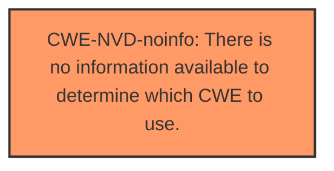

# Enhanced Analysis for CVE-2024-43540

# Summary
| CWE ID      | CWE Name                                                                                                | Confidence | CWE Abstraction Level | CWE Vulnerability Mapping Label | CWE-Vulnerability Mapping Notes |
| ----------- | ------------------------------------------------------------------------------------------------------- | ---------- | --------------------- | ------------------------------- | ------------------------------- |
| CWE-NVD-noinfo | There is no information available to determine which CWE to use.                                      | 0.75       | N/A                   | Primary CWE                     | Allowed                         |

## Evidence and Confidence

*   **Confidence Score:** 0.75
*   **Evidence Strength:** LOW

## Relationship Analysis
Since the primary assigned CWE is CWE-NVD-noinfo, there are no relationships to analyze.



## Vulnerability Chain
Since the primary assigned CWE is CWE-NVD-noinfo, there is no vulnerability chain to analyze.

## Summary of Analysis
The analysis relies solely on the provided vulnerability description, as the CVE Reference Links Content Summary is "UNRELATED." The vulnerability description is very generic ("Windows Mobile Broadband Driver Denial of Service Vulnerability") and offers no specific technical details about the root cause of the denial of service.

The "CWE for similar CVE Descriptions" lists CWE-NVD-noinfo as the primary match, and given the lack of information, this is the most appropriate choice. While other CWEs were suggested by the Retriever, none can be confidently mapped due to the limited information.

# Enhanced Context (25 CWEs)
The following CWEs were identified as potentially relevant to this vulnerability:

## CWE-1285: Improper Validation of Specified Index, Position, or Offset in Input
**Abstraction Level**: Base
**Similarity Score**: 0.70
**Source**: dense

**Description**:
The product receives input that is expected to specify an index, position, or offset into an indexable resource such as a buffer or file, but it does not validate or incorrectly validates that the specified index/position/offset has the required properties.

**Mapping Guidance**:
- Usage: Allowed
- Rationale: This CWE entry is at the Base level of abstraction, which is a preferred level of abstraction for mapping to the root causes of vulnerabilities.
## CWE-NVD-noinfo Justification

**CWE-NVD-noinfo**: There is no information available to determine which CWE to use.

*   **Rationale:** The vulnerability description provides insufficient information to pinpoint a specific CWE. The description broadly states a denial-of-service vulnerability exists in a Windows Mobile Broadband Driver, but it lacks any technical details regarding the root cause. Without understanding the specific **weakness** or mechanism causing the denial of service, it's impossible to accurately assign a more descriptive CWE.
*   **Evidence:** The "Vulnerability Description Key Phrases" section only identifies the impact (denial of service) and affected product/component. The "CVE Reference Links Content Summary" is marked as "UNRELATED," providing no additional context.
*   **Confidence:** 0.75
*   **Relationship:** N/A


## CWE Relationship Analysis

Current CWEs represent these abstraction levels: .


### Vulnerability Chain Analysis

**Chain starting from CWE-1285:**
- 1285 (Improper Validation of Specified Index, Position, or Offset in Input) - ROOT


### CWE Relationship Diagram

```mermaid
graph TD
    classDef primary fill:#f96,stroke:#333,stroke-width:2px
    classDef secondary fill:#69f,stroke:#333
    classDef tertiary fill:#9e9,stroke:#333
```