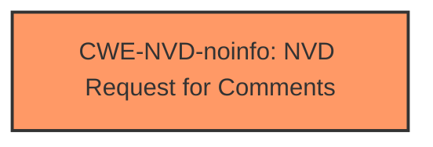

# Analysis for CVE-2024-43561

# Summary
| CWE ID | CWE Name | Confidence | CWE Abstraction Level | CWE Vulnerability Mapping Label | CWE-Vulnerability Mapping Notes |
|---|---|---|---|---|---|
| CWE-NVD-noinfo | NVD Request for Comments | 1.0 | N/A | Primary | N/A |

## Evidence and Confidence

*   **Confidence Score:** 1.0
*   **Evidence Strength:** LOW

## Relationship Analysis
There are no relationships to analyze since the only CWE is CWE-NVD-noinfo.

## Vulnerability Chain
There is no vulnerability chain to map, as the vulnerability description lacks specific details about the root cause. The description only indicates a denial-of-service vulnerability in a Windows Mobile Broadband Driver. Without more information, it is impossible to determine the sequence of weaknesses that led to the impact.

## Summary of Analysis
The analysis is based on the lack of evidence provided in the vulnerability description. The description mentions a "Denial of Service Vulnerability" in "Windows Mobile Broadband Driver" but lacks details about the root cause or technical specifics. The "CVE Reference Links Content Summary" section is marked as "UNRELATED," providing no additional information.

Given the absence of root cause details, the most appropriate CWE is CWE-NVD-noinfo. This CWE is used when there is insufficient information available to assign a specific CWE.

The retriever results suggest several potential CWEs, including CWE-1285, CWE-787, CWE-476, CWE-362, CWE-67, etc. However, without more specific information from the vulnerability description, I cannot confidently select any of these.

I considered other CWEs from the retriever results, but I did not use them due to the lack of supporting evidence in the provided vulnerability description. For example, CWE-787 (Out-of-bounds Write) could be a possibility, but there's no mention of memory corruption or buffer overflows in the description. Similarly, CWE-476 (NULL Pointer Dereference) is a potential cause of denial of service, but without more information, it's impossible to confirm.