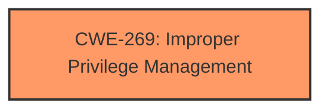

# Analysis for CVE-2024-43594

# Summary
| CWE ID | CWE Name | Confidence | CWE Abstraction Level | CWE Vulnerability Mapping Label | CWE-Vulnerability Mapping Notes |
|---|---|---|---|---|---|
| CWE-269 | Improper Privilege Management | 0.5 | Class | Primary | Discouraged |

## Evidence and Confidence

*   **Confidence Score:** 0.5
*   **Evidence Strength:** LOW

## Relationship Analysis
The primary relationship considered was the parent-child relationship. The retriever results suggested some base-level CWEs like CWE-59, CWE-266, but given the extremely limited information about the root cause, and the general "Elevation of Privilege" impact statement, the higher level CWE-269 was chosen despite the discouraged mapping guidance.

## Vulnerability Chain
The vulnerability chain appears to be a single step: **Improper Privilege Management** leading to Elevation of Privilege. Given the lack of information, there's no further root cause or detailed impact that can be identified.

## Summary of Analysis
The analysis is heavily constrained by the lack of detailed information in the vulnerability description. The description only states that it is an "Elevation of Privilege Vulnerability" in "System Center Operations Manager". The retriever results provide some candidate CWEs, but most of them are too specific given the vague description.

The retriever results suggested CWE-59, CWE-266, CWE-782, CWE-434, CWE-295, CWE-426, CWE-390, CWE-807, CWE-1386, and CWE-363.

*   CWE-59: Improper Link Resolution Before File Access ('Link Following') - Too specific, requires file access via links.
*   CWE-266: Incorrect Privilege Assignment - Possible, but not enough evidence to confirm a privilege assignment issue.
*   CWE-782: Exposed IOCTL with Insufficient Access Control - Likely specific to a particular code pattern, there is no evidence of IOCTL exposure.
*   CWE-434: Unrestricted Upload of File with Dangerous Type - Requires file upload functionality, no evidence.
*   CWE-295: Improper Certificate Validation - Requires certificate validation, no evidence.
*   CWE-426: Untrusted Search Path - Requires a search path issue, no evidence.
*   CWE-390: Detection of Error Condition Without Action - Requires a detected error, no evidence.
*   CWE-807: Reliance on Untrusted Inputs in a Security Decision - Requires reliance on untrusted input, no evidence.
*   CWE-1386: Insecure Operation on Windows Junction / Mount Point - Too specific to Windows Junctions/Mount Points.
*   CWE-363: Race Condition Enabling Link Following - Too specific to race conditions and link following.

Given the very high-level description and "Elevation of Privilege" impact, the best option, although discouraged, is to select CWE-269 Improper Privilege Management. This is a class-level CWE, and typically one would want to be more specific, but there just is not enough information to do so. The MITRE guidance discourages this CWE because it is commonly misused and conflated with Privilege Escalation. However, given the lack of specific root cause information, and the high-level "Elevation of Privilege" impact, it is the most reasonable choice.

Relevant CWE Information:

# Enhanced Context (25 CWEs)
The following CWEs were identified as potentially relevant to this vulnerability:

## CWE-266: Incorrect Privilege Assignment
**Abstraction Level**: Base
**Similarity Score**: 0.79
**Source**: dense

**Description**:
A product incorrectly assigns a privilege to a particular actor, creating an unintended sphere of control for that actor.

**Mapping Guidance**:
- Usage: Allowed
- Rationale: This CWE entry is at the Base level of abstraction, which is a preferred level of abstraction for mapping to the root causes of vulnerabilities.

## CWE-267: Privilege Defined With Unsafe Actions
**Abstraction Level**: Base
**Similarity Score**: 0.78
**Source**: dense

**Description**:
A particular privilege, role, capability, or right can be used to perform unsafe actions that were not intended, even when it is assigned to the correct entity.

**Mapping Guidance**:
- Usage: Allowed
- Rationale: This CWE entry is at the Base level of abstraction, which is a preferred level of abstraction for mapping to the root causes of vulnerabilities.

## CWE-274: Improper Handling of Insufficient Privileges
**Abstraction Level**: Base
**Similarity Score**: 0.77
**Source**: dense

**Description**:
The product does not handle or incorrectly handles when it has insufficient privileges to perform an operation, leading to resultant weaknesses.

**Mapping Guidance**:
- Usage: Discouraged
- Rationale: This CWE entry could be deprecated in a future version of CWE.

## CWE-59: Improper Link Resolution Before File Access ('Link Following')
**Abstraction Level**: Base
**Similarity Score**: 0.77
**Source**: dense

**Description**:
The product attempts to access a file based on the filename, but it does not properly prevent that filename from identifying a link or shortcut that resolves to an unintended resource.

**Mapping Guidance**:
- Usage: Allowed
- Rationale: This CWE entry is at the Base level of abstraction, which is a preferred level of abstraction for mapping to the root causes of vulnerabilities.

## CWE-280: Improper Handling of Insufficient Permissions or Privileges 
**Abstraction Level**: Base
**Similarity Score**: 0.77
**Source**: dense

**Description**:
The product does not handle or incorrectly handles when it has insufficient privileges to access resources or functionality as specified by their permissions. This may cause it to follow unexpected code paths that may leave the product in an invalid state.

**Mapping Guidance**:
- Usage: Allowed
- Rationale: This CWE entry is at the Base level of abstraction, which is a preferred level of abstraction for mapping to the root causes of vulnerabilities.

## CWE-41: Improper Resolution of Path Equivalence
**Abstraction Level**: Base
**Similarity Score**: 0.76
**Source**: dense

**Description**:
The product is vulnerable to file system contents disclosure through path equivalence. Path equivalence involves the use of special characters in file and directory names. The associated manipulations are intended to generate multiple names for the same object.

**Mapping Guidance**:
- Usage: Allowed
- Rationale: This CWE entry is at the Base level of abstraction, which is a preferred level of abstraction for mapping to the root causes of vulnerabilities.

## CWE-668: Exposure of Resource to Wrong Sphere
**Abstraction Level**: Class
**Similarity Score**: 0.75
**Source**: dense

**Description**:
The product exposes a resource to the wrong control sphere, providing unintended actors with inappropriate access to the resource.

**Mapping Guidance**:
- Usage: Discouraged
- Rationale: CWE-668 is high-level and is often misused as a catch-all when lower-level CWE IDs might be applicable. It is sometimes used for low-information vulnerability reports [REF-1287]. It is a level-1 Class (i.e., a child of a Pillar). It is not useful for trend analysis.

## CWE-276: Incorrect Default Permissions
**Abstraction Level**: Base
**Similarity Score**: 0.74
**Source**: dense

**Description**:
During installation, installed file permissions are set to allow anyone to modify those files.

**Mapping Guidance**:
- Usage: Allowed
- Rationale: This CWE entry is at the Base level of abstraction, which is a preferred level of abstraction for mapping to the root causes of vulnerabilities.

## CWE-73: External Control of File Name or Path
**Abstraction Level**: Base
**Similarity Score**: 0.74
**Source**: dense

**Description**:
The product allows user input to control or influence paths or file names that are used in filesystem operations.

**Mapping Guidance**:
- Usage: Allowed
- Rationale: This CWE entry is at the Base level of abstraction, which is a preferred level of abstraction for mapping to the root causes of vulnerabilities.

## CWE-497: Exposure of Sensitive System Information to an Unauthorized Control Sphere
**Abstraction Level**: Base
**Similarity Score**: 0.74
**Source**: dense

**Description**:
The product does not properly prevent sensitive system-level information from being accessed by unauthorized actors who do not have the same level of access to the underlying system as the product does.

**Mapping Guidance**:
- Usage: Allowed
- Rationale: This CWE entry is at the Base level of abstraction, which is a preferred level of abstraction for mapping to the root causes of vulnerabilities.

## CWE-863: Incorrect Authorization
**Abstraction Level**: Class
**Similarity Score**: 1209.51
**Source**: sparse

**Description**:
The product performs an authorization check when an actor attempts to access a resource or perform an action, but it does not correctly perform the check.

**Mapping Guidance**:
- Usage: Allowed-with-