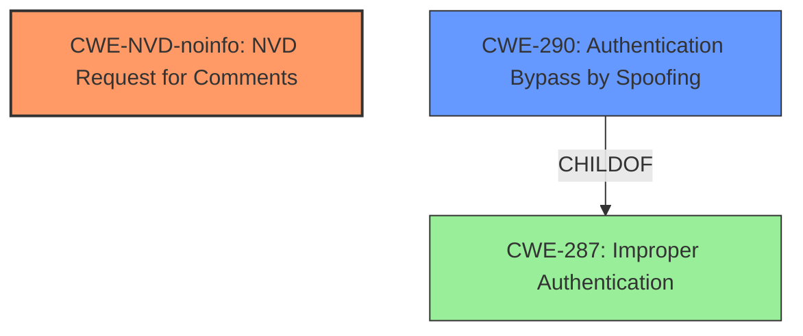

# Enhanced Analysis for CVE-2024-43609

# Summary

| CWE ID    | CWE Name                                                        | Confidence | CWE Abstraction Level | CWE Vulnerability Mapping Label | CWE-Vulnerability Mapping Notes |
| :-------- | :-------------------------------------------------------------- | :--------- | :-------------------- | :------------------------------ | :------------------------------ |
| CWE-NVD-noinfo | NVD Request for Comments                                           | 0.7       | Pillar                  | Primary                         | Allowed                       |
| CWE-290     | Authentication Bypass by Spoofing                               | 0.3       | Base                  | Secondary                       | Allowed                       |

## Evidence and Confidence

*   **Confidence Score:** 0.7
*   **Evidence Strength:** LOW

## Relationship Analysis

The primary identified CWE is CWE-NVD-noinfo, which is a very general placeholder indicating insufficient information for proper classification. While the retriever results suggest CWE-290 as a potential candidate, there's not enough technical detail to confirm the root cause as an authentication bypass. The relationships of CWE-290, such as its parent CWE-287 (Improper Authentication), could be relevant if more information were available.



## Vulnerability Chain

The current evidence only points to a "Spoofing Vulnerability" in Microsoft Office. Without further details, a chain cannot be accurately mapped. A possible chain *could* be:

1.  **Root Cause:** Insufficient Authentication (hypothetical, needs more information)
2.  **Weakness:** Authentication Bypass by Spoofing (CWE-290)
3.  **Impact:** Spoofing Vulnerability

However, this chain is speculative based on the limited information available.

## Summary of Analysis

The initial assessment heavily relies on the limited information provided. The vulnerability description mentions a "Spoofing Vulnerability" in Microsoft Office, but lacks specific technical details about the root cause or exploitation mechanism.

The primary classification is CWE-NVD-noinfo because the "CVE Reference Links Content Summary" is "UNRELATED" and there isn't any rootcause or weakness entry in the "Vulnerability Description Key Phrases" other than "Spoofing Vulnerability". This indicates a lack of sufficient information to pinpoint the underlying weakness.

The retriever results suggest CWE-290 (Authentication Bypass by Spoofing) as a potential candidate. However, without more evidence, it's difficult to confidently assign this CWE. If there were confirmation that the vulnerability involved bypassing authentication through spoofing, CWE-290 would be more appropriate. But based on the evidence provided, CWE-NVD-noinfo is the most accurate, albeit generic, classification.

The selection of CWE-NVD-noinfo is at the Pillar level because it's a high-level category indicating a need for more information. If more details were available, a more specific Base or Variant CWE could be chosen.

Relevant CWE Information:

# Enhanced Context (25 CWEs)
The following CWEs were identified as potentially relevant to this vulnerability:

## CWE-297: Improper Validation of Certificate with Host Mismatch
**Abstraction Level**: Variant
**Similarity Score**: 0.71
**Source**: dense

**Description**:
The product communicates with a host that provides a certificate, but the product does not properly ensure that the certificate is actually associated with that host.

**Mapping Guidance**:
- Usage: Allowed
- Rationale: This CWE entry is at the Variant level of abstraction, which is a preferred level of abstraction for mapping to the root causes of vulnerabilities.
*Not Used:* There is no evidence of certificate validation issues.

## CWE-290: Authentication Bypass by Spoofing
**Abstraction Level**: Base
**Similarity Score**: 0.70
**Source**: dense

**Description**:
This attack-focused weakness is caused by incorrectly implemented authentication schemes that are subject to spoofing attacks.

**Mapping Guidance**:
- Usage: Allowed
- Rationale: This CWE entry is at the Base level of abstraction, which is a preferred level of abstraction for mapping to the root causes of vulnerabilities.
*Used with Low Confidence:* It aligns with the "Spoofing Vulnerability" description, but lacks technical details for confirmation.

## CWE-305: Authentication Bypass by Primary Weakness
**Abstraction Level**: Base
**Similarity Score**: 0.69
**Source**: dense

**Description**:
The authentication algorithm is sound, but the implemented mechanism can be bypassed as the result of a separate weakness that is primary to the authentication error.

**Mapping Guidance**:
- Usage: Allowed
- Rationale: This CWE entry is at the Base level of abstraction, which is a preferred level of abstraction for mapping to the root causes of vulnerabilities.
*Not Used:* There's no indication of a separate primary weakness leading to authentication bypass.

## CWE-295: Improper Certificate Validation
**Abstraction Level**: Base
**Similarity Score**: 0.68
**Source**: dense

**Description**:
The product does not validate, or incorrectly validates, a certificate.

**Mapping Guidance**:
- Usage: Allowed
- Rationale: This CWE entry is at the Base level of abstraction, which is a preferred level of abstraction for mapping to the root causes of vulnerabilities.
*Not Used:* No evidence of certificate validation issues.

## CWE-303: Incorrect Implementation of Authentication Algorithm
**Abstraction Level**: Base
**Similarity Score**: 0.68
**Source**: dense

**Description**:
The requirements for the product dictate the use of an established authentication algorithm, but the implementation of the algorithm is incorrect.

**Mapping Guidance**:
- Usage: Allowed
- Rationale: This CWE entry is at the Base level of abstraction, which is a preferred level of abstraction for mapping to the root causes of vulnerabilities.
*Not Used:* There's no information about the specific authentication algorithm or its implementation.

## CWE-288: Authentication Bypass Using an Alternate Path or Channel
**Abstraction Level**: Base
**Similarity Score**: 0.68
**Source**: dense

**Description**:
The product requires authentication, but the product has an alternate path or channel that does not require authentication.

**Mapping Guidance**:
- Usage: Allowed
- Rationale: This CWE entry is at the Base level of abstraction, which is a preferred level of abstraction for mapping to the root causes of vulnerabilities.
*Not Used:* No evidence of an alternate path or channel for authentication bypass.

## CWE-1391: Use of Weak Credentials
**Abstraction Level**: Class
**Similarity Score**: 0.68
**Source**: dense

**Description**:
The product uses weak credentials (such as a default key or hard-coded password) that can be calculated, derived, reused, or guessed by an attacker.

**Mapping Guidance**:
- Usage: Allowed-with-Review
- Rationale: This CWE entry is a Class and might have Base-level children that would be more appropriate
*Not Used:* There's no mention of weak credentials being a factor in the spoofing vulnerability.

## CWE-941: Incorrectly Specified Destination in a Communication Channel
**Abstraction Level**: Base
**Similarity Score**: 0.68
**Source**: dense

**Description**:
The product creates a communication channel to initiate an outgoing request to an actor, but it does not correctly specify the intended destination for that actor.

**Mapping Guidance**:
- Usage: Allowed
- Rationale: This CWE entry is at the Base level of abstraction, which is a preferred level of abstraction for mapping to the root causes of vulnerabilities.
*Not Used:* This is not related to destination specification in a communication channel.

## CWE-1289: Improper Validation of Unsafe Equivalence in Input
**Abstraction Level**: Base
**Similarity Score**: 0.67
**Source**: dense

**Description**:
The product receives an input value that is used as a resource identifier or other type of reference, but it does not validate or incorrectly validates that the input is equivalent to a potentially-unsafe value.

**Mapping Guidance**:
- Usage: Allowed
- Rationale: This CWE entry is at the Base level of abstraction, which is a preferred level of abstraction for mapping to the root causes of vulnerabilities.
*Not Used:* There's no information about input validation issues.

## CWE-294: Authentication Bypass by Capture-replay
**Abstraction Level**: Base
**Similarity Score**: 0.67
**Source**: dense

**Description**:
A capture-replay flaw exists when the design of the product makes it possible for a malicious user to sniff network traffic and bypass authentication by replaying it to the server in question to the same effect as the original message (or with minor changes).

**Mapping Guidance**:
- Usage: Allowed
- Rationale: This CWE


## CWE Relationship Analysis

Current CWEs represent these abstraction levels: .


### Vulnerability Chain Analysis

**Chain starting from CWE-288:**
- 288 (Authentication Bypass Using an Alternate Path or Channel) - ROOT


**Chain starting from CWE-290:**
- 290 (Authentication Bypass by Spoofing) - ROOT


### CWE Relationship Diagram

```mermaid
graph TD
    classDef primary fill:#f96,stroke:#333,stroke-width:2px
    classDef secondary fill:#69f,stroke:#333
    classDef tertiary fill:#9e9,stroke:#333
```