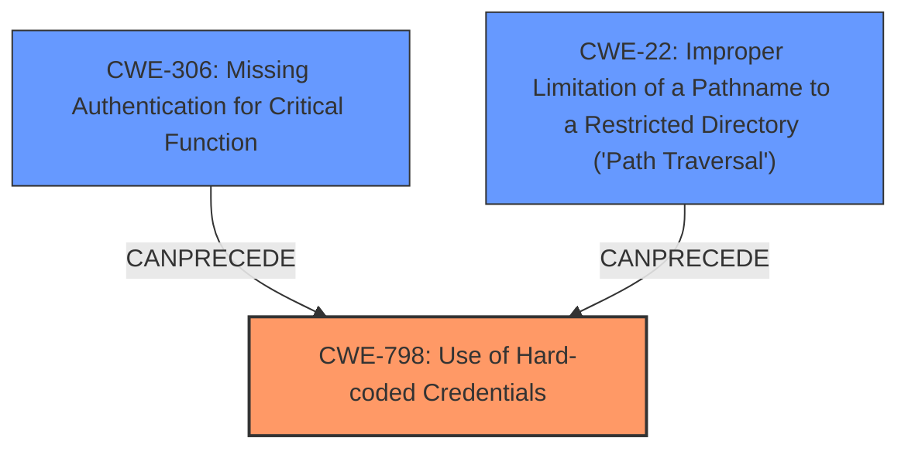

# Analysis Report for CVE-2024-43659

# Vulnerability Analysis Report: CVE-2024-43659

## Description

After gaining access to the firmware of a charging station, a file at can be accessed to obtain default credentials that are the same across all Iocharger AC model EV chargers. This issue affects Iocharger firmware for AC models before firmware version 25010801. The issue is addressed by requiring a mandatory password change on first login, it is still recommended to change the password on older models. Likelihood Moderate The attacker will first have to abuse a **code execution or file inclusion vulnerability** (for example by using .sh) to gain access to the .json file, or obtain a firmware dump of the charging station or obtain the firmware via other channels. Impact Critical All chargers using Iocharger firmware for AC models started with the same initial password. For models with firmware version before 25010801 a password change was not mandatory. It is therefore very likely that this firmware password is still active on many chargers. These credentials could, once obtained, allow an attacker to log into many Iocharger charging station, and allow them to execute arbitrary commands via the System Custom page. CVSS clarification Any network interface serving the web ui is vulnerable (AVN) and there are not additional security measures to circumvent (ACL), nor does the attack require and existing preconditions (ATN). The attack is authenticated, and requires high privileges (PRH), there is no user interaction required (UIN). The attack leads to a compromised of the confidentialy of the super user credentials of the device (VCH/VIN/VAN), and can subsequently be used to full compromise and other devices (SCH/SIH/SAH). Becuase this is an EV charger handing significant power, there is a potential safety impact (SP). This attack can be automated (AUY).

## Vulnerability Description Key Phrases

- **Weakness:** code execution or file inclusion vulnerability
- **Product:** Iocharger AC model EV chargers
- **Impact:** ['obtain default credentials', 'execute arbitrary commands']
- **Version:** before firmware version 25010801

## Analysis (with Relationship Data)

# Summary
| CWE ID | CWE Name | Confidence | CWE Abstraction Level | CWE Vulnerability Mapping Label | CWE-Vulnerability Mapping Notes |
|---|---|---|---|---|---|
| CWE-798 | Use of Hard-coded Credentials | 1.0 | Base | Allowed | Primary CWE |
| CWE-306 | Missing Authentication for Critical Function | 0.7 | Base | Allowed | Secondary Candidate |
| CWE-22 | Improper Limitation of a Pathname to a Restricted Directory ('Path Traversal') | 0.6 | Base | Allowed | Secondary Candidate |

## Evidence and Confidence

*   **Confidence Score:** 0.9
*   **Evidence Strength:** MEDIUM

## Relationship Analysis
The primary CWE is CWE-798, representing the use of hard-coded credentials. CWE-306 (Missing Authentication for Critical Function) and CWE-22 (Improper Limitation of a Pathname to a Restricted Directory ('Path Traversal')) are considered as secondary CWEs, as they represent potential prerequisite steps or related weaknesses. CWE-798 is the root cause, while CWE-306 and CWE-22 are potential ways to access the system to exploit the hard-coded credentials.



## Vulnerability Chain
The vulnerability chain starts with a potential **code execution or file inclusion vulnerability** (as mentioned in the description) which could be represented by CWE-22. This could then lead to the attacker accessing the file containing the **hard-coded credentials** (CWE-798). If the charging station lacks proper authentication (CWE-306), the attacker can then use these credentials to log in and execute arbitrary commands.

## Summary of Analysis
The primary weakness is the **use of hard-coded credentials** (CWE-798), which is the most direct cause of the vulnerability. The vulnerability description states that "a file at can be accessed to obtain default credentials that are the same across all Iocharger AC model EV chargers." This clearly points to the presence of hard-coded credentials.
The likelihood of exploitation is increased by the potential absence of mandatory password changes on older models, but the root cause remains the presence of the hardcoded credentials.
CWE-306 is considered because the description mentions that after obtaining the credentials, an attacker can "log into many Iocharger charging station, and allow them to execute arbitrary commands via the System Custom page," implying a potential lack of proper authentication mechanisms, but that is a consequence of the Hardcoded Credentials.
CWE-22 is considered because the attacker will first have to abuse a **code execution or file inclusion vulnerability** (for example by using .sh) to gain access to the .json file.

The selection of CWE-798 as the primary CWE is based on the direct evidence of **hard-coded credentials** being present. The other CWEs are secondary considerations based on potential exploitation paths or contributing factors.
The selected CWEs are at the optimal level of specificity, as they directly address the identified weaknesses.

Relevant CWE Information:

# Enhanced Context (25 CWEs)
The following CWEs were identified as potentially relevant to this vulnerability:

## CWE-345: Insufficient Verification of Data Authenticity
**Abstraction Level**: Class
**Similarity Score**: 0.78
**Source**: dense

**Description**:
The product does not sufficiently verify the origin or authenticity of data, in a way that causes it to accept invalid data.

**Mapping Guidance**:
- Usage: Discouraged
- Rationale: This CWE entry is a level-1 Class (i.e., a child of a Pillar). It might have lower-level children that would be more appropriate

*Not Used:* There is no direct evidence in the description about insufficient verification of data authenticity. This vulnerability is more about the presence of hardcoded credentials rather than data verification issues.

## CWE-1391: Use of Weak Credentials
**Abstraction Level**: Class
**Similarity Score**: 0.78
**Source**: dense

**Description**:
The product uses weak credentials (such as a default key or hard-coded password) that can be calculated, derived, reused, or guessed by an attacker.

**Mapping Guidance**:
- Usage: Allowed-with-Review
- Rationale: This CWE entry is a Class and might have Base-level children that would be more appropriate

*Not Used:* While related, CWE-798 (Use of Hard-coded Credentials) is a more specific Base CWE than this Class CWE.

## CWE-280: Improper Handling of Insufficient Permissions or Privileges 
**Abstraction Level**: Base
**Similarity Score**: 0.78
**Source**: dense

**Description**:
The product does not handle or incorrectly handles when it has insufficient privileges to access resources or functionality as specified by their permissions. This may cause it to follow unexpected code paths that may leave the product in an invalid state.

**Mapping Guidance**:
- Usage: Allowed
- Rationale: This CWE entry is at the Base level of abstraction, which is a preferred level of abstraction for mapping to the root causes of vulnerabilities.

*Not Used:* There is no direct evidence of permission handling issues. The primary issue is related to the use of hard-coded credentials and potential lack of authentication.

## CWE-668: Exposure of Resource to Wrong Sphere
**Abstraction Level**: Class
**Similarity Score**: 0.78
**Source**: dense

**Description**:
The product exposes a resource to the wrong control sphere, providing unintended actors with inappropriate access to the resource.

**Mapping Guidance**:
- Usage: Discouraged
- Rationale: CWE-668 is high-level and is often misused as a catch-all when lower-level CWE IDs might be applicable. It is sometimes used for low-information vulnerability reports [REF-1287]. It is a level-1 Class (i.e., a child of a Pillar). It is not useful for trend analysis.

*Not Used:* This is a high-level CWE, and CWE-798 is a more specific fit.

## CWE-267: Privilege Defined With Unsafe Actions
**Abstraction Level**: Base
**Similarity Score**: 0.77
**Source**: dense

**Description**:
A particular privilege, role, capability, or right can be used to perform unsafe actions that were not intended, even when it is assigned to the correct entity.

**Mapping Guidance**:
- Usage: Allowed
- Rationale: This CWE entry is at the Base level of abstraction, which is a preferred level of abstraction for mapping to the root causes of vulnerabilities.

*Not Used:* This doesn't apply as the issue is about the credentials themselves, not unsafe actions.

## CWE-266: Incorrect Privilege Assignment
**Abstraction Level**: Base
**Similarity Score**: 0.77
**Source**: dense

**Description**:
A product incorrectly assigns a privilege to a particular actor, creating an unintended sphere of control for that actor.

**Mapping Guidance**:
- Usage: Allowed
- Rationale: This CWE entry is at the Base level of abstraction, which is a preferred level of abstraction for mapping to the root causes of vulnerabilities.

*Not Used:* Incorrect privilege assignment is not the root cause.

## CWE-41: Improper Resolution of Path Equivalence
**Abstraction Level**: Base
**Similarity Score**: 0.77
**Source**: dense

**Description**:
The product is vulnerable to file system contents disclosure through path equivalence. Path equivalence involves the use of special characters in file and directory names. The associated manipulations are intended to generate multiple names for the same object.

**Mapping Guidance**:
- Usage: Allowed
- Rationale: This CWE entry is at the Base level of abstraction, which is a preferred level of abstraction for mapping to the root causes of vulnerabilities.

*Not Used:* Path equivalence is not relevant to this vulnerability.

## CWE-274: Improper Handling of Insufficient Privileges
**Abstraction Level**: Base
**Similarity Score**: 0.77
**Source**: dense

**Description**:
The product does not handle or incorrectly handles when it has insufficient privileges to perform an operation, leading to resultant weaknesses.

**Mapping Guidance**:
- Usage: Discouraged
- Rationale: This CWE entry could be deprecated in a future version of CWE.

*Not Used:* Improper handling of insufficient privileges is not the core issue.

## CWE-798: Use of Hard-coded Credentials
**Abstraction Level**: Base
**Similarity Score**: 0.77
**Source**: dense

**Description**:
The product contains hard-coded credentials, such as a password or cryptographic key.


## CWE Relationship Analysis

Current CWEs represent these abstraction levels: .


### Vulnerability Chain Analysis

**Chain starting from CWE-274:**
- 274 (Improper Handling of Insufficient Privileges) - ROOT


**Chain starting from CWE-280:**
- 280 (Improper Handling of Insufficient Permissions or Privileges ) - ROOT


### CWE Relationship Diagram

```mermaid
graph TD
    classDef primary fill:#f96,stroke:#333,stroke-width:2px
    classDef secondary fill:#69f,stroke:#333
    classDef tertiary fill:#9e9,stroke:#333
```


*Report generated on 2025-07-13 15:06:41*
