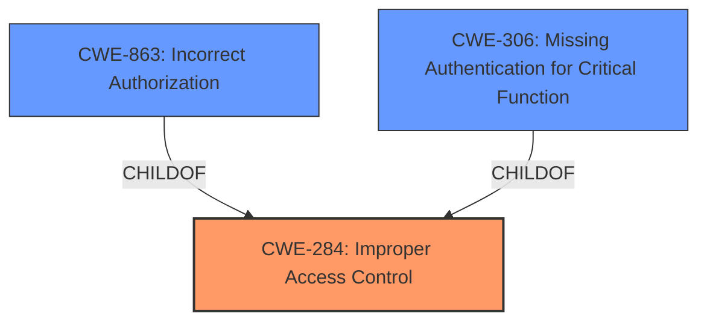

# Enhanced Analysis for CVE-2024-43717

# Summary
| CWE ID | CWE Name | Confidence | CWE Abstraction Level | CWE Vulnerability Mapping Label | CWE-Vulnerability Mapping Notes |
|---|---|---|---|---|---|
| CWE-284 | Improper Access Control | 0.8 | Pillar | Primary CWE | Allowed |

## Evidence and Confidence

*   **Confidence Score:** 0.8
*   **Evidence Strength:** HIGH

## Relationship Analysis
The primary relationship that influenced the decision was the hierarchical structure with CWE-284 as a high-level category encompassing more specific access control issues. While other CWEs like CWE-863 (Incorrect Authorization) and CWE-306 (Missing Authentication for Critical Function) were considered, the description's lack of specific detail about the exact mechanism of failure led to the selection of the more general CWE-284.



## Vulnerability Chain
The vulnerability chain starts with the **improper access control** (**ROOTCAUSE**) leading to a security feature bypass and unauthorized access (**IMPACT**). The description doesn't specify further details, so the chain is relatively short and direct.

## Summary of Analysis
The initial analysis focused on identifying the **improper access control** as the root cause. The provided evidence from the "CVE Reference Links Content Summary" explicitly mentions "**CWE-284**: Improper Access Control" as a weakness.

The guidance provided emphasizes that CWE-284 should be used when the root cause is unclear, and more specific child CWEs are not appropriate. Since the description lacks detailed information about whether the issue is due to missing authentication (CWE-306), incorrect authorization (CWE-863), or a more general access control problem, CWE-284 is the most suitable choice.

The selection of CWE-284 is based on the explicit mention of **improper access control** in both the vulnerability description and the CVE summary, combined with the absence of specific details that would warrant a more granular CWE.

Relevant CWE Information:

# Enhanced Context (25 CWEs)
The following CWEs were identified as potentially relevant to this vulnerability:

## Vulnerability Description
Adobe Experience Manager versions 6.5.21 and earlier are affected by an **Improper Access Control vulnerability** that could result in a Security feature bypass. An attacker could leverage this vulnerability to bypass security measures and gain unauthorized access. Exploitation of this issue does not require user interaction.

### Vulnerability Description Key Phrases
- **rootcause:** **improper access control**
- **impact:** security feature bypass and gain unauthorized access
- **attacker:** attacker
- **product:** Adobe Experience Manager
- **version:** 6.5.21 and earlier

### CWE for similar CVE Descriptions
### Primary CWE Match
CWE-NVD-noinfo

#### Top CWEs
- CWE-NVD-noinfo (Count: 71)
- CWE-NVD-Other (Count: 23)
- CWE-863 (Count: 5)

## CVE Reference Links Content Summary
Based on the provided information, here's an analysis of CVE-2024-43717:

**Summary:**

CVE-2024-43717 is an **Improper Access Control vulnerability** in Adobe Experience Manager (AEM). This vulnerability could allow a malicious actor to bypass security features.

**Root Cause:**

The root cause is an **improper access control** mechanism within AEM.

**Weaknesses/Vulnerabilities:**

- **CWE-284:** Improper Access Control

**Impact of Exploitation:**

Successful exploitation of this vulnerability could lead to a security feature bypass, potentially allowing an attacker to gain unauthorized access or modify the system.


## CWE Relationship Analysis

Current CWEs represent these abstraction levels: .


### Vulnerability Chain Analysis

**Chain starting from CWE-284:**
- 284 (Improper Access Control) - ROOT


**Chain starting from CWE-863:**
- 863 (Incorrect Authorization) - ROOT


### CWE Relationship Diagram

```mermaid
graph TD
    classDef primary fill:#f96,stroke:#333,stroke-width:2px
    classDef secondary fill:#69f,stroke:#333
    classDef tertiary fill:#9e9,stroke:#333
```