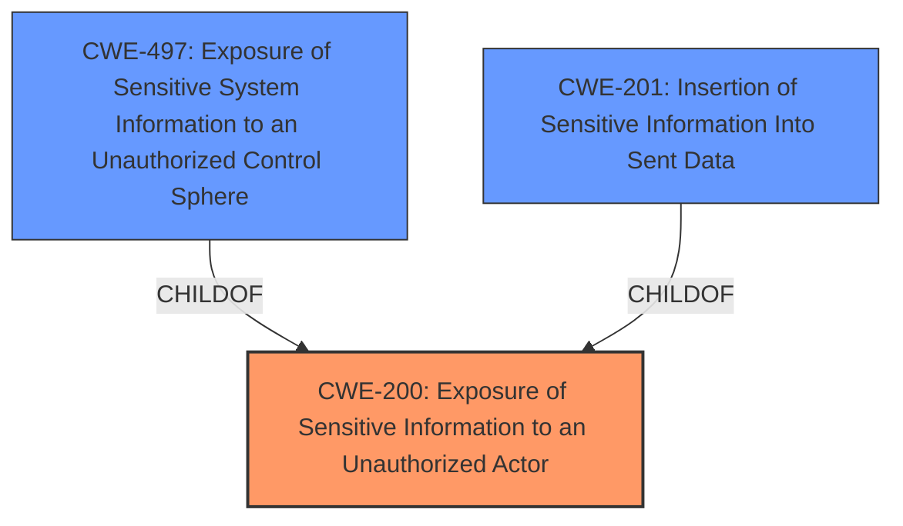

# Analysis for CVE-2024-43779

# Summary
| CWE ID | CWE Name | Confidence | CWE Abstraction Level | CWE Vulnerability Mapping Label | CWE-Vulnerability Mapping Notes |
|---|---|---|---|---|---|
| CWE-200 | Exposure of Sensitive Information to an Unauthorized Actor | 0.9 | Class | Discouraged | The product exposes sensitive information to an actor that is not explicitly authorized to have access to that information. |
| CWE-497 | Exposure of Sensitive System Information to an Unauthorized Control Sphere | 0.7 | Base | Allowed | The product does not properly prevent sensitive system-level information from being accessed by unauthorized actors who do not have the same level of access to the underlying system as the product does. |
| CWE-201 | Insertion of Sensitive Information Into Sent Data | 0.6 | Base | Allowed | The code transmits data to another actor, but a portion of the data includes sensitive information that should not be accessible to that actor. |

## Evidence and Confidence

*   **Confidence Score:** 0.8
*   **Evidence Strength:** HIGH

## Relationship Analysis
The primary relationship considered was the parent-child relationship. Specifically, CWE-200 is a class-level CWE, while CWE-497 and CWE-201 are base-level CWEs. Given the specificity of the vulnerability description, choosing a base-level CWE is preferable, but the evidence supporting CWE-497 and CWE-201 is weaker than CWE-200, making CWE-200 the primary candidate.

## Vulnerability Chain
The vulnerability chain starts with a **failure to properly restrict access to disabled vault items**, leading to **information disclosure**. The root cause is the **improper handling of access control** for these disabled items.

## Summary of Analysis
The initial assessment, supported by vulnerability descriptions and CVE reference links, points to an **information disclosure vulnerability** due to the **failure to properly restrict access** to disabled vault items. The primary CWE, CWE-200, is the best fit overall, though it is normally discouraged. The vulnerability allows authenticated users to retrieve disabled vault items through a specially crafted HTTP request, potentially leaking sensitive credentials.

CWE-200 is a Class-level CWE, and while it is generally better to choose a Base-level CWE, the evidence provided supports this classification more strongly than the other, more specific, CWEs.

Relevant CWE Information:

# Enhanced Context (25 CWEs)
The following CWEs were identified as potentially relevant to this vulnerability:

## CWE-497: Exposure of Sensitive System Information to an Unauthorized Control Sphere
**Abstraction Level**: Base
**Similarity Score**: 0.75
**Source**: dense

**Description**:
The product does not properly prevent sensitive system-level information from being accessed by unauthorized actors who do not have the same level of access to the underlying system as the product does.

**Mapping Guidance**:
- Usage: Allowed
- Rationale: This CWE entry is at the Base level of abstraction, which is a preferred level of abstraction for mapping to the root causes of vulnerabilities.

## CWE-200: Exposure of Sensitive Information to an Unauthorized Actor
**Abstraction Level**: Class
**Similarity Score**: 0.73
**Source**: dense

**Description**:
The product exposes sensitive information to an actor that is not explicitly authorized to have access to that information.

**Mapping Guidance**:
- Usage: Discouraged
- Rationale: CWE-200 is commonly misused to represent the loss of confidentiality in a vulnerability, but confidentiality loss is a technical impact - not a root cause error. As of CWE 4.9, over 400 CWE entries can lead to a loss of confidentiality. Other options are often available. [REF-1287].

## CWE-201: Insertion of Sensitive Information Into Sent Data
**Abstraction Level**: Base
**Similarity Score**: 621.10
**Source**: sparse

**Description**:
The code transmits data to another actor, but a portion of the data includes sensitive information that should not be accessible to that actor.

**Mapping Guidance**:
- Usage: Allowed
- Rationale: This CWE entry is at the Base level of abstraction, which is a preferred level of abstraction for mapping to the root causes of vulnerabilities.

## CWE-306: Missing Authentication for Critical Function
This CWE was considered and rejected because the vulnerability occurs for authenticated users, not unauthenticated users.

CWE-89, CWE-502, CWE-134, CWE-20, CWE-1287, CWE-922, CWE-1272 were also considered and rejected because they did not directly align with the specific **information disclosure vulnerability** described, which is caused by **improper access control** of disabled vault items.