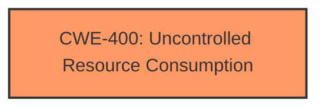

# Raw Analyzer Response for CVE-2024-43789

# Summary
| CWE ID | CWE Name | Confidence | CWE Abstraction Level | CWE Vulnerability Mapping Label | CWE-Vulnerability Mapping Notes |
|---|---|---|---|---|---|
| CWE-400 | Uncontrolled Resource Consumption | 0.8 | Class | Primary | Allowed-with-Review |

## Evidence and Confidence

*   **Confidence Score:** 0.8
*   **Evidence Strength:** MEDIUM

## Relationship Analysis
The primary relationship that influenced the decision was the parent-child relationship between CWE-400 (Uncontrolled Resource Consumption) and its potential children. While the description doesn't specify the exact resource being exhausted, the overall impact aligns with the general concept of uncontrolled resource consumption. There were also retriever results that were considered but rejected, due to not directly matching the **root cause** of the vulnerability.

## Vulnerability Chain
The vulnerability chain starts with the **lack of restrictions** on the number of replies to a post. This leads to a user being able to create a post with many replies. The user then attempts to fetch all the replies at once. This results in **uncontrolled resource consumption**, which reduces the availability of the Discourse instance.

## Summary of Analysis
The primary focus of this analysis was to identify the **root cause** of the vulnerability, which lies in the **absence of restrictions** on the number of replies to a post. This allows a malicious user to trigger a denial-of-service condition by exhausting server resources. The description clearly states, "A user can create a post with many replies, and then attempt to fetch them all at once. This can potentially reduce the availability of a Discourse instance." This aligns directly with the concept of uncontrolled resource consumption.

CWE-400 (Uncontrolled Resource Consumption) is selected as the primary CWE because it accurately represents the **root cause** and impact of the vulnerability. The weakness is a **lack of input validation or rate limiting** which allows for an excessive number of replies to a post, leading to a denial of service.

The retriever results suggested several other CWEs, but they were not as directly relevant to the **root cause** of the vulnerability:

*   CWE-201 (Insertion of Sensitive Information Into Sent Data), CWE-525 (Use of Web Browser Cache Containing Sensitive Information), CWE-1390 (Weak Authentication), CWE-863 (Incorrect Authorization), CWE-359 (Exposure of Private Personal Information to an Unauthorized Actor), CWE-837 (Improper Enforcement of a Single, Unique Action), CWE-79 (Improper Neutralization of Input During Web Page Generation ('Cross-site Scripting')), CWE-1333 (Inefficient Regular Expression Complexity), CWE-538 (Insertion of Sensitive Information into Externally-Accessible File or Directory), CWE-226 (Sensitive Information in Resource Not Removed Before Reuse): These were not chosen because the vulnerability is not about insertion of sensitive information, weak authentication, authorization, cross-site scripting or inefficient regular expressions.

Relevant CWE Information:

# Enhanced Context (25 CWEs)

## CWE-400: Uncontrolled Resource Consumption
**Abstraction Level**: Class
**Description**: The software does not properly control the consumption of resources, leading to a denial of service. This can happen because the software allows an actor to consume more resources than it is allocated, or because of **fundamental flaws in how the software manages resources**.
**Mapping Guidance**:
- Usage: Allowed-with-Review
- Rationale: This CWE entry is a Class and might have Base-level children that would be more appropriate
CWE-400 is a suitable fit because the vulnerability allows a user to consume excessive resources by creating a large number of replies and fetching them all at once. This leads to a reduction in the availability of the Discourse instance, which is a denial-of-service condition.