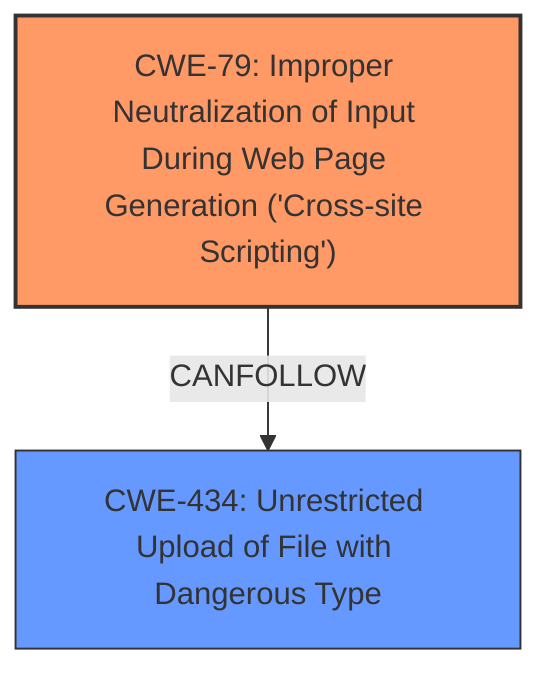

# Analysis Report for CVE-2024-43801

# Vulnerability Analysis Report: CVE-2024-43801

## Description

Jellyfin is an open source self hosted media server. The Jellyfin user profile image upload accepts SVG files, allowing for a **stored XSS attack** against an admin user via a specially crafted malicious SVG file. When viewed by an admin outside of the Jellyfin Web UI (e.g. via view image in a browser), this malicious SVG file could interact with the browsers LocalStorage and retrieve an AccessToken, which in turn can be used in an API call to elevate the target user to a Jellyfin administrator. The actual attack vector is unlikely to be exploited, as it requires specific actions by the administrator to view the SVG image outside of Jellyfins WebUI, i.e. it is not a passive attack. The underlying exploit mechanism is solved by PR #12490, which forces attached images (including the potential malicious SVG) to be treated as attachments and thus downloaded by browsers, rather than viewed. This prevents exploitation of the LocalStorage of the browser. This PR has been merged and the relevant code changes are included in release version 10.9.10. All users are advised to upgrade.

## Vulnerability Description Key Phrases

- **Weakness:** stored XSS attack
- **Impact:** access the AccessToken
- **Vector:** specially crafted malicious SVG file
- **Attacker:** Jellyfin user
- **Product:** Jellyfin
- **Version:** before 10.9.10
- **Component:** user profile image upload

## Analysis (with Relationship Data)

# Summary
| CWE ID | CWE Name | Confidence | CWE Abstraction Level | CWE Vulnerability Mapping Label | CWE-Vulnerability Mapping Notes |
|---|---|---|---|---|---|
| CWE-79 | Improper Neutralization of Input During Web Page Generation ('Cross-site Scripting') | 1.0 | Base | Allowed | Primary CWE. The root cause is the **stored XSS attack** due to the acceptance of SVG files without proper neutralization. |
| CWE-434 | Unrestricted Upload of File with Dangerous Type | 0.8 | Base | Allowed | Secondary Candidate. The vulnerability exists because the application allows the upload of SVG files, which can contain malicious code. |

## Evidence and Confidence

*   **Confidence Score:** 0.9
*   **Evidence Strength:** HIGH

## Relationship Analysis
The primary weakness is CWE-79, which is triggered by uploading a file with a dangerous type, CWE-434. CWE-79 is at the Base level, which is a preferred level for mapping.



## Vulnerability Chain
1.  **Unrestricted File Upload (CWE-434):** A user can upload an SVG file.
2.  **Improper Neutralization of Input During Web Page Generation (CWE-79):** The SVG file contains malicious JavaScript that is executed when the image is viewed, leading to a **stored XSS attack**.
3.  **Privilege Escalation:** The XSS attack allows an attacker to access the AccessToken and escalate privileges.
4.  **Remote Code Execution:** By adding a malicious plugin repository and installing a malicious plugin.

## Summary of Analysis
The primary weakness is CWE-79, as the root cause is the **improper neutralization of input**, leading to a **stored XSS attack**. This is supported by the vulnerability description and CVE reference links. The application allows the upload of SVG files (CWE-434), which facilitates the XSS attack, making it a secondary concern. The relationship analysis shows that CWE-434 can precede CWE-79 in a vulnerability chain.

The vulnerability description clearly states, "The Jellyfin user profile image upload accepts SVG files, allowing for a **stored XSS attack** against an admin user via a specially crafted malicious SVG file." This directly supports the selection of CWE-79. The CVE Reference Links Content Summary also states "**Stored Cross-Site Scripting (XSS):** Malicious JavaScript code embedded within a crafted SVG file is stored on the server. When this SVG is viewed, the JavaScript executes."

The retriever results also list CWE-79 and CWE-434 as high-scoring candidates.

Relevant CWE Information:

# Enhanced Context (25 CWEs)
The following CWEs were identified as potentially relevant to this vulnerability:

## CWE-434: Unrestricted Upload of File with Dangerous Type
**Abstraction Level**: Base
**Similarity Score**: 0.77
**Source**: dense

**Description**:
The product allows the upload or transfer of dangerous file types that are automatically processed within its environment.

**Mapping Guidance**:
- Usage: Allowed
- Rationale: This CWE entry is at the Base level of abstraction, which is a preferred level of abstraction for mapping to the root causes of vulnerabilities.

## CWE-79: Improper Neutralization of Input During Web Page Generation ('Cross-site Scripting')
**Abstraction Level**: Base
**Similarity Score**: 0.75
**Source**: dense

**Description**:
The product does not neutralize or incorrectly neutralizes user-controllable input before it is placed in output that is used as a web page that is served to other users.

**Mapping Guidance**:
- Usage: Allowed
- Rationale: This CWE entry is at the Base level of abstraction, which is a preferred level of abstraction for mapping to the root causes of vulnerabilities.


## CWE Relationship Analysis

Current CWEs represent these abstraction levels: .


### Vulnerability Chain Analysis

**Chain starting from CWE-79:**
- 79 (Improper Neutralization of Input During Web Page Generation ('Cross-site Scripting')) - ROOT


**Chain starting from CWE-434:**
- 434 (Unrestricted Upload of File with Dangerous Type) - ROOT


### CWE Relationship Diagram

```mermaid
graph TD
    classDef primary fill:#f96,stroke:#333,stroke-width:2px
    classDef secondary fill:#69f,stroke:#333
    classDef tertiary fill:#9e9,stroke:#333
```


*Report generated on 2025-07-13 15:15:12*
