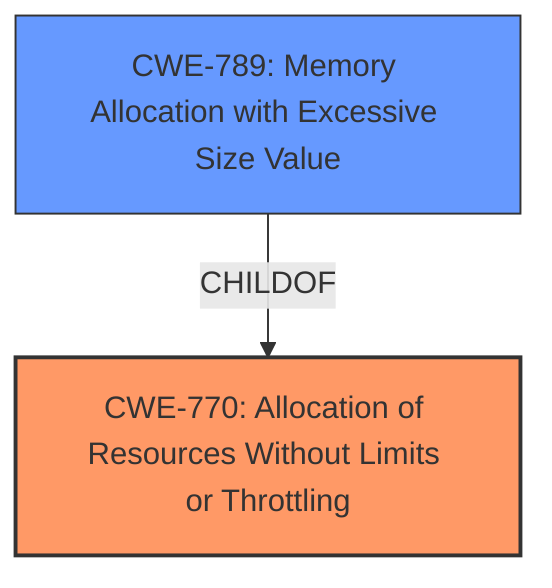

# Analysis Report for CVE-2024-43806

# Vulnerability Analysis Report: CVE-2024-43806

## Description

Rustix is a set of safe Rust bindings to POSIX-ish APIs. When using `rustixfsDir` using the `linux_raw` backend, its possible for the iterator to get stuck when an IO error is encountered. Combined with a **memory over-allocation** issue in `rustixfsDirread_more`, this can cause quick and unbounded memory explosion (gigabytes in a few seconds if used on a hot path) and eventually lead to an OOM crash of the application. The symptoms were initially discovered in https//github.com/imsnif/bandwhich/issues/284. That post has lots of details of our investigation. Full details can be read on the GHSA-c827-hfw6-qwvm repo advisory. If a program tries to access a directory with its file descriptor after the file has been unlinked (or any other action that leaves the `Dir` iterator in the stuck state), and the implementation does not break after seeing an error, it can cause a memory explosion. As an example, Linuxs various virtual file systems (e.g. `/proc`, `/sys`) can contain directories that spontaneously pop in and out of existence. Attempting to iterate over them using `rustixfsDir` directly or indirectly (e.g. with the `procfs` crate) can trigger this fault condition if the implementation decides to continue on errors. An attacker knowledgeable about the implementation details of a vulnerable target can therefore try to trigger this fault condition via any one or a combination of several available APIs. If successful, the application host will quickly run out of m

## Vulnerability Description Key Phrases

- **Rootcause:** memory over-allocation
- **Impact:** ['memory explosion', 'OOM crash']
- **Product:** Rustix
- **Component:** rustixfsDir

## Analysis (with Relationship Data)

# Summary
| CWE ID | CWE Name | Confidence | CWE Abstraction Level | CWE Vulnerability Mapping Label | CWE-Vulnerability Mapping Notes |
|---|---|---|---|---|---|
| CWE-770 | Allocation of Resources Without Limits or Throttling | 0.9 | Base | Allowed | Primary CWE. The application allocates memory without proper limits, leading to a denial-of-service. |
| CWE-789 | Memory Allocation with Excessive Size Value | 0.8 | Variant | Allowed | Secondary CWE. The allocated memory is based on a size value that could be excessively large, exacerbating the resource exhaustion. |

## Evidence and Confidence

*   **Confidence Score:** 0.85
*   **Evidence Strength:** HIGH

## Relationship Analysis
The primary weakness is CWE-770, which describes the **allocation of resources without limits or throttling**. CWE-789, **memory allocation with excessive size value**, is a variant of CWE-770, and it describes more specifically that the size of the allocated memory is excessive. The relationship is hierarchical: CWE-789 is a child of CWE-770. Choosing CWE-770 as the primary weakness and CWE-789 as the secondary weakness provides a more complete picture of the vulnerability.



## Vulnerability Chain
The vulnerability chain starts with the **improper allocation of memory** without limits (CWE-770). This leads to the allocation of an excessive amount of memory (CWE-789), which eventually causes a memory explosion and an out-of-memory (OOM) crash, resulting in a denial-of-service.

## Summary of Analysis
The analysis is based on the provided evidence, specifically the "**memory over-allocation**" issue described in the vulnerability description and the analysis of the CVE reference links, which highlights the unbounded memory growth due to incorrect buffer resizing. The retriever results also strongly suggest CWE-770 and CWE-789.

The decision to select CWE-770 as the primary weakness is based on its broader applicability to the vulnerability, as it encompasses the root cause of the issue. CWE-789 provides further specificity by highlighting the excessive size value used in the memory allocation, exacerbating the vulnerability.

The selected CWEs are at the optimal level of specificity because they accurately represent the root cause and contributing factors to the vulnerability, as evidenced by the vulnerability description and the CVE reference links content summary.

Relevant CWE Information:

# Enhanced Context (25 CWEs)
The following CWEs were identified as potentially relevant to this vulnerability:

## CWE-789: Memory Allocation with Excessive Size Value
**Abstraction Level**: Variant
**Similarity Score**: 0.73
**Source**: dense

**Description**:
The product allocates memory based on an untrusted, large size value, but it does not ensure that the size is within expected limits, allowing arbitrary amounts of memory to be allocated.

**Mapping Guidance**:
- Usage: Allowed
- Rationale: This CWE entry is at the Variant level of abstraction, which is a preferred level of abstraction for mapping to the root causes of vulnerabilities.


## CWE-367: Time-of-check Time-of-use (TOCTOU) Race Condition
**Abstraction Level**: Base
**Similarity Score**: 0.71
**Source**: dense

**Description**:
The product checks the state of a resource before using that resource, but the resource's state can change between the check and the use in a way that invalidates the results of the check. This can cause the product to perform invalid actions when the resource is in an unexpected state.

**Mapping Guidance**:
- Usage: Allowed
- Rationale: This CWE entry is at the Base level of abstraction, which is a preferred level of abstraction for mapping to the root causes of vulnerabilities.


## CWE-362: Concurrent Execution using Shared Resource with Improper Synchronization ('Race Condition')
**Abstraction Level**: Class
**Similarity Score**: 0.71
**Source**: dense

**Description**:
The product contains a concurrent code sequence that requires temporary, exclusive access to a shared resource, but a timing window exists in which the shared resource can be modified by another code sequence operating concurrently.

**Mapping Guidance**:
- Usage: Allowed-with-Review
- Rationale: This CWE entry is a Class and might have Base-level children that would be more appropriate


## CWE-755: Improper Handling of Exceptional Conditions
**Abstraction Level**: Class
**Similarity Score**: 0.70
**Source**: dense

**Description**:
The product does not handle or incorrectly handles an exceptional condition.

**Mapping Guidance**:
- Usage: Discouraged
- Rationale: This CWE entry is a level-1 Class (i.e., a child of a Pillar). It might have lower-level children that would be more appropriate


## CWE-674: Uncontrolled Recursion
**Abstraction Level**: Class
**Similarity Score**: 0.69
**Source**: dense

**Description**:
The product does not properly control the amount of recursion that takes place,  consuming excessive resources, such as allocated memory or the program stack.

**Mapping Guidance**:
- Usage: Allowed-with-Review
- Rationale: This CWE entry is a Class and might have Base-level children that would be more appropriate


## CWE-125: Out-of-bounds Read
**Abstraction Level**: Base
**Similarity Score**: 0.69
**Source**: dense

**Description**:
The product reads data past the end, or before the beginning, of the intended buffer.

**Mapping Guidance**:
- Usage: Allowed
- Rationale: This CWE entry is at the Base level of abstraction, which is a preferred level of abstraction for mapping to the root causes of vulnerabilities.


## CWE-770: Allocation of Resources Without Limits or Throttling
**Abstraction Level**: Base
**Similarity Score**: 0.69
**Source**: dense

**Description**:
The product allocates a reusable resource or group of resources on behalf of an actor without imposing any restrictions on the size or number of resources that can be allocated, in violation of the intended security policy for that actor.

**Mapping Guidance**:
- Usage: Allowed
- Rationale: This CWE entry is at the Base level of abstraction, which is a preferred level of abstraction for mapping to the root causes of vulnerabilities.


## CWE-252: Unchecked Return Value
**Abstraction Level**: Base
**Similarity Score**: 0.69
**Source**: dense

**Description**:
The product does not check the return value from a method or function, which can prevent it from detecting unexpected states and conditions.

**Mapping Guidance**:
- Usage: Allowed
- Rationale: This CWE entry is at the Base level of abstraction, which is a preferred level of abstraction for mapping to the root causes of vulnerabilities.


## CWE-119: Improper Restriction of Operations within the Bounds of a Memory Buffer
**Abstraction Level**: Class
**Similarity Score**: 0.69
**Source**: dense

**Description**:
The product performs operations on a memory buffer, but it reads from or writes to a memory location outside the buffer's intended boundary. This may result in read or write operations on unexpected memory locations that could be linked to other variables, data structures, or internal program data.

**Mapping Guidance**:
- Usage: Discouraged
- Rationale: CWE-119 is commonly misused in low-information vulnerability reports when lower-level CWEs could be used instead, or when more details about the vulnerability are available.


## CWE-617: Reachable Assertion
**Abstraction Level**: Base
**Similarity Score**: 0.69
**Source**: dense

**Description**:
The product contains an assert() or similar statement that can be triggered by an attacker, which leads to an application exit or other behavior that is more severe than necessary.

**Mapping Guidance**:
- Usage: Allowed
- Rationale: This CWE entry is at the Base level of abstraction, which is a preferred level of abstraction for mapping to the root causes of vulnerabilities.


## CWE-1284: Improper Validation of Specified Quantity in Input
**Abstraction Level**: Base
**Similarity Score**: 1399.31
**Source**: sparse

**Description**:
The product receives input that is expected to specify a quantity (such as size or length), but it does not validate or incorrectly validates that the quantity has the required properties.

**Mapping Guidance**:
- Usage: Allowed
- Rationale: This CWE entry is at the Base level of abstraction, which is a preferred level of abstraction for mapping to the root causes of vulnerabilities.


## CWE-789: Memory Allocation with Excessive Size Value
**Abstraction Level**: Variant
**Similarity Score**: 1387.96
**Source**: sparse

**Description**:
The product allocates memory based on an untrusted, large size value,


## CWE Relationship Analysis

Current CWEs represent these abstraction levels: .


### Vulnerability Chain Analysis

**Chain starting from CWE-617:**
- 617 (Reachable Assertion) - ROOT


**Chain starting from CWE-1284:**
- 1284 (Improper Validation of Specified Quantity in Input) - ROOT


### CWE Relationship Diagram

```mermaid
graph TD
    classDef primary fill:#f96,stroke:#333,stroke-width:2px
    classDef secondary fill:#69f,stroke:#333
    classDef tertiary fill:#9e9,stroke:#333
```


*Report generated on 2025-07-13 15:15:56*
