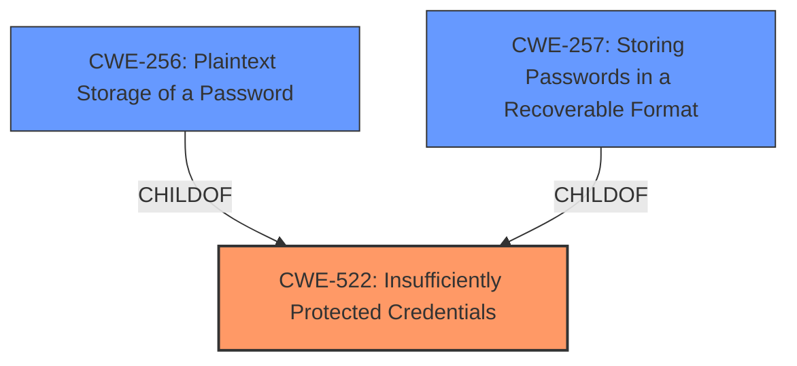

# Raw Analyzer Response for CVE-2024-43812

# Summary

| CWE ID  | CWE Name                                                     | Confidence | CWE Abstraction Level | CWE Vulnerability Mapping Label | CWE-Vulnerability Mapping Notes |
| :-------- | :----------------------------------------------------------- | :--------- | :-------------------- | :------------------------------ | :------------------------------ |
| CWE-522 | Insufficiently Protected Credentials                         | 1          | Class                 | Primary CWE                       | Allowed-with-Review             |
| CWE-256 | Plaintext Storage of a Password                             | 0.7        | Base                  | Secondary Candidate               | Allowed                         |
| CWE-257 | Storing Passwords in a Recoverable Format                    | 0.7        | Base                  | Secondary Candidate               | Allowed                         |

## Evidence and Confidence

*   **Confidence Score:** 0.8
*   **Evidence Strength:** HIGH

## Relationship Analysis

The primary CWE identified is CWE-522, a Class-level CWE indicating the presence of **insufficiently protected credentials**. The retriever results suggest exploring more specific Base-level CWEs related to credential storage. Specifically, CWE-256 (Plaintext Storage of a Password) and CWE-257 (Storing Passwords in a Recoverable Format) are considered due to their relevance to how credentials might be insufficiently protected. These are child or peer relationships that could be considered.

## Vulnerability Chain

The vulnerability chain starts with **insufficiently protected credentials** (CWE-522), leading to the exposure of password hashes. This exposure enables an unauthenticated attacker with access to `/etc/passwd` to read these hashes. If the hashes are easily crackable due to weak algorithms or other factors, it could lead to unauthorized access and control of the system.

## Summary of Analysis

The initial assessment points to CWE-522 (Insufficiently Protected Credentials) as the primary weakness. The vulnerability description and the CVE Reference Links Content Summary explicitly mention "**insufficiently protected credentials**" as the root cause. The retriever results also list CWE-522 as the top candidate. While CWE-522 is a Class-level CWE, the evidence provided doesn't give enough information to determine if the credentials are in plaintext (CWE-256) or in a recoverable format (CWE-257), so I am keeping the selection as CWE-522.

The other CWEs listed in the retriever results, such as CWE-798 (Use of Hard-coded Credentials), CWE-668 (Exposure of Resource to Wrong Sphere), CWE-331 (Insufficient Entropy), CWE-916 (Use of Password Hash With Insufficient Computational Effort), CWE-912 (Hidden Functionality), CWE-836 (Use of Password Hash Instead of Password for Authentication), and CWE-942 (Permissive Cross-domain Policy with Untrusted Domains) are not directly supported by the provided evidence. These alternative suggestions were not selected, because there was no evidence to support them.

Relevant CWE Information:

# Enhanced Context (25 CWEs)

## CWE-916: Use of Password Hash With Insufficient Computational Effort
**Abstraction Level**: Base
**Similarity Score**: 0.78
**Source**: dense

**Description**:
The product generates a hash for a password, but it uses a scheme that does not provide a sufficient level of computational effort that would make password cracking attacks infeasible or expensive.

**Mapping Guidance**:
- Usage: Allowed
- Rationale: This CWE entry is at the Base level of abstraction, which is a preferred level of abstraction for mapping to the root causes of vulnerabilities.

*Not Selected:* There is no direct evidence the hash algorithm is weak.

## CWE-1391: Use of Weak Credentials
**Abstraction Level**: Class
**Similarity Score**: 0.77
**Source**: dense

**Description**:
The product uses weak credentials (such as a default key or hard-coded password) that can be calculated, derived, reused, or guessed by an attacker.

**Mapping Guidance**:
- Usage: Allowed-with-Review
- Rationale: This CWE entry is a Class and might have Base-level children that would be more appropriate

*Not Selected:* There is no evidence to suggest the credentials themselves are weak.

## CWE-798: Use of Hard-coded Credentials
**Abstraction Level**: Base
**Similarity Score**: 0.76
**Source**: dense

**Description**:
The product contains hard-coded credentials, such as a password or cryptographic key.

**Mapping Guidance**:
- Usage: Allowed
- Rationale: This CWE entry is at the Base level of abstraction, which is a preferred level of abstraction for mapping to the root causes of vulnerabilities.

*Not Selected:* There is no evidence to suggest the credentials are hardcoded.

## CWE-257: Storing Passwords in a Recoverable Format
**Abstraction Level**: Base
**Similarity Score**: 0.75
**Source**: dense

**Description**:
The storage of passwords in a recoverable format makes them subject to password reuse attacks by malicious users. In fact, it should be noted that recoverable encrypted passwords provide no significant benefit over plaintext passwords since they are subject not only to reuse by malicious attackers but also by malicious insiders. If a system administrator can recover a password directly, or use a brute force search on the available information, the administrator can use the password on other accounts.

**Mapping Guidance**:
- Usage: Allowed
- Rationale: This CWE entry is at the Base level of abstraction, which is a preferred level of abstraction for mapping to the root causes of vulnerabilities.

*Secondary Candidate:* It is possible the passwords are in a recoverable format, however there is no evidence to confirm this.

## CWE-288: Authentication Bypass Using an Alternate Path or Channel
**Abstraction Level**: Base
**Similarity Score**: 0.74
**Source**: dense

**Description**:
The product requires authentication, but the product has an alternate path or channel that does not require authentication.

**Mapping Guidance**:
- Usage: Allowed
- Rationale: This CWE entry is at the Base level of abstraction, which is a preferred level of abstraction for mapping to the root causes of vulnerabilities.

*Not Selected:* This is not an authentication bypass issue.

## CWE-522: Insufficiently Protected Credentials
**Abstraction Level**: Class
**Similarity Score**: 0.73
**Source**: dense

**Description**:
The product transmits or stores authentication credentials, but it uses an insecure method that is susceptible to unauthorized interception and/or retrieval.

**Mapping Guidance**:
- Usage: Allowed-with-Review
- Rationale: This CWE entry is a Class and might have Base-level children that would be more appropriate

*Selected as Primary CWE:* The vulnerability description and the CVE Reference Links Content Summary explicitly mention "**insufficiently protected credentials**" as the root cause.

## CWE-312: Cleartext Storage of Sensitive Information
**Abstraction Level**: Base
**Similarity Score**: 0.73
**Source**: dense

**Description**:
The product stores sensitive information in cleartext within a resource that might be accessible to another control sphere.

**Mapping Guidance**:
- Usage: Allowed
- Rationale: This CWE entry is at the Base level of abstraction, which is a preferred level of abstraction for mapping to the root causes of vulnerabilities.

*Not Selected:* The issue is specific to the protection of credentials, not sensitive information generally.

## CWE-256: Plaintext Storage of a Password
**Abstraction Level**: Base
**Similarity Score**: 0.73
**Source**: dense

**Description**:
Storing a password in plaintext may result in a system compromise.

**Mapping Guidance**:
- Usage: Allowed
- Rationale: This CWE entry is at the Base level of abstraction, which is a preferred level of abstraction for mapping to the root causes of vulnerabilities.

*Secondary Candidate:* It is possible the passwords are in plaintext, however there is no evidence to confirm this.

## CWE-303: Incorrect Implementation of Authentication Algorithm
**Abstraction Level**: Base
**Similarity Score**: 0.73
**Source**: dense

**Description**:
The requirements for the product dictate the use of an established authentication algorithm, but the implementation of the algorithm is incorrect.

**Mapping Guidance**:
- Usage: Allowed
- Rationale: This CWE entry is at the Base level of abstraction, which is a preferred level of abstraction for mapping to the root causes of vulnerabilities.

*Not Selected:* There is no evidence that the authentication algorithm is implemented incorrectly.

## CWE-1392: Use of Default Credentials
**Abstraction Level**: Base
**Similarity Score**: 0.73
**Source**: dense

**Description**:
The product uses