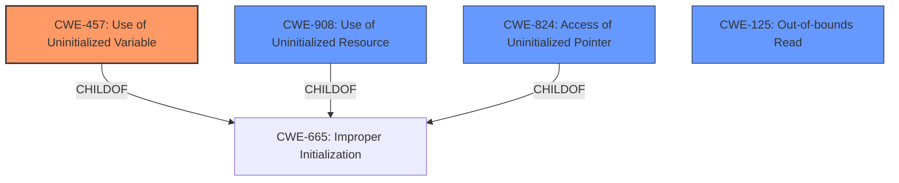

# Analysis Report for CVE-2024-43845

# Vulnerability Analysis Report: CVE-2024-43845

## Description

In the Linux kernel, the following vulnerability has been resolved udf Fix bogus checksum computation in udf_rename() Syzbot reports **uninitialized memory access in udf_rename()** when updating checksum of .. directory entry of a moved directory. This is indeed true as we pass on-stack diriter.fi to the udf_update_tag() and because that has only struct fileIdentDesc included in it and not the impUse or name fields, the checksumming function is going to checksum random stack contents beyond the end of the structure. This is actually harmless because the following udf_fiiter_write_fi() will recompute the checksum from on-disk buffers where everything is properly included. So all that is needed is just removing the bogus calculation.

## Vulnerability Description Key Phrases

- **Rootcause:** uninitialized memory access in udf_rename()
- **Impact:** bogus checksum computation
- **Product:** Linux kernel
- **Component:** udf

## Analysis (with Relationship Data)

# Summary

| CWE ID  | CWE Name                                                                                 | Confidence | CWE Abstraction Level | CWE Vulnerability Mapping Label | CWE-Vulnerability Mapping Notes |
| :-------- | :----------------------------------------------------------------------------------------- | :--------- | :---------------------- | :------------------------------ | :------------------------------ |
| CWE-457   | Use of Uninitialized Variable                                                              | 0.9        | Variant                 | Allowed                       | Primary CWE                     |
| CWE-125   | Out-of-bounds Read                                                                         | 0.7        | Base                    | Allowed                       | Secondary Candidate             |
| CWE-908   | Use of Uninitialized Resource                                                              | 0.6        | Base                    | Allowed                       | Secondary Candidate             |

## Evidence and Confidence

*   **Confidence Score:** 0.8
*   **Evidence Strength:** MEDIUM

## Relationship Analysis

The primary relationship influencing the CWE selection is the child-of relationship between **CWE-457** and its parent **CWE-665 Improper Initialization**. While **CWE-665** is a broader category, **CWE-457** specifically addresses the use of an uninitialized variable, which aligns more precisely with the vulnerability description. **CWE-908 Use of Uninitialized Resource** and **CWE-824 Access of Uninitialized Pointer** are siblings to **CWE-457** under **CWE-665**, but the description explicitly mentions the use of the uninitialized memory.
**CWE-125** is added as a secondary issue due to the checksum function accessing memory beyond the intended structure.



## Vulnerability Chain

The vulnerability chain starts with the **missing initialization** of the `impUse` or `name` fields in the `diriter.fi` structure. This leads to **CWE-457 Use of Uninitialized Variable** because the checksum calculation uses this uninitialized memory. The checksumming function reads beyond the allocated structure (fileIdentDesc) leading to **CWE-125 Out-of-bounds Read**. The impact is a bogus checksum computation, although it's later corrected.

## Summary of Analysis

The primary assessment is based on the vulnerability description and the "CVE Reference Links Content Summary". The key phrase "**uninitialized memory access in udf_rename()**" points to the use of uninitialized data. The summary states "the on-stack `diriter.fi` structure...only includes the `fileIdentDesc` and not the `impUse` or `name` fields. Consequently, `udf_update_tag()` checksums random stack memory contents beyond the structure's boundary." This confirms that uninitialized memory is being used in the checksum calculation. The retriever results also suggest **CWE-457**, **CWE-824 Access of Uninitialized Pointer**, and **CWE-908**.

**CWE-457 Use of Uninitialized Variable** is selected as the primary CWE because it is the most specific description of the root cause. **CWE-908 Use of Uninitialized Resource** and **CWE-824 Access of Uninitialized Pointer** are closely related and could be considered, but **CWE-457** is preferred because it specifically describes the use of an uninitialized *variable*, which aligns with the details in the vulnerability description. **CWE-125 Out-of-bounds Read** is included as a secondary issue as the checksum function reads beyond the allocated structure leading to an out-of-bounds memory read.

Relevant CWE Information:
**CWE-457**: The product uses a variable that has not been initialized, leading to predictable, and potentially sensitive, information.
**CWE-125**: The product reads data past the end, or before the beginning, of the intended buffer.
**CWE-908**: The product uses or accesses a resource that has not been initialized.


## CWE Relationship Analysis

Current CWEs represent these abstraction levels: .


### Vulnerability Chain Analysis

**Chain starting from CWE-457:**
- 457 (Use of Uninitialized Variable) - ROOT


**Chain starting from CWE-125:**
- 125 (Out-of-bounds Read) - ROOT


### CWE Relationship Diagram

```mermaid
graph TD
    classDef primary fill:#f96,stroke:#333,stroke-width:2px
    classDef secondary fill:#69f,stroke:#333
    classDef tertiary fill:#9e9,stroke:#333
```


*Report generated on 2025-07-13 15:17:36*
