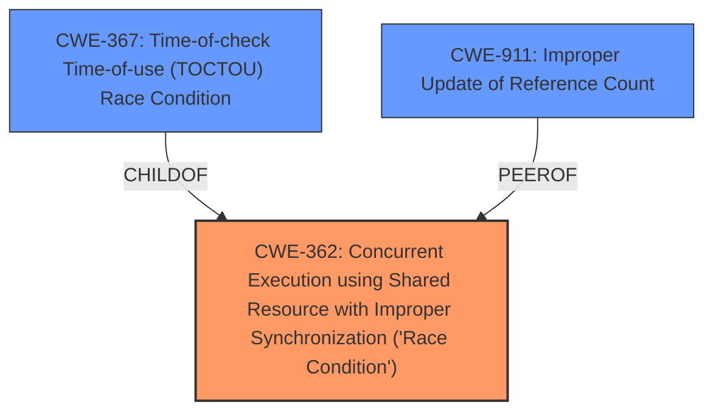

# Analysis for CVE-2024-43887

# Summary
| CWE ID | CWE Name | Confidence | CWE Abstraction Level | CWE Vulnerability Mapping Label | CWE-Vulnerability Mapping Notes |
|---|---|---|---|---|---|
| **CWE-362** | Concurrent Execution using Shared Resource with Improper Synchronization ('Race Condition') | 0.9 | Class | Primary | Allowed-with-Review |
| CWE-367 | Time-of-check Time-of-use (TOCTOU) Race Condition | 0.7 | Base | Secondary | Allowed |
| CWE-911 | Improper Update of Reference Count | 0.6 | Base | Secondary | Allowed |

## Evidence and Confidence

*   **Confidence Score:** 0.8
*   **Evidence Strength:** MEDIUM

## Relationship Analysis
The primary CWE is CWE-362, which is a Class-level CWE. A more specific Base-level CWE related to race conditions is CWE-367, a Time-of-check Time-of-use (TOCTOU) Race Condition. While TOCTOU captures part of the problem, the vulnerability involves a more general race condition related to the enabling/disabling of a static key and the use of `static_key_fast_inc_not_disabled()`. CWE-911 is included as a possible secondary CWE because the incorrect management of the static key can be interpreted as an improper update of a reference count.

## Vulnerability Chain
The vulnerability chain starts with the **improper use of a static key** within the TCP-AO implementation. This leads to a **race condition** during socket destruction due to the deferred destruction of the static key. The race condition breaks the assumption of `static_key_fast_inc_not_disabled()`, potentially leading to a use-after-free condition and a kernel panic.

## Summary of Analysis
The primary weakness is a race condition that arises from the improper management of a static key in the Linux kernel's TCP-AO implementation. The evidence supports mapping this to CWE-362 (Concurrent Execution using Shared Resource with Improper Synchronization ('Race Condition')). Although the description also mentions an **overflow**, the root cause is the race condition, not the overflow itself. The retriever results also suggest CWE-190 (Integer Overflow or Wraparound), but this is misleading; the vulnerability is not directly related to an integer overflow in the classic sense.

The evidence for CWE-362 is derived from the following key phrases:
*   "RCU grace period is delayed by more than a second and tcp_ao_needed is in the process of disablement, other CPUs may yet see tcp_ao_info which atent dead, but soon-to-be."
*   "And that breaks the assumption of static_key_fast_inc_not_disabled()."
*   "But it must not be used if the static branch could get disabled in parallel as its not prote"

The selection of CWE-362 is at the Class level because it accurately represents the generic concurrent execution problem. While a more specific CWE like CWE-367 (TOCTOU) is considered, it does not fully capture the nature of the race condition. CWE-911 is included because the incorrect handling can be viewed as an improper update to a reference count.

Other CWEs considered but not used:

*   CWE-190 (Integer Overflow or Wraparound): While the description mentions "overflow," it is in the context of a comment about a previous fix and is not the direct cause of the vulnerability described.
*   CWE-119 (Improper Restriction of Operations within the Bounds of a Memory Buffer): This is too generic and does not accurately reflect the root cause of the vulnerability.
*   CWE-120 (Buffer Copy without Checking Size of Input ('Classic Buffer Overflow')): This is not relevant as the vulnerability is not related to a buffer copy operation.
*   CWE-321 (Use of Hard-coded Cryptographic Key), CWE-1204 (Generation of Weak Initialization Vector (IV)), CWE-1391 (Use of Weak Credentials), CWE-639 (Authorization Bypass Through User-Controlled Key), and CWE-327 (Use of a Broken or Risky Cryptographic Algorithm): These are all related to cryptographic issues, which are not relevant to the vulnerability described.
*   CWE-259 (Use of Hard-coded Password): This is not relevant as the vulnerability is not related to the use of a hard-coded password.

# Enhanced Context (25 CWEs)
The following CWEs were identified as potentially relevant to this vulnerability:

## CWE-362: Concurrent Execution using Shared Resource with Improper Synchronization ('Race Condition')
**Abstraction Level**: Class
**Similarity Score**: 0.75
**Source**: dense

**Description**:
The product contains a concurrent code sequence that requires temporary, exclusive access to a shared resource, but a timing window exists in which the shared resource can be modified by another code sequence operating concurrently.

**Mapping Guidance**:
- Usage: Allowed-with-Review
- Rationale: This CWE entry is a Class and might have Base-level children that would be more appropriate

## CWE-667: Improper Locking
**Abstraction Level**: Class
**Similarity Score**: 0.75
**Source**: dense

**Description**:
The product does not properly acquire or release a lock on a resource, leading to unexpected resource state changes and behaviors.

**Mapping Guidance**:
- Usage: Allowed-with-Review
- Rationale: This CWE entry is a Class and might have Base-level children that would be more appropriate

## CWE-755: Improper Handling of Exceptional Conditions
**Abstraction Level**: Class
**Similarity Score**: 0.74
**Source**: dense

**Description**:
The product does not handle or incorrectly handles an exceptional condition.

**Mapping Guidance**:
- Usage: Discouraged
- Rationale: This CWE entry is a level-1 Class (i.e., a child of a Pillar). It might have lower-level children that would be more appropriate

## CWE-367: Time-of-check Time-of-use (TOCTOU) Race Condition
**Abstraction Level**: Base
**Similarity Score**: 0.74
**Source**: dense

**Description**:
The product checks the state of a resource before using that resource, but the resource's state can change between the check and the use in a way that invalidates the results of the check. This can cause the product to perform invalid actions when the resource is in an unexpected state.

**Mapping Guidance**:
- Usage: Allowed
- Rationale: This CWE entry is at the Base level of abstraction, which is a preferred level of abstraction for mapping to the root causes of vulnerabilities.

## CWE-824: Access of Uninitialized Pointer
**Abstraction Level**: Base
**Similarity Score**: 0.74
**Source**: dense

**Description**:
The product accesses or uses a pointer that has not been initialized.

**Mapping Guidance**:
- Usage: Allowed
- Rationale: This CWE entry is at the Base level of abstraction, which is a preferred level of abstraction for mapping to the root causes of vulnerabilities.

## CWE-131: Incorrect Calculation of Buffer Size
**Abstraction Level**: Base
**Similarity Score**: 0.74
**Source**: dense

**Description**:
The product does not correctly calculate the size to be used when allocating a buffer, which could lead to a buffer overflow.

**Mapping Guidance**:
- Usage: Allowed
- Rationale: This CWE entry is at the Base level of abstraction, which is a preferred level of abstraction for mapping to the root causes of vulnerabilities.

## CWE-191: Integer Underflow (Wrap or Wraparound)
**Abstraction Level**: Base
**Similarity Score**: 0.74
**Source**: dense

**Description**:
The product subtracts one value from another, such that the result is less than the minimum allowable integer value, which produces a value that is not equal to the correct result.

**Mapping Guidance**:
- Usage: Allowed
- Rationale: This CWE entry is at the Base level of abstraction, which is a preferred level of abstraction for mapping to the root causes of vulnerabilities.

## CWE-754: Improper Check for Unusual or Exceptional Conditions
**Abstraction Level**: Class
**Similarity Score**: 0.74
**Source**: dense

**Description**:
The product does not check or incorrectly checks for unusual or exceptional conditions that are not expected to occur frequently during day to day operation of the product.

**Mapping Guidance**:
- Usage: Allowed-with-Review
- R