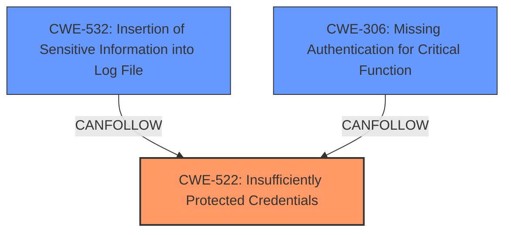

# Enhanced Analysis for CVE-2024-44000

# Summary
| CWE ID | CWE Name | Confidence | CWE Abstraction Level | CWE Vulnerability Mapping Label | CWE-Vulnerability Mapping Notes |
|---|---|---|---|---|---|
| CWE-522 | Insufficiently Protected Credentials | 0.9 | Class | Allowed-with-Review | Primary CWE. The credentials (cookies) were logged, but not properly protected, leading to exposure |
| CWE-532 | Insertion of Sensitive Information into Log File | 0.8 | Base | Allowed | Secondary. The root cause was the insertion of sensitive information into the log file. |
| CWE-306 | Missing Authentication for Critical Function | 0.6 | Base | Allowed | Secondary. If the debug log file was publicly accessible, then there was **missing authentication** to access the log file. |

## Evidence and Confidence

*   **Confidence Score:** 0.8
*   **Evidence Strength:** HIGH

## Relationship Analysis
The primary relationship is that CWE-522 is a class level CWE and there are more specific base level CWEs that could be considered. However, given that the key weakness is that credentials are **insufficiently protected**, CWE-522 is the best fit, though it is a Class level.

CWE-532 is related because the credentials ended up in a log file. CWE-306 is related because if the log file was publicly accessible, there was **missing authentication** to the debug log file.



## Vulnerability Chain
The vulnerability chain starts with the **insufficient protection** of credentials (cookies), leading to the insertion of sensitive information into a log file, and then potentially **missing authentication** to access the log file.

## Summary of Analysis
The primary weakness is the **insufficient protection** of credentials, which led to the logging of sensitive information and potential unauthorized access. The selection of CWE-522 is based on the vulnerability description and the retriever results, which both highlight the issue of **insufficiently protected credentials**. The relationship graph shows how the insertion of sensitive information into the log file and the **missing authentication** contribute to the overall vulnerability.

The evidence for this assessment is primarily based on the "CVE Reference Links Content Summary" section of the provided input. Specifically, the following points support the selection of CWE-522:

*   "The LiteSpeed Cache plugin's debug logging feature was improperly implemented. It logged sensitive information, specifically HTTP response headers including "Set-Cookie" headers and optionally, the request cookies themselves, into the debug log file."
*   "An attacker could potentially extract these cookies from the log file, allowing them to impersonate logged-in users, leading to account takeover."
*   "The vulnerability was exploitable by unauthenticated visitors if they could access the debug log file."

These points clearly indicate that the credentials (cookies) were not adequately protected, leading to the potential for unauthorized access and account takeover.

The other CWEs considered were:

*   CWE-532: Insertion of Sensitive Information into Log File - This was considered because sensitive information was being logged.
*   CWE-306: Missing Authentication for Critical Function - This was considered because the log file may not have had authentication to protect it from being accessed publicly.
*   CWE-256: Plaintext Storage of a Password - This was not selected as it is too specific since the vulnerability involves more than just passwords.
*   CWE-257: Storing Passwords in a Recoverable Format - This was not selected as it is too specific since the vulnerability involves more than just passwords.
*   CWE-287: Improper Authentication - This was not selected because this is not an issue with authentication but authorization.
*   CWE-330: Use of Insufficiently Random Values - This was not selected because this is not an issue with random values.
*   CWE-331: Insufficient Entropy - This was not selected because this is not an issue with entropy.
*   CWE-540: Inclusion of Sensitive Information in Source Code - This was not selected because this is not an issue with source code.
*   CWE-668: Exposure of Resource to Wrong Sphere - This was not selected because it does not directly reflect the logging of credentials, but the access to the log file.
*   CWE-804: Guessable CAPTCHA - This was not selected because it is not relevant to the vulnerability.

# Complete CWE Specifications

## CWE-522: Insufficiently Protected Credentials
**Technical Explanation:** The application stores or transmits credentials in a way that does not adequately protect them from unauthorized access. This can include storing passwords in a reversible format, using weak encryption, or transmitting credentials in plaintext. In this case, the credentials (cookies) are logged in a debug file.

**Security Implications:** Unauthorized access to credentials can lead to account takeover, data breaches, and other security incidents.

**Relationship:** Class

**Mapping Guidance:** Allowed-with-Review

## CWE-532: Insertion of Sensitive Information into Log File
**Technical Explanation:** The application logs sensitive information, such as passwords, API keys, or personal data, into log files. This can expose the information to unauthorized users who have access to the logs. In this case, the "Set-Cookie" headers and optionally request cookies were logged into the debug log file.

**Security Implications:** Exposure of sensitive information can lead to account takeover, data breaches, and other security incidents.

**Relationship:** Base

**Mapping Guidance:** Allowed

## CWE-306: Missing Authentication for Critical Function
**Technical Explanation:** The application does not require authentication for a critical function, such as accessing a log file containing sensitive information. This allows unauthorized users to access the function and potentially compromise the system.

**Security Implications:** Unauthorized access to critical functions can lead to account takeover, data breaches, and other security incidents.

**Relationship:** Base

**Mapping Guidance:** Allowed


## CWE Relationship Analysis

Current CWEs represent these abstraction levels: .


### Vulnerability Chain Analysis

**Chain starting from CWE-540:**
- 540 (Inclusion of Sensitive Information in Source Code) - ROOT


**Chain starting from CWE-330:**
- 330 (Use of Insufficiently Random Values) - ROOT


### CWE Relationship Diagram

```mermaid
graph TD
    classDef primary fill:#f96,stroke:#333,stroke-width:2px
    classDef secondary fill:#69f,stroke:#333
    classDef tertiary fill:#9e9,stroke:#333
```