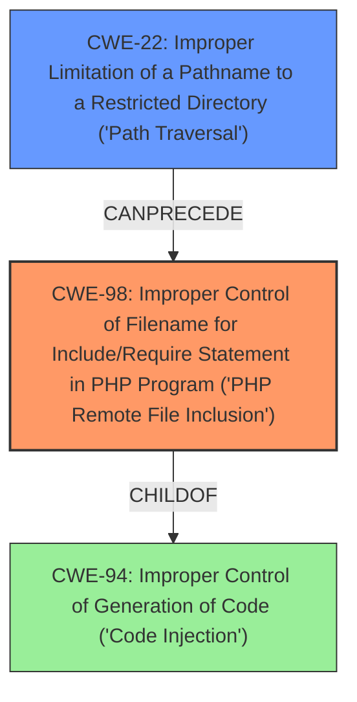

# Analysis Report for CVE-2024-44014

# Vulnerability Analysis Report: CVE-2024-44014

## Description

**Improper Limitation of a Pathname to a Restricted Directory** (Path Traversal) vulnerability in Vmaxstudio Vmax Project Manager allows PHP **Local File Inclusion**, Code Injection.This issue affects Vmax Project Manager from n/a through 1.0.

## Vulnerability Description Key Phrases

- **Rootcause:** Improper Limitation of a Pathname to a Restricted Directory
- **Weakness:** Local File Inclusion
- **Impact:** ['PHP Local File Inclusion', 'Code Injection']
- **Vector:** Path Traversal
- **Product:** Vmaxstudio Vmax Project Manager
- **Version:** n/a through 1.0

## Analysis (with Relationship Data)

# Summary
| CWE ID | CWE Name | Confidence | CWE Abstraction Level | CWE Vulnerability Mapping Label | CWE-Vulnerability Mapping Notes |
|---|---|---|---|---|---|
| CWE-98 | Improper Control of Filename for Include/Require Statement in PHP Program ('PHP Remote File Inclusion') | 0.9 | Variant | Allowed | Primary CWE. Matches the local file inclusion vulnerability.|
| CWE-22 | Improper Limitation of a Pathname to a Restricted Directory ('Path Traversal') | 0.7 | Base | Allowed | Secondary CWE. Contributes to the root cause by not properly restricting pathnames.|

## Evidence and Confidence

*   **Confidence Score:** 0.8
*   **Evidence Strength:** HIGH

## Relationship Analysis
The primary CWE is CWE-98, which is a variant of CWE-94 (Improper Control of Generation of Code). CWE-22 is related as it describes the **improper limitation of a pathname**, contributing to the ability to include arbitrary files. The relationship between CWE-22 and CWE-98 is that the **path traversal** vulnerability (CWE-22) allows an attacker to manipulate the filename used in the include/require statement (CWE-98).



## Vulnerability Chain
The vulnerability chain starts with **improper limitation of a pathname** (CWE-22), allowing an attacker to control the filename used in an include/require statement, leading to **local file inclusion** (CWE-98) and potentially code injection.

## Summary of Analysis
The primary vulnerability is **Local File Inclusion**, which aligns well with CWE-98 (Improper Control of Filename for Include/Require Statement in PHP Program ('PHP Remote File Inclusion')). The root cause is related to **improper limitation of a pathname**, corresponding to CWE-22 (Improper Limitation of a Pathname to a Restricted Directory ('Path Traversal')).

The description explicitly mentions "**Improper Limitation of a Pathname to a Restricted Directory** (Path Traversal) vulnerability in Vmaxstudio Vmax Project Manager allows PHP **Local File Inclusion**, Code Injection." and the CVE reference links content summary states "**Local File Inclusion:** The primary vulnerability is the ability to include local files. This means the plugin is not properly sanitizing or validating user-supplied input that is used in file inclusion operations.".

CWE-98 is chosen as the primary because it directly reflects the LFI aspect of the vulnerability, while CWE-22 describes the path traversal that enables it.

**CWEs Considered But Not Used:**

*   CWE-434 (Unrestricted Upload of File with Dangerous Type): This CWE is not applicable because the vulnerability does not involve file uploads.
*   CWE-425 (Direct Request ('Forced Browsing')): This CWE is not applicable as the vulnerability is not related to unauthorized access to URLs.
*   CWE-23 (Relative Path Traversal): While related to path traversal, CWE-22 is a broader and more appropriate fit as it encompasses both relative and absolute path traversal issues.
*   CWE-36 (Absolute Path Traversal): Similar to CWE-23, CWE-22 is a more encompassing fit.
*   CWE-96 (Improper Neutralization of Directives in Statically Saved Code ('Static Code Injection')): This is not the primary issue, the issue is that the code that is already there is vulnerable, not that it is being injected.
*   CWE-116 (Improper Encoding or Escaping of Output): This is not the primary issue.
*   CWE-184 (Incomplete List of Disallowed Inputs): While this might contribute, it is not the core issue.
*   CWE-95 (Improper Neutralization of Directives in Dynamically Evaluated Code ('Eval Injection')): Code injection is a potential consequence, but not the root cause.
*   CWE-178 (Improper Handling of Case Sensitivity): Not related to this vulnerability.


## CWE Relationship Analysis

Current CWEs represent these abstraction levels: .


### Vulnerability Chain Analysis

**Chain starting from CWE-94:**
- 94 (Improper Control of Generation of Code ('Code Injection')) - ROOT


**Chain starting from CWE-116:**
- 116 (Improper Encoding or Escaping of Output) - ROOT


### CWE Relationship Diagram

```mermaid
graph TD
    classDef primary fill:#f96,stroke:#333,stroke-width:2px
    classDef secondary fill:#69f,stroke:#333
    classDef tertiary fill:#9e9,stroke:#333
```


*Report generated on 2025-07-13 15:21:53*
