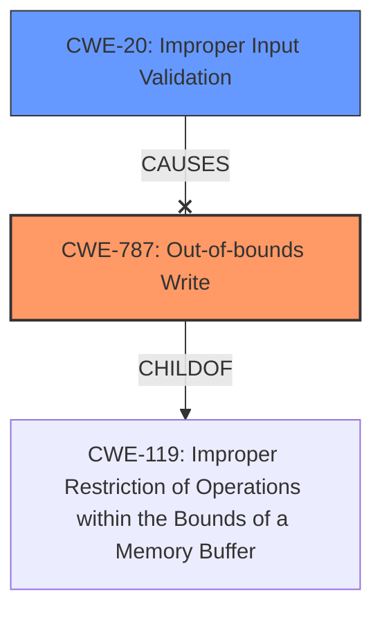

# Enhanced Analysis for CVE-2024-44094

# Summary
| CWE ID | CWE Name | Confidence | CWE Abstraction Level | CWE Vulnerability Mapping Label | CWE-Vulnerability Mapping Notes |
|---|---|---|---|---|---|
| CWE-787 | Out-of-bounds Write | 0.9 | Base | Primary CWE | Allowed |
| CWE-20 | Improper Input Validation | 0.7 | Class | Secondary Candidate | Discouraged |

## Evidence and Confidence

*   **Confidence Score:** 0.8
*   **Evidence Strength:** MEDIUM

## Relationship Analysis
The primary relationship influencing my decision is the hierarchical relationship between CWE-787 (Out-of-bounds Write) and its parent CWE-119 (Improper Restriction of Operations within the Bounds of a Memory Buffer). CWE-787 is a specific type of buffer overflow, which aligns with the description of "memory corruption".

CWE-20 (Improper Input Validation) is considered because the vulnerability description mentions "**improper input validation**" as the root cause. However, CWE-20 is a very broad class, and we should try to be more specific, if possible.



## Vulnerability Chain
The vulnerability chain starts with **improper input validation** (CWE-20, though not definitively assigned) which leads to **memory corruption**, specifically, an out-of-bounds write (CWE-787). The impact is local escalation of privilege.

## Summary of Analysis
The initial analysis considered both CWE-787 and CWE-20 based on the vulnerability description. The description explicitly states "**improper input validation**" as the root cause and "**memory corruption**" as the weakness. The retriever results also listed CWE-787 as the top candidate.

The relationship graph shows that CWE-787 is a more specific type of memory corruption than other potential candidates. While the root cause is stated to be **improper input validation**, the direct consequence is an out-of-bounds write. Therefore, CWE-787 is selected as the primary CWE because it accurately describes the type of memory corruption.

CWE-20 is a general class, and while the description mentions **improper input validation**, it is not specific enough to be the primary CWE. It could be considered a contributing factor, but without more detail, it's best to focus on the out-of-bounds write.

Relevant CWE Information:
*   **CWE-787: Out-of-bounds Write** - This is a Base level CWE, which is preferred. The vulnerability description mentions "memory corruption" which aligns with the concept of writing outside the intended memory boundaries.
*   **CWE-20: Improper Input Validation** - This is a Class level CWE, and the retriever usage guidance is Discouraged, as it is overused and not useful for trend analysis. The vulnerability description mentions **improper input validation**, which aligns with this CWE. However, the description is very general and does not provide enough information to determine how the input validation is improper. Therefore, it is a secondary candidate, and not the primary CWE.


## CWE Relationship Analysis

Current CWEs represent these abstraction levels: .


### Vulnerability Chain Analysis

**Chain starting from CWE-119:**
- 119 (Improper Restriction of Operations within the Bounds of a Memory Buffer) - ROOT


**Chain starting from CWE-787:**
- 787 (Out-of-bounds Write) - ROOT


### CWE Relationship Diagram

```mermaid
graph TD
    classDef primary fill:#f96,stroke:#333,stroke-width:2px
    classDef secondary fill:#69f,stroke:#333
    classDef tertiary fill:#9e9,stroke:#333
```