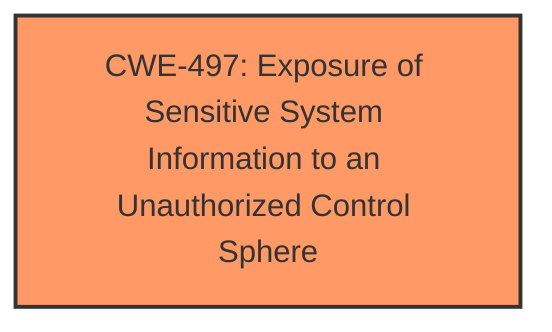

# Analysis Report for CVE-2024-44129

# Vulnerability Analysis Report: CVE-2024-44129

## Description

The issue was addressed with improved checks. This issue is fixed in macOS Ventura 13.7, macOS Sequoia 15. An app may be able to leak sensitive user information.

## Vulnerability Description Key Phrases

- **Impact:** leak sensitive user information
- **Product:** ['macOS Ventura', 'macOS Sequoia']
- **Version:** ['13.7', '15']

## Analysis (with Relationship Data)

# Summary
| CWE ID | CWE Name | Confidence | CWE Abstraction Level | CWE Vulnerability Mapping Label | CWE-Vulnerability Mapping Notes |
|---|---|---|---|---|---|
| CWE-497 | Exposure of Sensitive System Information to an Unauthorized Control Sphere | 0.7 | Base | Allowed | Primary CWE |

## Evidence and Confidence

*   **Confidence Score:** 0.7
*   **Evidence Strength:** MEDIUM

## Relationship Analysis
The primary CWE selected is CWE-497 **Exposure of Sensitive System Information to an Unauthorized Control Sphere**. No child or parent relationships were relevant in this case. The abstraction level is Base, which is appropriate.



## Vulnerability Chain
The chain of events is as follows: a vulnerability in the Accounts component leads to the **exposure of sensitive user information** to an unauthorized application.

## Summary of Analysis
The analysis is based on the provided evidence, specifically the vulnerability description and the CVE reference summary. The vulnerability allows an application to **leak sensitive user information** due to an issue within the Accounts component of macOS.

The primary CWE selected is CWE-497 **Exposure of Sensitive System Information to an Unauthorized Control Sphere**. This selection is justified by the vulnerability description stating that an app may be able to **leak sensitive user information**, which directly aligns with the definition of CWE-497. The confidence level is 0.7 due to the lack of detailed technical information about the root cause.

Other CWEs considered but not used:
*   CWE-787: Out-of-bounds Write, CWE-843: Access of Resource Using Incompatible Type ('Type Confusion'), CWE-347: Improper Verification of Cryptographic Signature, CWE-770: Allocation of Resources Without Limits or Throttling - These CWEs are related to memory safety or resource management issues and are not directly supported by the description which indicates an information exposure issue.
*   CWE-285: Improper Authorization - While authorization issues can lead to information leaks, the description focuses on the exposure of information itself.
*   CWE-201: Insertion of Sensitive Information Into Sent Data, CWE-209: Generation of Error Message Containing Sensitive Information - These CWEs are too specific as the vulnerability description does not mention how the sensitive information is leaked.

Relevant CWE Information:

# Enhanced Context (25 CWEs)
The following CWEs were identified as potentially relevant to this vulnerability:

## CWE-497: Exposure of Sensitive System Information to an Unauthorized Control Sphere
**Abstraction Level**: Base
**Similarity Score**: 0.71
**Source**: dense

**Description**:
The product does not properly prevent sensitive system-level information from being accessed by unauthorized actors who do not have the same level of access to the underlying system as the product does.

**Mapping Guidance**:
- Usage: Allowed
- Rationale: This CWE entry is at the Base level of abstraction, which is a preferred level of abstraction for mapping to the root causes of vulnerabilities.


## CWE Relationship Analysis

Current CWEs represent these abstraction levels: .


### Vulnerability Chain Analysis

**Chain starting from CWE-770:**
- 770 (Allocation of Resources Without Limits or Throttling) - ROOT


**Chain starting from CWE-787:**
- 787 (Out-of-bounds Write) - ROOT


### CWE Relationship Diagram

```mermaid
graph TD
    classDef primary fill:#f96,stroke:#333,stroke-width:2px
    classDef secondary fill:#69f,stroke:#333
    classDef tertiary fill:#9e9,stroke:#333
```


*Report generated on 2025-07-13 15:25:31*
