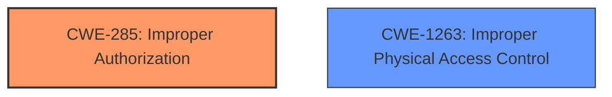

# Analysis Report for CVE-2024-44180

# Vulnerability Analysis Report: CVE-2024-44180

## Description

The issue was addressed with improved checks. This issue is fixed in iOS 18 and iPadOS 18. An attacker with physical access may be able to access contacts from the lock screen.

## Vulnerability Description Key Phrases

- **Impact:** access contacts from the lock screen
- **Attacker:** attacker with physical access
- **Product:** ['iOS', 'iPadOS']
- **Version:** ['18', '18']

## Analysis (with Relationship Data)

# Summary
| CWE ID  | CWE Name                                                    | Confidence | CWE Abstraction Level | CWE Vulnerability Mapping Label | CWE-Vulnerability Mapping Notes |
| :-------- | :---------------------------------------------------------- | :--------- | :---------------------- | :------------------------------ | :-------------------------------- |
| CWE-285   | Improper Authorization                                      | 0.75       | Class                   | Primary CWE                     | Discouraged                       |
| CWE-1263  | Improper Physical Access Control                            | 0.60       | Class                   | Secondary Candidate             | Allowed-with-Review               |

## Evidence and Confidence

*   **Confidence Score:** 0.70
*   **Evidence Strength:** MEDIUM

## Relationship Analysis

The primary relationship influencing the CWE selection is the hierarchical structure. CWE-285 is a class-level CWE, and while more specific base-level CWEs exist for authorization issues, the provided information lacks the detail necessary to pinpoint the precise authorization failure. CWE-1263 is also a Class level CWE, but it's considered because physical access is a key component of the attack.



## Vulnerability Chain

The vulnerability chain starts with the **improper authorization** check on the lock screen, leading to the impact of unauthorized access to contacts.

Improper Authorization (CWE-285) -> Access to Contacts

## Summary of Analysis

The initial analysis focused on identifying the root cause of the vulnerability. The description clearly states that an attacker with physical access can access contacts from the lock screen. The retriever results suggested several CWEs, including CWE-285 (**Improper Authorization**) and CWE-1263 (**Improper Physical Access Control**).

The evidence supporting CWE-285 is the description "An attacker with physical access may be able to access contacts from the lock screen". This implies that the lock screen's authorization mechanism is **improperly** implemented or bypassed. Since the description mentions "improved checks" as the fix, it further strengthens the argument that there was an initial **lack of proper authorization**.

CWE-1263 is included because the attacker requires "physical access" to exploit the vulnerability.

CWE-20 (**Improper Input Validation**) was considered but discarded because the issue appears to be related to authorization rather than input validation. Similarly, CWE-787 (**Out-of-bounds Write**) and CWE-120 (**Buffer Copy without Checking Size of Input ('Classic Buffer Overflow')**) were deemed irrelevant as there is no mention of memory corruption or buffer overflows.

The final selection of CWE-285 as the primary CWE is based on the evidence of **improper authorization** leading to unauthorized access. This aligns with the CWE's description and the provided fix ("improved checks"). The level of specificity is appropriate given the available information.

Relevant CWE Information:

# Enhanced Context (25 CWEs)
The following CWEs were identified as potentially relevant to this vulnerability:

## CWE-1263: Improper Physical Access Control
**Abstraction Level**: Class
**Similarity Score**: 0.67
**Source**: dense

**Description**:
The product is designed with access restricted to certain information, but it does not sufficiently protect against an unauthorized actor with physical access to these areas.

**Mapping Guidance**:
- Usage: Allowed-with-Review
- Rationale: This CWE entry is a Class and might have Base-level children that would be more appropriate

## CWE-285: Improper Authorization
**Abstraction Level**: Class
**Similarity Score**: 493.19
**Source**: sparse

**Description**:
The product does not perform or incorrectly performs an authorization check when an actor attempts to access a resource or perform an action.

**Mapping Guidance**:
- Usage: Discouraged
- Rationale: CWE-285 is high-level and lower-level CWEs can frequently be used instead. It is a level-1 Class (i.e., a child of a Pillar).


## CWE Relationship Analysis

Current CWEs represent these abstraction levels: .


### Vulnerability Chain Analysis

**Chain starting from CWE-787:**
- 787 (Out-of-bounds Write) - ROOT


**Chain starting from CWE-285:**
- 285 (Improper Authorization) - ROOT


### CWE Relationship Diagram

```mermaid
graph TD
    classDef primary fill:#f96,stroke:#333,stroke-width:2px
    classDef secondary fill:#69f,stroke:#333
    classDef tertiary fill:#9e9,stroke:#333
```


*Report generated on 2025-07-13 15:29:28*
