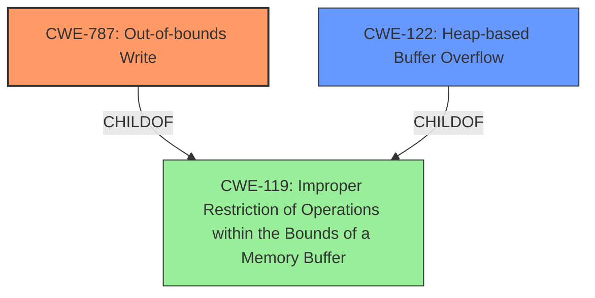

# Raw Analyzer Response for CVE-2024-44218

# Summary
| CWE ID | CWE Name | Confidence | CWE Abstraction Level | CWE Vulnerability Mapping Label | CWE-Vulnerability Mapping Notes |
|---|---|---|---|---|---|
| CWE-787 | Out-of-bounds Write | 0.9 | Base | Allowed | Primary CWE. The vulnerability involves writing data past the end or before the beginning of the intended buffer, leading to heap corruption. |
| CWE-122 | Heap-based Buffer Overflow | 0.7 | Variant | Allowed | Secondary candidate. Heap corruption suggests a buffer overflow condition in the heap portion of memory. |
| CWE-119 | Improper Restriction of Operations within the Bounds of a Memory Buffer | 0.5 | Class | Discouraged | Secondary candidate. This is a more general case of memory buffer errors and is discouraged when more specific CWEs are available. |

## Evidence and Confidence

*   **Confidence Score:** 0.8
*   **Evidence Strength:** MEDIUM

## Relationship Analysis
The primary CWE is CWE-787 **Out-of-bounds Write**, a Base level CWE that directly describes the **heap corruption** caused by writing data outside the intended buffer. CWE-122 **Heap-based Buffer Overflow** is a Variant of buffer overflow, which can lead to **heap corruption** and is a child of CWE-119 **Improper Restriction of Operations within the Bounds of a Memory Buffer**. CWE-119 is a more general Class level CWE and is discouraged when more specific CWEs like CWE-787 or CWE-122 are applicable.

## Vulnerability Chain
The vulnerability chain starts with processing a **maliciously crafted file** leading to an **out-of-bounds write (CWE-787)**, which results in **heap corruption**.

## Summary of Analysis
The analysis is primarily based on the vulnerability description which indicates that processing a **maliciously crafted file** leads to **heap corruption**. The **heap corruption** is a strong indicator of memory corruption issues.

The provided evidence, "Processing a maliciously crafted file may lead to heap corruption," directly supports the selection of CWE-787 **Out-of-bounds Write** as the primary CWE because it is a common cause of **heap corruption**. Additionally, the description of CWE-787 aligns with the vulnerability's description of writing data outside the intended buffer.

CWE-122 **Heap-based Buffer Overflow** was considered as a secondary CWE because **heap corruption** is a typical outcome of heap-based buffer overflows. While CWE-119 **Improper Restriction of Operations within the Bounds of a Memory Buffer** was also considered because it is a parent of both CWE-787 and CWE-122, it was deemed too general.

The selected CWEs are at an optimal level of specificity, with CWE-787 being a Base CWE and CWE-122 being a Variant CWE.

CWE-843 **Access of Resource Using Incompatible Type ('Type Confusion')**, CWE-665 **Improper Initialization**, CWE-415 **Double Free**, CWE-20 **Improper Input Validation**, CWE-401 **Missing Release of Memory after Effective Lifetime**, CWE-190 **Integer Overflow or Wraparound**, and CWE-123 **Write-what-where Condition** were considered but not selected. These CWEs, while relevant to memory corruption in general, do not specifically address the **out-of-bounds write** scenario described in the vulnerability.