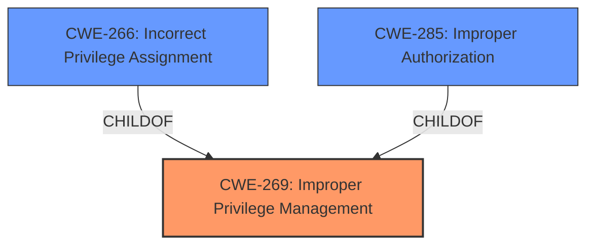

# Analysis for CVE-2024-4428

# Summary
| CWE ID    | CWE Name                                                                | Confidence | CWE Abstraction Level | CWE Vulnerability Mapping Label | CWE-Vulnerability Mapping Notes |
| --------- | ----------------------------------------------------------------------- | ---------- | --------------------- | ------------------------------- | ----------------------------- |
| CWE-269   | Improper Privilege Management                                           | 0.75       | Class                 | Primary                         | Discouraged                   |
| CWE-266   | Incorrect Privilege Assignment                                          | 0.65       | Base                  | Secondary                       | Allowed                       |
| CWE-285   | Improper Authorization                                                  | 0.50       | Class                 | Secondary                       | Discouraged                   |

## Evidence and Confidence

*   **Confidence Score:** 0.7
*   **Evidence Strength:** MEDIUM

## Relationship Analysis
The primary relationship considered was the parent-child relationship between CWE-269 (Improper Privilege Management) and its children, such as CWE-266 (Incorrect Privilege Assignment). While CWE-266 is more specific and therefore preferable, the evidence leans toward a general issue of **improper privilege management**, making CWE-269 a reasonable, albeit less precise, choice. The relationships between authorization and authentication issues were also considered.

## Vulnerability Chain
The vulnerability chain starts with **Improper Privilege Management**, leading to the ability to "Collect Data as Provided by Users". This indicates a breakdown in the system's ability to properly manage user privileges, which then results in unauthorized data collection.

## Summary of Analysis
The initial assessment focused on identifying the **root cause** of the vulnerability. The description explicitly mentions "**Improper Privilege Management**," which strongly suggests CWE-269. However, CWE-269 is a Class-level CWE and thus more general. The retriever results included CWE-266 (Incorrect Privilege Assignment) which is more specific.

The evidence is somewhat limited, relying heavily on the description's key phrases. The absence of detailed technical information makes it challenging to pinpoint the precise nature of the privilege management issue. Therefore, while CWE-266 could be a more precise mapping, the lack of specific details about the assignment process makes it difficult to confidently choose it over CWE-269.

The final decision favors CWE-269 as the primary CWE because it directly reflects the stated vulnerability. However, CWE-266 is considered as a secondary candidate because if the description had more details, it could have been a better fit. CWE-285 is considered a tertiary candidate, reflecting the possibility of authorization issues stemming from the privilege management problem.

Relevant CWE Information:

# Enhanced Context (25 CWEs)
The following CWEs were identified as potentially relevant to this vulnerability:

## CWE-269: Improper Privilege Management
**Abstraction Level**: Class
**Similarity Score**: 1221.35
**Source**: sparse

**Description**:
The product does not properly assign, modify, track, or check privileges for an actor, creating an unintended sphere of control for that actor.

**Mapping Guidance**:
- Usage: Discouraged
- Rationale: CWE-269 is commonly misused. It can be conflated with "privilege escalation," which is a technical impact that is listed in many low-information vulnerability reports [REF-1287]. It is not useful for trend analysis.

## CWE-266: Incorrect Privilege Assignment
**Abstraction Level**: Base
**Similarity Score**: 0.80
**Source**: dense

**Description**:
A product incorrectly assigns a privilege to a particular actor, creating an unintended sphere of control for that actor.

**Mapping Guidance**:
- Usage: Allowed
- Rationale: This CWE entry is at the Base level of abstraction, which is a preferred level of abstraction for mapping to the root causes of vulnerabilities.

## CWE-285: Improper Authorization
**Abstraction Level**: Class
**Similarity Score**: 1211.27
**Source**: sparse

**Description**:
The product does not perform or incorrectly performs an authorization check when an actor attempts to access a resource or perform an action.

**Mapping Guidance**:
- Usage: Discouraged
- Rationale: CWE-285 is high-level and lower-level CWEs can frequently be used instead. It is a level-1 Class (i.e., a child of a Pillar).

## CWE-266: Incorrect Privilege Assignment
**Abstraction Level**: Base
**Similarity Score**: 1178.84
**Source**: sparse

**Description**:
A product incorrectly assigns a privilege to a particular actor, creating an unintended sphere of control for that actor.

**Mapping Guidance**:
- Usage: Allowed
- Rationale: This CWE entry is at the Base level of abstraction, which is a preferred level of abstraction for mapping to the root causes of vulnerabilities.

## CWE-287: Improper Authentication
**Abstraction Level**: class
**Similarity Score**: 2.55
**Source**: graph

**Description**:
CWE-287: Improper Authentication

**Mapping Guidance**:
- Usage: Discouraged
- Rationale: This CWE entry might be misused when lower-level CWE entries are likely to be applicable. It is a level-1 Class (i.e., a child of a Pillar).

### CWE-269: Improper Privilege Management

*   **Technical Explanation:** CWE-269 [Improper Privilege Management](https://cwe.mitre.org/data/definitions/269.html) occurs when a product does not properly manage the privileges of an actor, leading to an unintended sphere of control. This could involve assigning, modifying, tracking, or checking privileges. In this case, the vulnerability allows unauthorized data collection, indicating a failure in privilege management.
*   **Security Implications:** The impact is the ability to "Collect Data as Provided by Users", a clear violation of data security and privacy.
*   **Relationship and Chain:** This is the primary weakness, potentially leading to other authorization issues.
*   **Mapping Guidance:** While CWE-269 is discouraged due to its generality, the lack of specific details in the description makes it the most fitting choice.
*   **Confidence:** 0.75

### CWE-266: Incorrect Privilege Assignment

*   **Technical Explanation:** CWE-266 [Incorrect Privilege Assignment](https://cwe.mitre.org/data/definitions/266.html) refers to the incorrect assignment of privileges to an actor, leading to an unintended sphere of control. This is a more specific case of **Improper Privilege Management**.
*   **Security Implications:** Similar to CWE-269, the impact is unauthorized data collection.
*   **Relationship and Chain:** This is a child of CWE-269 and a potential root cause if the **improper privilege management** stems specifically from incorrect assignment.
*   **Mapping Guidance:** CWE-266 is ALLOWED and at the Base level of abstraction, which is preferred.
*   **Confidence:** 0.65

### CWE-285: Improper Authorization

*   **Technical Explanation:** CWE-285 [Improper Authorization](https://cwe.mitre.org/data/definitions/285.html) describes a situation where the product does not perform or incorrectly performs an authorization check when an actor attempts to access a resource or perform an action.
*   **Security Implications:** The impact is unauthorized data collection
*   **Relationship and Chain:** This could be a related issue stemming from **improper privilege management**, but it is less directly indicated than CWE-266.
*   **Mapping Guidance:** CWE-285 is discouraged due to its generality.
*   **Confidence:** 0.5

CWEs Considered But Not Used:

*   CWE-287 (Improper Authentication): While authentication issues can lead to authorization problems, the description focuses on **privilege management**, making CWE-287 less relevant.
*   CWE-284 (Improper Access Control): Similar to CWE-269, this is a high-level CWE. Given the explicit mention of "**Improper Privilege Management**," CWE-284 is too general.
*   CWE-233 (Improper Handling of Parameters): This CWE is not directly related to the **improper privilege management** issue described in the vulnerability.