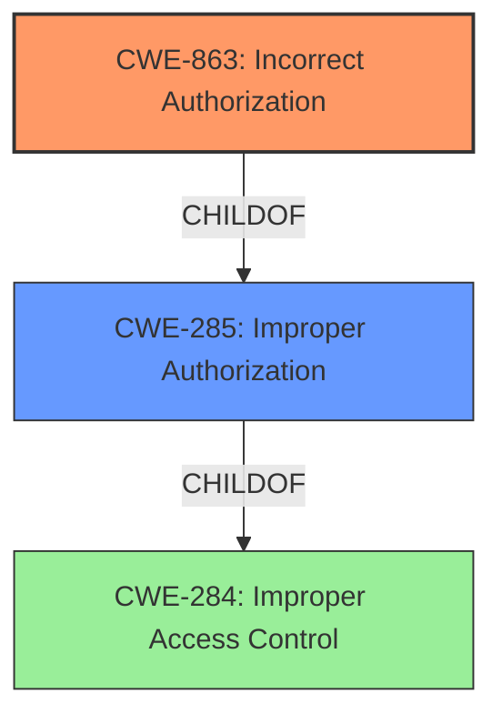

# Analysis Report for CVE-2024-44314

# Vulnerability Analysis Report: CVE-2024-44314

## Description

TastyIgniter 3.7.6 contains an Incorrect Access Control vulnerability in the Orders Management System, allowing unauthorized users to update order statuses. The issue occurs in the index_onUpdateStatus() function within Orders.php, which fails to verify if the user has permission to modify an orders status. This flaw can be exploited remotely, leading to unauthorized order manipulation.

## Vulnerability Description Key Phrases

- **Component:** Orders Management System
- **Rootcause:** incorrect access control
- **Product:** TastyIgniter
- **Impact:** access control, update order statuses
- **Attacker:** unauthorized users
- **Version:** 3.7.6

## Analysis (with Relationship Data)

# Summary
| CWE ID  | CWE Name                                                                | Confidence | CWE Abstraction Level | CWE Vulnerability Mapping Label | CWE-Vulnerability Mapping Notes |
| :-------- | :---------------------------------------------------------------------- | :--------- | :-------------------- | :------------------------------ | :------------------------------ |
| CWE-863   | Incorrect Authorization                                                 | 0.9        | Class                 | Primary                         | Allowed-with-Review             |
| CWE-285   | Improper Authorization                                                  | 0.7        | Class                 | Secondary                       | Discouraged                   |
| CWE-284   | Improper Access Control                                                 | 0.6        | Pillar                  | Secondary                       | Discouraged                   |

## Evidence and Confidence

*   **Confidence Score:** 0.9
*   **Evidence Strength:** HIGH

## Relationship Analysis
The primary CWE selected is CWE-863, Incorrect Authorization. This is a Class-level CWE, but it is more specific than its parent CWE, CWE-285, Improper Authorization, and much more specific than CWE-284, Improper Access Control. The vulnerability description indicates that the `index_onUpdateStatus()` function **fails to verify** if the user has permission to modify an order's status, which aligns well with the definition of CWE-863, "The product performs an authorization check when an actor attempts to access a resource or perform an action, but it does not correctly perform the check."



## Vulnerability Chain
The vulnerability chain begins with the **incorrect access control** in the `index_onUpdateStatus()` function. This **failure to properly verify permissions** allows unauthorized users to update order statuses, leading to unauthorized order manipulation.

The chain is: **Incorrect Authorization** (CWE-863) -> Unauthorized Order Status Update.

## Summary of Analysis
The initial analysis identified that the root cause of this vulnerability is **incorrect access control**. The `index_onUpdateStatus()` function **fails to verify** if the user has permission to modify an order's status. This aligns with the definition of CWE-863, Incorrect Authorization, which states, "The product performs an authorization check when an actor attempts to access a resource or perform an action, but it does not correctly perform the check." The vulnerability description and the CVE reference links content summary both support this classification. The provided text indicates the function attempts authorization (implying a check exists), but it's flawed.

The Retriever Results also listed CWE-285 (Improper Authorization) and CWE-284 (Improper Access Control) as potential candidates. However, CWE-863 is more specific because it highlights that the authorization check is present but flawed, rather than completely missing. While CWE-285 and CWE-284 could be considered, CWE-863 is more precise given the available information.

The CWE guidance specifically recommends using CWE-863 when "Role check is present but flawed". This guidance reinforces the choice of CWE-863 over the more general CWE-285 and CWE-284.

The final selection is based on the evidence that the vulnerability is due to a **flawed authorization check**, making CWE-863 the most appropriate and specific CWE.


## CWE Relationship Analysis

Current CWEs represent these abstraction levels: .


### Vulnerability Chain Analysis

**Chain starting from CWE-284:**
- 284 (Improper Access Control) - ROOT


**Chain starting from CWE-863:**
- 863 (Incorrect Authorization) - ROOT


### CWE Relationship Diagram

```mermaid
graph TD
    classDef primary fill:#f96,stroke:#333,stroke-width:2px
    classDef secondary fill:#69f,stroke:#333
    classDef tertiary fill:#9e9,stroke:#333
```


*Report generated on 2025-07-13 15:33:38*
