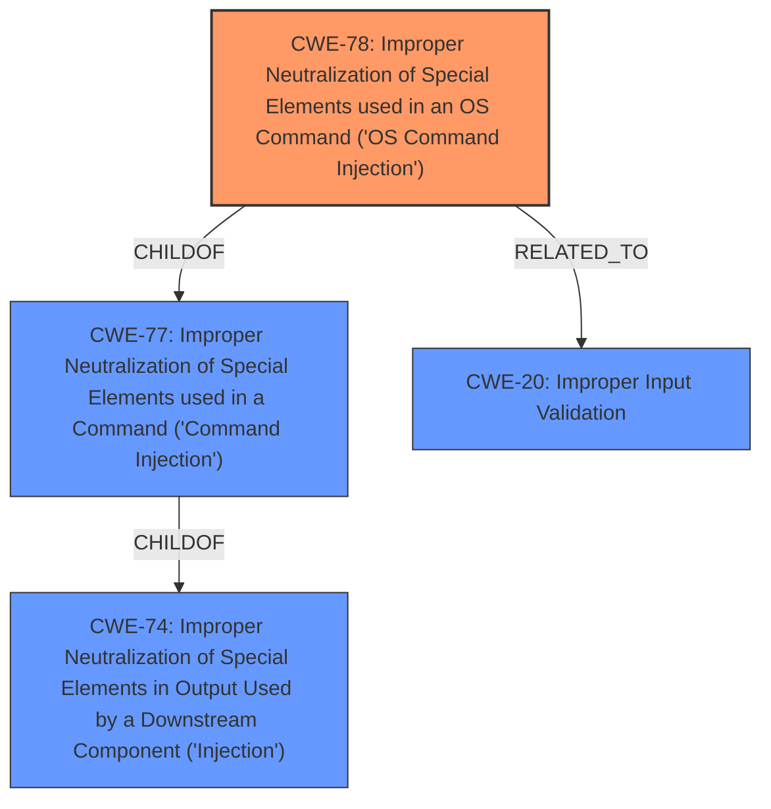

# Enhanced Analysis for CVE-2024-44334

# Summary
| CWE ID | CWE Name | Confidence | CWE Abstraction Level | CWE Vulnerability Mapping Label | CWE-Vulnerability Mapping Notes |
|---|---|---|---|---|---|
| CWE-78 | Improper Neutralization of Special Elements used in an OS Command ('OS Command Injection') | 1.0 | Base | Allowed | Primary CWE: The root cause is **insufficient parameter filtering** leading to OS command injection. |
| CWE-20 | Improper Input Validation | 0.7 | Class | Discouraged | Secondary Candidate: The **insufficient parameter filtering** is an instance of **Improper Input Validation**|

## Evidence and Confidence

*   **Confidence Score:** 0.9
*   **Evidence Strength:** HIGH

## Relationship Analysis
The primary relationship influencing the decision is that CWE-78 is a child of CWE-77 (Improper Neutralization of Special Elements used in a Command ('Command Injection')), which is itself a child of CWE-74 (Improper Neutralization of Special Elements in Output Used by a Downstream Component ('Injection')). CWE-78 is also related to CWE-20 (Improper Input Validation) as command injection vulnerabilities often arise from inadequate input validation. The choice of CWE-78 is based on the specific context of OS command execution.



## Vulnerability Chain
The vulnerability chain starts with **insufficient parameter filtering** (CWE-Other), which leads to OS command injection (CWE-78), ultimately resulting in remote command execution.

## Summary of Analysis
The primary CWE is CWE-78 because the vulnerability description explicitly mentions **insufficient parameter filtering** in the CGI handling function, leading to the execution of arbitrary OS commands. The **CVE Reference Links Content Summary** further reinforces this by stating that the `path` parameter is not adequately sanitized before being passed to the `system` function. This aligns perfectly with the definition of CWE-78.

CWE-20 was considered as a secondary weakness because the root cause is **insufficient parameter filtering**, which falls under the broader category of **Improper Input Validation**. However, due to the availability of a more specific CWE (CWE-78), CWE-20 is not the primary.

The graph relationships influenced the decision by highlighting the hierarchical structure of injection vulnerabilities and the relationship between input validation and command injection. The chosen CWEs are at the optimal level of specificity because CWE-78 directly addresses the OS command injection vulnerability, while CWE-20 represents the more general class of input validation issues.

Relevant CWE Information:
- "The product constructs all or part of an OS command using externally-influenced input from an upstream component, but it does not neutralize or incorrectly neutralizes special elements that could modify the intended OS command when it is sent to a downstream component." - CWE-78 description. This aligns with the vulnerability description indicating the **path** parameter is not sanitized before being passed to the system function.


## CWE Relationship Analysis

Current CWEs represent these abstraction levels: .


### Vulnerability Chain Analysis

**Chain starting from CWE-74:**
- 74 (Improper Neutralization of Special Elements in Output Used by a Downstream Component ('Injection')) - ROOT


**Chain starting from CWE-77:**
- 77 (Improper Neutralization of Special Elements used in a Command ('Command Injection')) - ROOT


### CWE Relationship Diagram

```mermaid
graph TD
    classDef primary fill:#f96,stroke:#333,stroke-width:2px
    classDef secondary fill:#69f,stroke:#333
    classDef tertiary fill:#9e9,stroke:#333
```