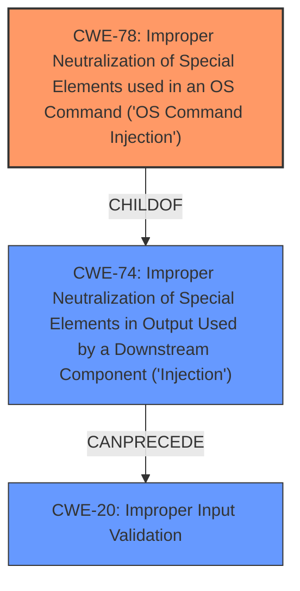

# Analysis for CVE-2024-44381

# Summary
| CWE ID | CWE Name | Confidence | CWE Abstraction Level | CWE Vulnerability Mapping Label | CWE-Vulnerability Mapping Notes |
|---|---|---|---|---|---|
| CWE-78 | Improper Neutralization of Special Elements used in an OS Command ('OS Command Injection') | 1.0 | Base | Primary | Allowed |
| CWE-74 | Improper Neutralization of Special Elements in Output Used by a Downstream Component ('Injection') | 0.7 | Class | Secondary | Discouraged |
| CWE-20 | Improper Input Validation | 0.6 | Class | Secondary | Discouraged |

## Evidence and Confidence

*   **Confidence Score:** 0.9
*   **Evidence Strength:** HIGH

## Relationship Analysis
The primary CWE is CWE-78, which is a base-level CWE detailing OS Command Injection. CWE-78 is a child of CWE-74 (Improper Neutralization of Special Elements in Output Used by a Downstream Component ('Injection')), a more general class. CWE-74 itself can be caused by CWE-20 (Improper Input Validation). The vulnerability chain involves improper input validation leading to command injection. The abstraction levels were considered, and the base level CWE-78 was chosen as it is the most specific and accurately represents the weakness.

## Vulnerability Chain
The vulnerability chain starts with **Improper Input Validation** (potentially CWE-20) where the router firmware does not adequately sanitize user-supplied input. This leads to **Improper Neutralization of Special Elements** (CWE-74), specifically in the context of constructing OS commands. The ultimate result is **OS Command Injection** (CWE-78), allowing attackers to execute arbitrary commands on the system.

## Summary of Analysis
The primary weakness is clearly **OS Command Injection** (CWE-78) due to the **improper handling of user-supplied input**. The evidence provided in the CVE Reference Links Content Summary explicitly states this, mentioning the **failure to sanitize or validate parameters passed to functions**, and the ability to **inject arbitrary shell commands**. This aligns perfectly with the description of CWE-78. The retriever results also list CWE-78 as a high-scoring candidate. While CWE-74 (Improper Neutralization of Special Elements in Output Used by a Downstream Component ('Injection')) and CWE-20 (Improper Input Validation) are also relevant, CWE-78 is the most specific and accurately describes the vulnerability. CWE-74 is considered a class-level CWE, and the guidance recommends avoiding it if a more specific base-level CWE exists. CWE-20 is a parent of CWE-74 and less specific to the actual injection.

Relevant CWE Information:
*   CWE-78: Improper Neutralization of Special Elements used in an OS Command ('OS Command Injection')
    *   The product constructs all or part of an OS command using externally-influenced input from an upstream component, but it does not neutralize or incorrectly neutralizes special elements that could modify the intended OS command when it is sent to a downstream component.
    *   "The root cause lies in the **improper handling of user-supplied input** in two specific functions...The firmware **fails to sanitize or validate the parameters** passed to these functions, leading to **command injection**."
*   CWE-74: Improper Neutralization of Special Elements in Output Used by a Downstream Component ('Injection')
    *   The product constructs all or part of a command, data structure, or record using externally-influenced input from an upstream component, but it does not neutralize or incorrectly neutralizes special elements that could modify how it is parsed or interpreted when it is sent to a downstream component.
*   CWE-20: Improper Input Validation
    *   The product receives input or data, but it does not validate or incorrectly validates that the input has the properties that are required to process the data safely and correctly.