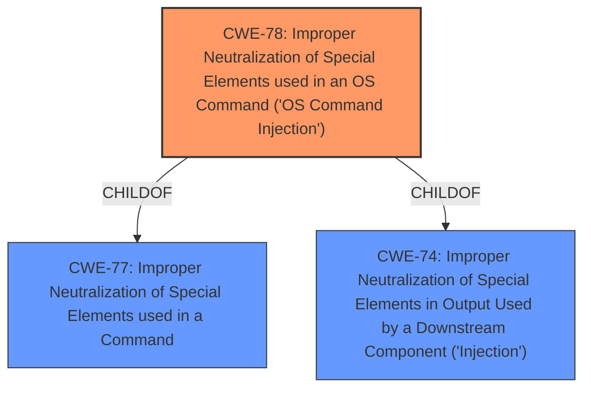

# Enhanced Analysis for CVE-2024-44383

# Summary
| CWE ID | CWE Name | Confidence | CWE Abstraction Level | CWE Vulnerability Mapping Label | CWE-Vulnerability Mapping Notes |
|---|---|---|---|---|---|
| CWE-78 | Improper Neutralization of Special Elements used in an OS Command ('OS Command Injection') | 0.9 | Base | Primary | Allowed |

## Evidence and Confidence

*   **Confidence Score:** 0.9
*   **Evidence Strength:** MEDIUM

## Relationship Analysis
The primary CWE is CWE-78, which is a base-level CWE. Several other CWEs were considered, particularly those related to injection and neutralization. CWE-78 is a child of CWE-77 (Improper Neutralization of Special Elements used in a Command) and CWE-74 (Improper Neutralization of Special Elements in Output Used by a Downstream Component ('Injection')). This indicates a hierarchical relationship where CWE-78 is a specific type of command injection.



## Vulnerability Chain
The vulnerability chain starts with the **improper neutralization** of special elements in the OS command, leading to command execution.

## Summary of Analysis
The vulnerability description indicates that the WAYOS FBM-291W device is vulnerable to command execution through the msp_info_htm component. The key phrase "Command Execution" and the lack of proper input validation or sanitization suggest that an attacker can inject malicious commands into the system.

The retriever results point to several CWEs related to injection and neutralization. CWE-78, "Improper Neutralization of Special Elements used in an OS Command ('OS Command Injection')", is the most appropriate because it directly addresses the root cause of the vulnerability, which is the **improper handling of special elements in OS commands.**

The evidence provided is the vulnerability description key phrase "Command Execution".

Other CWEs considered but not chosen:

*   CWE-88 (Improper Neutralization of Argument Delimiters in a Command ('Argument Injection')): While related to command injection, CWE-78 is more specific to OS command injection.
*   CWE-94 (Improper Control of Generation of Code ('Code Injection')): Code injection is a broader category, and the description specifically mentions command execution, making CWE-78 a better fit.
*   CWE-138 (Improper Neutralization of Special Elements): This is a class-level CWE and less specific than CWE-78.
*   CWE-790 (Improper Filtering of Special Elements): Similar to CWE-138, this is a more general CWE.
*   CWE-1236 (Improper Neutralization of Formula Elements in a CSV File): This is specific to CSV files and not relevant to the vulnerability.
*   CWE-36 (Absolute Path Traversal): This is related to path manipulation, not command execution.
*   CWE-1336 (Improper Neutralization of Special Elements Used in a Template Engine): This is specific to template engines and not relevant to the vulnerability.
*   CWE-912 (Hidden Functionality): While there may be hidden functionality involved, the root cause is the command injection.
*   CWE-184 (Incomplete List of Disallowed Inputs): This could be a contributing factor, but the primary issue is the lack of proper neutralization.

The selection of CWE-78 is at the optimal level of specificity, as it directly describes the vulnerability and its root cause.


## CWE Relationship Analysis

Current CWEs represent these abstraction levels: .


### Vulnerability Chain Analysis

**Chain starting from CWE-94:**
- 94 (Improper Control of Generation of Code ('Code Injection')) - ROOT


**Chain starting from CWE-88:**
- 88 (Improper Neutralization of Argument Delimiters in a Command ('Argument Injection')) - ROOT


### CWE Relationship Diagram

```mermaid
graph TD
    classDef primary fill:#f96,stroke:#333,stroke-width:2px
    classDef secondary fill:#69f,stroke:#333
    classDef tertiary fill:#9e9,stroke:#333
```