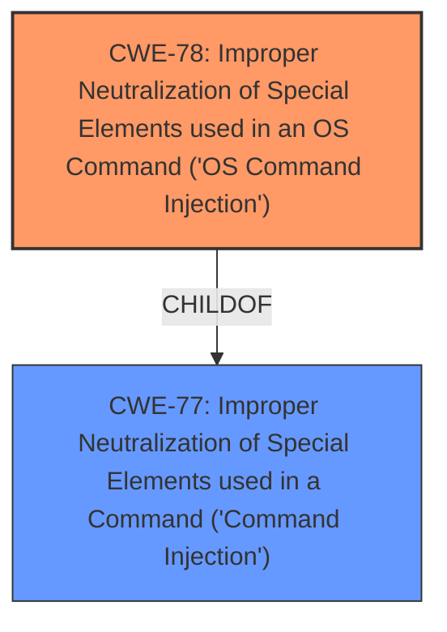

# Analysis for CVE-2024-44401

# Summary
| CWE ID | CWE Name | Confidence | CWE Abstraction Level | CWE Vulnerability Mapping Label | CWE-Vulnerability Mapping Notes |
|---|---|---|---|---|---|
| CWE-78 | Improper Neutralization of Special Elements used in an OS Command ('OS Command Injection') | 1.0 | Base | Allowed | Primary CWE. The **root cause** is **command injection** due to **insufficient input validation**, leading to the execution of arbitrary commands. |

## Evidence and Confidence

*   **Confidence Score:** 1.0
*   **Evidence Strength:** HIGH

## Relationship Analysis
The primary relationship influencing the decision is the hierarchical relationship between CWE-78 (Base) and its parent CWE-77 (Class). CWE-78 is more specific, as it explicitly involves OS commands, which aligns directly with the vulnerability description and evidence.

## Vulnerability Chain
The vulnerability chain starts with **insufficient input validation** in the `upgrade_filter.asp` file. This **root cause** allows an attacker to inject commands via the 'path' parameter, leading to arbitrary command execution on the device.

## Summary of Analysis
The analysis is based on the provided vulnerability description and the CVE reference summary, which clearly indicates a **command injection** vulnerability due to **insufficient input validation** in the `upgrade_filter.asp` file. The `sub_47A60C` function **concatenates user-supplied input into a system command without proper sanitization**, directly enabling the injection. This aligns perfectly with the description of CWE-78.

The selection of CWE-78 is optimal because it precisely describes the vulnerability's nature (OS command injection) at the appropriate level of specificity (Base). Other CWEs were considered but deemed less accurate. For example, CWE-77 is a more general class of command injection, but CWE-78 is more specific to OS commands, making it the better fit.

Relevant CWE Information:

# Enhanced Context (25 CWEs)
The following CWEs were identified as potentially relevant to this vulnerability:

## CWE-78: Improper Neutralization of Special Elements used in an OS Command ('OS Command Injection')
**Abstraction Level**: Base
**Similarity Score**: 0.76
**Source**: dense

**Description**:
The product constructs all or part of an OS command using externally-influenced input from an upstream component, but it does not neutralize or incorrectly neutralizes special elements that could modify the intended OS command when it is sent to a downstream component.

**Mapping Guidance**:
- Usage: Allowed
- Rationale: This CWE entry is at the Base level of abstraction, which is a preferred level of abstraction for mapping to the root causes of vulnerabilities.

## CWE-77: Improper Neutralization of Special Elements used in a Command ('Command Injection')
**Abstraction Level**: Class
**Similarity Score**: 1.00
**Source**: alternate_terms

**Description**:
The product constructs all or part of a command using externally-influenced input from an upstream component, but it does not neutralize or incorrectly neutralizes special elements that could modify the intended command when it is sent to a downstream component.

**Mapping Guidance**:
- Usage: Allowed-with-Review
- Rationale: This CWE entry is a Class and might have Base-level children that would be more appropriate

The vulnerability description clearly indicates that the device is vulnerable to **command injection**. The vulnerability occurs because the `sub47A60C` function in the `upgrade_filter.asp` file does not properly sanitize the 'path' parameter before concatenating it into a system command. Successful exploitation allows an attacker to execute arbitrary system commands on the target device.

CWE-78 (Improper Neutralization of Special Elements used in an OS Command ('OS Command Injection')) is the most appropriate CWE because it specifically describes the **root cause** of the vulnerability: the lack of proper neutralization of special elements in an OS command, leading to **command injection**. The CWE description aligns directly with the vulnerability details, and the suggested usage is "Allowed". The **weakness** is the **improper neutralization of special elements** in the OS command.

CWE-77 (Improper Neutralization of Special Elements used in a Command ('Command Injection')) was considered, but CWE-78 is a more specific case of **command injection**, as it explicitly involves OS commands.

CWE-89 (Improper Neutralization of Special Elements used in an SQL Command ('SQL Injection')) was not selected because the vulnerability involves OS commands, not SQL commands.

CWE-79 (Improper Neutralization of Input During Web Page Generation ('Cross-site Scripting')) was not selected because the vulnerability is related to command execution, not web page generation.

CWE-134 (Use of Externally-Controlled Format String) was not selected because the vulnerability is related to command injection, not format string usage.

CWE-425 (Direct Request ('Forced Browsing')) was not selected because the vulnerability is related to command injection, not forced browsing.

CWE-288 (Authentication Bypass Using an Alternate Path or Channel) was not selected because the vulnerability is related to command injection, not authentication bypass.

CWE-184 (Incomplete List of Disallowed Inputs) was not selected because the vulnerability is related to command injection, not an incomplete list of disallowed inputs.