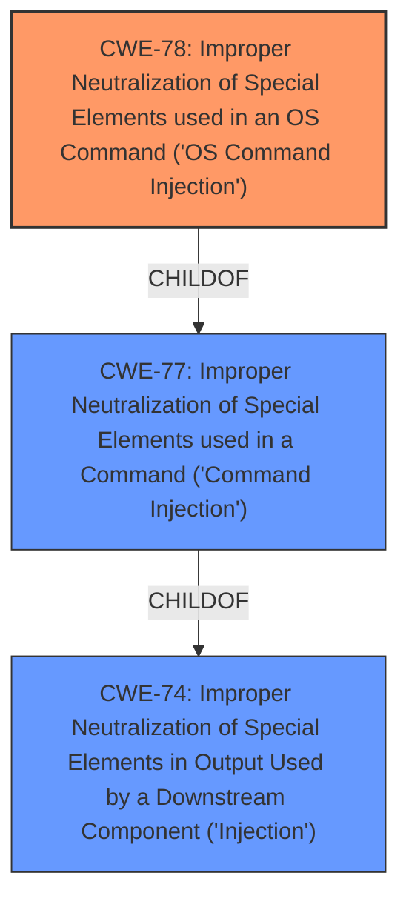

# Enhanced Analysis for CVE-2024-44411

# Summary
| CWE ID | CWE Name | Confidence | CWE Abstraction Level | CWE Vulnerability Mapping Label | CWE-Vulnerability Mapping Notes |
|---|---|---|---|---|---|
| CWE-78 | Improper Neutralization of Special Elements used in an OS Command ('OS Command Injection') | 1.0 | Base | Primary | Allowed |

## Evidence and Confidence

*   **Confidence Score:** 1.0
*   **Evidence Strength:** HIGH

## Relationship Analysis
The primary relationship that influenced the decision was the hierarchical relationship between CWE-78 and its parent, CWE-77. While CWE-77 is a broader category, CWE-78 specifically addresses **OS Command Injection**, which is the precise nature of this vulnerability. The evidence clearly points to the injection occurring within the context of an operating system command.



## Vulnerability Chain
The vulnerability chain starts with the **improper neutralization** of input, specifically within the `msp_info_htm` function. This leads directly to the ability to inject OS commands. The final impact is **arbitrary command execution**, potentially leading to complete control of the device.

## Summary of Analysis
The initial analysis focused on identifying the root cause of the vulnerability. The key phrase "**command injection**" in the vulnerability description, combined with the details in the CVE Reference Links Content Summary, strongly suggests a problem with input validation. The evidence supports the selection of CWE-78 as the primary weakness because the `flag` and `cmd` parameters are directly used to construct an OS command without proper sanitization. The `msp_info_htm` function in the D-Link DI-8300A1 router firmware is vulnerable due to **insufficient input sanitization**, which allows an attacker to inject arbitrary shell commands. This directly leads to **arbitrary command execution**.

Relevant CWE Information:

# Enhanced Context (25 CWEs)
The following CWEs were identified as potentially relevant to this vulnerability:

## CWE-78: Improper Neutralization of Special Elements used in an OS Command ('OS Command Injection')
**Abstraction Level**: Base
**Similarity Score**: 0.75
**Source**: dense

**Description**:
The product constructs all or part of an OS command using externally-influenced input from an upstream component, but it does not neutralize or incorrectly neutralizes special elements that could modify the intended OS command when it is sent to a downstream component.

**Mapping Guidance**:
- Usage: Allowed
- Rationale: This CWE entry is at the Base level of abstraction, which is a preferred level of abstraction for mapping to the root causes of vulnerabilities.
The evidence and Retriever results strongly support the choice of CWE-78. Other CWEs were considered but deemed less specific or less relevant to the identified root cause. For example, CWE-77 is a broader category encompassing all types of command injection, while CWE-78 is specific to OS commands.

The selected CWE is at the optimal level of specificity because it accurately describes the type of injection occurring (OS command injection) and is supported by the evidence provided in the vulnerability description.


## CWE Relationship Analysis

Current CWEs represent these abstraction levels: .


### Vulnerability Chain Analysis

**Chain starting from CWE-74:**
- 74 (Improper Neutralization of Special Elements in Output Used by a Downstream Component ('Injection')) - ROOT


**Chain starting from CWE-77:**
- 77 (Improper Neutralization of Special Elements used in a Command ('Command Injection')) - ROOT


### CWE Relationship Diagram

```mermaid
graph TD
    classDef primary fill:#f96,stroke:#333,stroke-width:2px
    classDef secondary fill:#69f,stroke:#333
    classDef tertiary fill:#9e9,stroke:#333
```