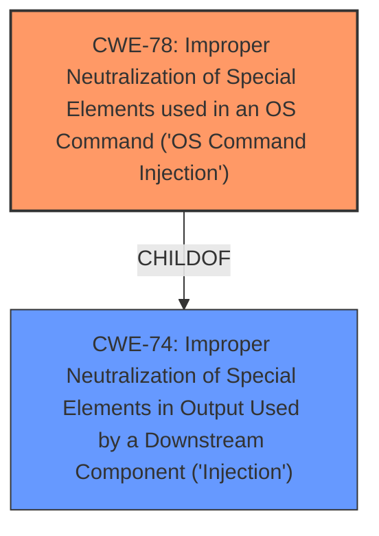

# Raw Analyzer Response for CVE-2024-44414

# Summary
| CWE ID | CWE Name | Confidence | CWE Abstraction Level | CWE Vulnerability Mapping Label | CWE-Vulnerability Mapping Notes |
|---|---|---|---|---|---|
| CWE-78 | Improper Neutralization of Special Elements used in an OS Command ('OS Command Injection') | 1.0 | Base | Allowed | Primary CWE |
| CWE-74 | Improper Neutralization of Special Elements in Output Used by a Downstream Component ('Injection') | 0.7 | Class | Discouraged | Secondary Candidate |

## Evidence and Confidence

*   **Confidence Score:** 0.9
*   **Evidence Strength:** HIGH

## Relationship Analysis
The primary relationship influencing the CWE selection is the hierarchical relationship between CWE-74 ('Injection') and CWE-78 ('OS Command Injection'). CWE-78 is a child of CWE-74, representing a more specific type of injection. The vulnerability description clearly indicates **OS Command Injection**, making CWE-78 the more appropriate choice. While CWE-74 is a broader category that encompasses injection vulnerabilities, the evidence strongly suggests a command injection context.

## Vulnerability Chain
The vulnerability chain starts with the **improper handling of user-supplied input** within the `sub_4901E0` function. This leads to the construction of a command string using `sprintf` with unsanitized input, which is then executed by the `system` function. The chain can be summarized as:

1.  **Improper Input Handling**: The application fails to sanitize the input received via the `cmd` parameter.
2.  **Command Injection (CWE-78)**: Due to the lack of sanitization, an attacker can inject arbitrary OS commands.
3.  **Arbitrary Command Execution**: The injected commands are executed on the system.

## Summary of Analysis
The analysis strongly supports the classification of this vulnerability as CWE-78, **Improper Neutralization of Special Elements used in an OS Command ('OS Command Injection')**. The vulnerability description clearly states that manipulation of the path parameter leads to **command injection**. The CVE Reference Links Content Summary confirms this, highlighting that the root cause is improper handling of user-supplied input within the `sub_4901E0` function. The `httpd_get_parm` function retrieves a parameter which is later used in a `sprintf` function. This concatenated string is then executed by the `system` function without proper sanitization. This directly aligns with the definition of CWE-78.

The Retriever Results also supports this conclusion with CWE-78 having a high similarity score and being a Base level CWE.

CWE-74 was considered but not chosen as the primary CWE because it is a more general class of injection vulnerabilities. While the vulnerability involves injection, the specific type of injection is OS command injection, making CWE-78 a more precise and appropriate classification.

Relevant CWE Information:

# Enhanced Context (25 CWEs)
The following CWEs were identified as potentially relevant to this vulnerability:

## CWE-74: Improper Neutralization of Special Elements in Output Used by a Downstream Component ('Injection')
**Abstraction Level**: Class
**Similarity Score**: 0.78
**Source**: dense

**Description**:
The product constructs all or part of a command, data structure, or record using externally-influenced input from an upstream component, but it does not neutralize or incorrectly neutralizes special elements that could modify how it is parsed or interpreted when it is sent to a downstream component.

**Mapping Guidance**:
- Usage: Discouraged
- Rationale: CWE-74 is high-level and often misused when lower-level weaknesses are more appropriate.

## CWE-78: Improper Neutralization of Special Elements used in an OS Command ('OS Command Injection')
**Abstraction Level**: Base
**Similarity Score**: 1326.25
**Source**: sparse

**Description**:
The product constructs all or part of an OS command using externally-influenced input from an upstream component, but it does not neutralize or incorrectly neutralizes special elements that could modify the intended OS command when it is sent to a downstream component.

**Mapping Guidance**:
- Usage: Allowed
- Rationale: This CWE entry is at the Base level of abstraction, which is a preferred level of abstraction for mapping to the root causes of vulnerabilities.

## CWE-78: Improper Neutralization of Special Elements used in an OS Command ('OS Command Injection')
**Abstraction Level**: base
**Similarity Score**: 4.33
**Source**: graph

**Description**:
CWE-78: Improper Neutralization of Special Elements used in an OS Command ('OS Command Injection')

**Mapping Guidance**:
- Usage: Allowed
- Rationale: This CWE entry is at the Base level of abstraction, which is a preferred level of abstraction for mapping to the root causes of vulnerabilities.