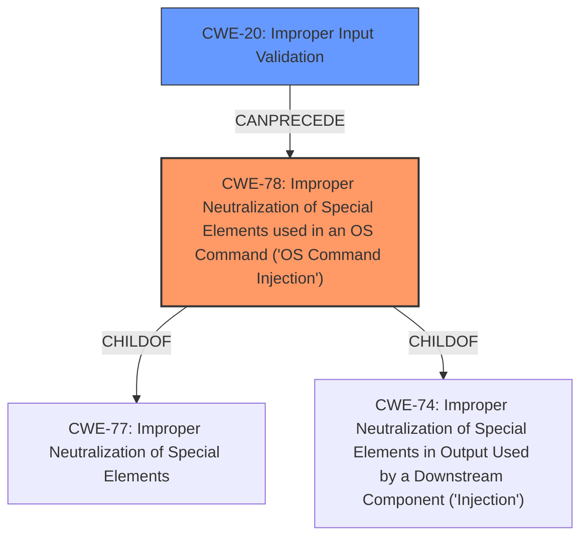

# Enhanced Analysis for CVE-2024-44809

# Summary
| CWE ID  | CWE Name                                                                         | Confidence | CWE Abstraction Level | CWE Vulnerability Mapping Label | CWE-Vulnerability Mapping Notes |
| :-------- | :------------------------------------------------------------------------------- | :--------- | :-------------------- | :------------------------------ | :-------------------------------- |
| CWE-78  | Improper Neutralization of Special Elements used in an OS Command ('OS Command Injection') | 1          | Base                  | Primary                         | Allowed                           |
| CWE-20  | Improper Input Validation                                                            | 0.7        | Class                 | Secondary                       | Discouraged                        |

## Evidence and Confidence

*   **Confidence Score:** 0.85
*   **Evidence Strength:** HIGH

## Relationship Analysis
The primary relationship influencing the decision is that CWE-78 is a specific type of **improper neutralization** that results in OS command injection. While CWE-20 represents the broader class of **improper input validation**, CWE-78 directly addresses the root cause described in the vulnerability, where user-supplied input is not sanitized, leading to arbitrary command execution. CWE-78 is a child of CWE-77 (Improper Neutralization of Special Elements) and CWE-74 (Improper Neutralization of Special Elements in Output Used by a Downstream Component ('Injection')). CWE-20 can precede CWE-78, as the lack of input validation can lead to command injection. Choosing CWE-78 provides a more specific and accurate representation of the vulnerability than higher-level classes.



## Vulnerability Chain
The vulnerability chain starts with **improper input validation** (CWE-20), which leads to the **improper neutralization of special elements** used in an OS command (CWE-78), and ultimately results in remote code execution.

## Summary of Analysis
The primary CWE is CWE-78 (Improper Neutralization of Special Elements used in an OS Command ('OS Command Injection')). The vulnerability description clearly states that the root cause is **improper sanitization of user input** passed to the `position` GET parameter, which allows an attacker to execute arbitrary commands on the server. This aligns directly with the definition of CWE-78, which focuses on the **improper neutralization of special elements** used in an OS command. The CVE Reference Links Content Summary reinforces this by stating that the `tilt.php` script fails to adequately validate or sanitize user-supplied input, allowing malicious command sequences to be injected.

The choice of CWE-78 is further supported by the Retriever Results, which lists CWE-78 as a relevant weakness with a score of 0.556. While CWE-20 (Improper Input Validation) is also listed, it is a more general weakness. Given that the vulnerability description specifies that the **improper sanitization** directly leads to OS command injection, CWE-78 is the more specific and appropriate choice.

The CWE selection is based on direct evidence from the vulnerability description and the CVE Reference Links Content Summary, aligning with the principle of evidence-based decision-making. The hierarchical relationship between CWE-78 and its parent CWEs (CWE-77 and CWE-74) was also considered.

CWE-20 was considered as a contributing factor since the **improper sanitization of user input** could also be seen as a lack of input validation. However, CWE-78 is a more precise description of the vulnerability since it directly causes OS command injection.

Relevant CWE Information:
*   **Vulnerability Description Key Phrases:**
    *   **rootcause:** **improper sanitization of user input**
*   **CVE Reference Links Content Summary:**
    *   The vulnerability stems from the lack of proper sanitization of the `position` GET parameter in the `tilt.php` script of the Raspberry Pi Camera project.
    *   The `tilt.php` script fails to adequately validate or sanitize user-supplied input, allowing malicious command sequences to be injected.

Therefore, CWE-78 is at the optimal level of specificity, accurately represents the root cause of the vulnerability, and is supported by evidence and mapping guidance.


## CWE Relationship Analysis

Current CWEs represent these abstraction levels: .


### Vulnerability Chain Analysis

**Chain starting from CWE-74:**
- 74 (Improper Neutralization of Special Elements in Output Used by a Downstream Component ('Injection')) - ROOT


**Chain starting from CWE-77:**
- 77 (Improper Neutralization of Special Elements used in a Command ('Command Injection')) - ROOT


### CWE Relationship Diagram

```mermaid
graph TD
    classDef primary fill:#f96,stroke:#333,stroke-width:2px
    classDef secondary fill:#69f,stroke:#333
    classDef tertiary fill:#9e9,stroke:#333
```