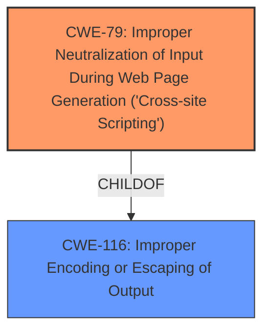

# Analysis Report for CVE-2024-4483

# Vulnerability Analysis Report: CVE-2024-4483

## Description

The Email Encoder WordPress plugin before 2.2.2 does not escape the WP_Email_Encoder_Bundle_options[protection_text] parameter before outputting it back in an attribute in an admin page, leading to a Stored Cross-Site Scripting

## Vulnerability Description Key Phrases

- **Weakness:** cross-site scripting
- **Product:** Email Encoder WordPress plugin
- **Version:** before 2.2.2

## Analysis (with Relationship Data)

# Summary
| CWE ID | CWE Name | Confidence | CWE Abstraction Level | CWE Vulnerability Mapping Label | CWE-Vulnerability Mapping Notes |
|---|---|---|---|---|---|
| CWE-79 | Improper Neutralization of Input During Web Page Generation ('Cross-site Scripting') | 1.0 | Base | Allowed | Primary CWE: The plugin does not neutralize or incorrectly neutralizes user-controllable input before it is placed in output that is used as a web page. |
| CWE-116 | Improper Encoding or Escaping of Output | 0.75 | Class | Allowed-with-Review | Secondary: This CWE is considered because the root cause involves improper encoding or escaping of output, which is a key aspect of XSS vulnerabilities. |

## Evidence and Confidence

*   **Confidence Score:** 0.9
*   **Evidence Strength:** HIGH

## Relationship Analysis
The primary relationship that influenced the CWE selection is the parent-child relationship between CWE-116 (Improper Encoding or Escaping of Output) and CWE-79 (Improper Neutralization of Input During Web Page Generation ('Cross-site Scripting')). CWE-79 is a more specific form of CWE-116, focusing on web page generation. Since the vulnerability is explicitly related to XSS, CWE-79 is the more appropriate choice.



## Vulnerability Chain
The vulnerability chain starts with the **lack of proper sanitization or escaping** of the `WP_Email_Encoder_Bundle_options[protection_text]` parameter. This leads to the injection of malicious code into the output, resulting in a Stored Cross-Site Scripting (XSS) vulnerability. The chain is:

1.  **Improper Input Handling (Lack of Sanitization/Escaping)**
2.  **CWE-79: Improper Neutralization of Input During Web Page Generation ('Cross-site Scripting')**
3.  **Execution of Arbitrary Code in User's Browser**

## Summary of Analysis
The primary CWE selected is CWE-79 (Improper Neutralization of Input During Web Page Generation ('Cross-site Scripting')). This is based on the vulnerability description and the CVE Reference Links Content Summary, which explicitly state that the plugin does not properly sanitize or escape the `WP_Email_Encoder_Bundle_options[protection_text]` parameter before outputting it on an admin page, leading to a Stored Cross-Site Scripting vulnerability. The evidence is strong, and the CWE aligns directly with the nature of the vulnerability.

CWE-116 (Improper Encoding or Escaping of Output) was considered as a more general case of the same issue, but CWE-79 is more specific to web page generation and therefore a better fit.

The analysis is based on the provided evidence, especially the "CVE Reference Links Content Summary" section, which contains the following quote: "**Root cause of vulnerability:** The plugin does not properly sanitize or escape the `WP_Email_Encoder_Bundle_options[protection_text]` parameter before outputting it on an admin page. This allows for the injection of arbitrary HTML and JavaScript code."

Relevant CWE Information:
CWE-79: Improper Neutralization of Input During Web Page Generation ('Cross-site Scripting'): The product does not neutralize or incorrectly neutralizes user-controllable input before it is placed in output that is used as a web page that is served to other users.
CWE-116: Improper Encoding or Escaping of Output: The product prepares a structured message for communication with another component, but encoding or escaping of the data is either missing or done incorrectly. As a result, the intended structure of the message is not preserved.


## CWE Relationship Analysis

Current CWEs represent these abstraction levels: .


### Vulnerability Chain Analysis

**Chain starting from CWE-79:**
- 79 (Improper Neutralization of Input During Web Page Generation ('Cross-site Scripting')) - ROOT


**Chain starting from CWE-116:**
- 116 (Improper Encoding or Escaping of Output) - ROOT


### CWE Relationship Diagram

```mermaid
graph TD
    classDef primary fill:#f96,stroke:#333,stroke-width:2px
    classDef secondary fill:#69f,stroke:#333
    classDef tertiary fill:#9e9,stroke:#333
```


*Report generated on 2025-07-13 15:46:40*
