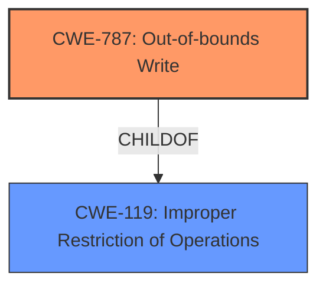

# Analysis Report for CVE-2024-44913

# Vulnerability Analysis Report: CVE-2024-44913

## Description

An issue in the component EXR!ReadEXR+0x40ef1 of Irfanview v4.67.1.0 allows attackers to cause an access violation via a crafted EXR file. This vulnerability can lead to a Denial of Service (DoS).

## Vulnerability Description Key Phrases

- **Impact:** ['Denial of Service', 'access violation']
- **Vector:** crafted EXR file
- **Attacker:** attackers
- **Product:** Irfanview
- **Version:** v4.67.1.0
- **Component:** EXR!ReadEXR+0x40ef1

## Analysis (with Relationship Data)

# Summary

| CWE ID  | CWE Name                                                                        | Confidence | CWE Abstraction Level | CWE Vulnerability Mapping Label | CWE-Vulnerability Mapping Notes |
| :-------- | :------------------------------------------------------------------------------ | :--------- | :---------------------- | :------------------------------ | :------------------------------ |
| CWE-787   | Out-of-bounds Write                                                            | 0.9        | Base                    | Primary                         | Allowed                         |
| CWE-119   | Improper Restriction of Operations within the Bounds of a Memory Buffer       | 0.7        | Class                   | Secondary                       | Discouraged                     |

## Evidence and Confidence

*   **Confidence Score:** 0.8
*   **Evidence Strength:** HIGH

## Relationship Analysis

The primary weakness is **CWE-787 (Out-of-bounds Write)**, which is a specific type of **CWE-119 (Improper Restriction of Operations within the Bounds of a Memory Buffer)**. The relationship is hierarchical, with **CWE-787** being a child of **CWE-119**. We choose **CWE-787** because the description specifies an invalid memory write operation, which is more specific than just a general buffer issue.



## Vulnerability Chain

The vulnerability chain starts with a crafted EXR file being processed by IrfanView. This leads to an **out-of-bounds write (CWE-787)**, which causes an access violation and ultimately results in a denial of service. The **out-of-bounds write** is the root cause, and the denial of service is the impact.

## Summary of Analysis

The analysis is strongly based on the provided evidence, particularly the "CVE Reference Links Content Summary," which details the root cause of the vulnerability as an invalid memory write operation.

> "Root Cause: An access violation occurs during the execution of `EXR!ReadEXR+0x40ef1` while processing a specific EXR file. The crash occurs due to an invalid memory write operation. Weaknesses/Vulnerabilities: The vulnerability is located at `EXR!ReadEXR+0x40ef1`, specifically a `mov word ptr [r9],ax` instruction. The register `r9` contains an invalid memory address."

The graph relationships reinforce the decision to choose **CWE-787** as the primary weakness because it is a more specific instance of a memory buffer error.

The selected CWEs are at the optimal level of specificity because **CWE-787** directly describes the **out-of-bounds write** condition, while **CWE-119** is a more general category. The evidence strongly supports the selection of **CWE-787** as the primary cause.

**CWE Considerations:**

*   **CWE-119:** While applicable as a broader category, it is not as precise as **CWE-787**. Therefore, it is considered as a secondary CWE.
*   **CWE-125: Out-of-bounds Read:** The description explicitly mentions an invalid *write* operation, ruling out an out-of-bounds read.
*   **CWE-476: NULL Pointer Dereference:** This is not relevant since the issue is an out-of-bounds write, not a dereference of a NULL pointer.
*   **CWE-789: Memory Allocation with Excessive Size Value:** This is a possible consideration, but the provided information doesn't explicitly state that memory allocation is the problem; it is an invalid write operation.


## CWE Relationship Analysis

Current CWEs represent these abstraction levels: .


### Vulnerability Chain Analysis

**Chain starting from CWE-476:**
- 476 (NULL Pointer Dereference) - ROOT


**Chain starting from CWE-125:**
- 125 (Out-of-bounds Read) - ROOT


### CWE Relationship Diagram

```mermaid
graph TD
    classDef primary fill:#f96,stroke:#333,stroke-width:2px
    classDef secondary fill:#69f,stroke:#333
    classDef tertiary fill:#9e9,stroke:#333
```


*Report generated on 2025-07-13 15:48:38*
