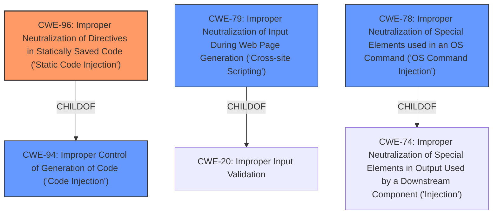

# Analysis for CVE-2024-44916

# Summary
| CWE ID | CWE Name | Confidence | CWE Abstraction Level | CWE Vulnerability Mapping Label | CWE-Vulnerability Mapping Notes |
|---|---|---|---|---|---|
| CWE-96 | Improper Neutralization of Directives in Statically Saved Code ('Static Code Injection') | 0.9 | Base | Allowed | Primary CWE |
| CWE-79 | Improper Neutralization of Input During Web Page Generation ('Cross-site Scripting') | 0.6 | Base | Allowed | Secondary Candidate |
| CWE-78 | Improper Neutralization of Special Elements used in an OS Command ('OS Command Injection') | 0.6 | Base | Allowed | Secondary Candidate |
| CWE-94 | Improper Control of Generation of Code ('Code Injection') | 0.5 | Base | Allowed-with-Review | Secondary Candidate |

## Evidence and Confidence

*   **Confidence Score:** 0.9
*   **Evidence Strength:** HIGH

## Relationship Analysis
The primary CWE is CWE-96, which deals with the **improper neutralization of directives in statically saved code**. This is a base-level CWE and accurately reflects the root cause of the vulnerability. CWE-96 has parent CWE-94, which is 'Code Injection'. CWE-78 and CWE-79 are related to injection, but are not precise as CWE-96.

## Vulnerability Chain
The vulnerability chain begins with a **lack of input validation**, leading to the ability to inject code into a statically saved file, which results in arbitrary command execution.
  - **Root Cause:** **Lack of input validation** on the `ip` parameter
  - **Weakness:** CWE-96: Improper Neutralization of Directives in Statically Saved Code ('Static Code Injection')
  - **Impact:** Arbitrary command execution

## Summary of Analysis
The analysis is based on the provided evidence, particularly the "CVE Reference Links Content Summary" and the vulnerable code snippet. The vulnerability involves **injecting** malicious code into a PHP file due to **lack of sanitization** of the `ip` parameter.

The "CVE Reference Links Content Summary" clearly states that the vulnerability stems from the **lack of input sanitization** in the `admin_ip.php` file, allowing attackers to inject arbitrary PHP code. The vulnerable code snippet confirms that the `ip` parameter is directly written into a PHP file without any filtering or validation.

CWE-96 is the most appropriate because it specifically addresses the **improper neutralization of directives in statically saved code**, which is the core issue in this vulnerability. The injected code is directly written into a PHP file, which is then executed by the server.

CWE-79 and CWE-78 could be related, but they are not as precise as CWE-96. CWE-79 is related to Cross-site Scripting, which involves injecting code into a web page, while CWE-78 is related to OS Command Injection, which involves injecting code into an operating system command.

CWE-94 is a parent of CWE-96 and could be considered, but CWE-96 is more specific and therefore a better fit.

Relevant CWE Information:

# Enhanced Context (25 CWEs)
The following CWEs were identified as potentially relevant to this vulnerability:

## CWE-96: Improper Neutralization of Directives in Statically Saved Code ('Static Code Injection')
**Abstraction Level**: Base
**Similarity Score**: 0.79
**Source**: dense

**Description**:
The product receives input from an upstream component, but it does not neutralize or incorrectly neutralizes code syntax before inserting the input into an executable resource, such as a library, configuration file, or template.

**Mapping Guidance**:
- Usage: Allowed
- Rationale: This CWE entry is at the Base level of abstraction, which is a preferred level of abstraction for mapping to the root causes of vulnerabilities.

## CWE-79: Improper Neutralization of Input During Web Page Generation ('Cross-site Scripting')
**Abstraction Level**: Base
**Similarity Score**: 1243.82
**Source**: sparse

**Description**:
The product does not neutralize or incorrectly neutralizes user-controllable input before it is placed in output that is used as a web page that is served to other users.

**Mapping Guidance**:
- Usage: Allowed
- Rationale: This CWE entry is at the Base level of abstraction, which is a preferred level of abstraction for mapping to the root causes of vulnerabilities.

## CWE-78: Improper Neutralization of Special Elements used in an OS Command ('OS Command Injection')
**Abstraction Level**: base
**Similarity Score**: 4.33
**Source**: graph

**Description**:
CWE-78: Improper Neutralization of Special Elements used in an OS Command ('OS Command Injection')

**Mapping Guidance**:
- Usage: Allowed
- Rationale: This CWE entry is at the Base level of abstraction, which is a preferred level of abstraction for mapping to the root causes of vulnerabilities.

## CWE-94: Improper Control of Generation of Code ('Code Injection')
**Abstraction Level**: base
**Similarity Score**: 3.30
**Source**: graph

**Description**:
CWE-94: Improper Control of Generation of Code ('Code Injection')

**Mapping Guidance**:
- Usage: Allowed-with-Review
- Rationale: This entry is frequently misused for vulnerabilities with a technical impact of "code execution," which does not by itself indicate a root cause weakness, since dozens of weaknesses can enable code execution.