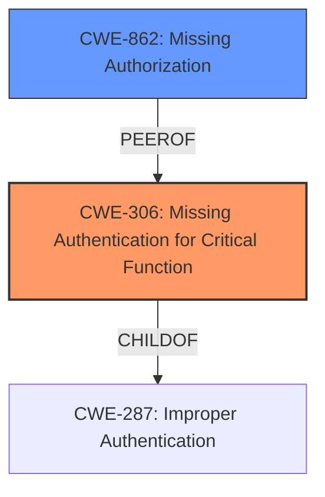

# Enhanced Analysis for CVE-2024-45043

# Summary
| CWE ID | CWE Name | Confidence | CWE Abstraction Level | CWE Vulnerability Mapping Label | CWE-Vulnerability Mapping Notes |
|---|---|---|---|---|---|
| CWE-306 | Missing Authentication for Critical Function | 1.0 | Base | Primary CWE | Allowed |
| CWE-862 | Missing Authorization | 0.7 | Class | Secondary | Allowed-with-Review |

## Evidence and Confidence

*   **Confidence Score:** 0.9
*   **Evidence Strength:** HIGH

## Relationship Analysis
The primary relationship influencing the decision is the parent-child relationship between CWE-287 (Improper Authentication) and CWE-306 (Missing Authentication for Critical Function), with CWE-306 being a more specific case of authentication failure. Additionally, the guidance on authentication vs. authorization clarifies the distinction, leading to the prioritization of CWE-306 due to the complete absence of authentication. The relationship between CWE-287 and CWE-862 (Missing Authorization) was also considered, but the vulnerability's nature pointed more strongly towards a complete lack of authentication rather than an authorization issue.



## Vulnerability Chain
The vulnerability chain begins with the **missing authentication** (**CWE-306**), leading to **unauthorized access** by remote clients, which allows the attackers to send crafted metrics. The root cause is the **improper authentication** in the `awsfirehosereceiver` module, which results in the impact of potentially hiding malicious activity due to the ability to write arbitrary metrics.

## Summary of Analysis
The initial analysis focused on identifying the root cause of the vulnerability. The vulnerability description and CVE details point to a complete absence of authentication, even when it was configured. The **improper authentication** allows unauthenticated remote requests, so the evidence strongly supports CWE-306 as the primary weakness.

The graph relationships and guidance on authentication vs. authorization solidified this decision. CWE-306 (Missing Authentication for Critical Function) is more specific than CWE-287 (Improper Authentication) and accurately reflects the vulnerability's nature. The retriever results also list CWE-306 as a strong candidate.

The selected CWEs are at the optimal level of specificity because CWE-306 is a Base level CWE, which is a preferred level of abstraction. It precisely describes the absence of authentication for a critical function. The evidence from the "CVE Reference Links Content Summary" confirms this by stating, "The vulnerability allows unauthenticated requests, even when an access key is configured."

Relevant CWE Information:

# Enhanced Context (25 CWEs)
The following CWEs were identified as potentially relevant to this vulnerability:

## CWE-212: Improper Removal of Sensitive Information Before Storage or Transfer
**Abstraction Level**: Base
**Similarity Score**: 0.75

## CWE-668: Exposure of Resource to Wrong Sphere
**Abstraction Level**: Class
**Similarity Score**: 0.75

## CWE-74: Improper Neutralization of Special Elements in Output Used by a Downstream Component ('Injection')
**Abstraction Level**: Class
**Similarity Score**: 0.75

## CWE-497: Exposure of Sensitive System Information to an Unauthorized Control Sphere
**Abstraction Level**: Base
**Similarity Score**: 0.74

## CWE-923: Improper Restriction of Communication Channel to Intended Endpoints
**Abstraction Level**: Class
**Similarity Score**: 0.74

## CWE-639: Authorization Bypass Through User-Controlled Key
**Abstraction Level**: Base
**Similarity Score**: 0.74

## CWE-345: Insufficient Verification of Data Authenticity
**Abstraction Level**: Class
**Similarity Score**: 0.74

## CWE-538: Insertion of Sensitive Information into Externally-Accessible File or Directory
**Abstraction Level**: Base
**Similarity Score**: 0.74

## CWE-203: Observable Discrepancy
**Abstraction Level**: Base
**Similarity Score**: 0.74

## CWE-303: Incorrect Implementation of Authentication Algorithm
**Abstraction Level**: Base
**Similarity Score**: 0.74

## CWE-863: Incorrect Authorization
**Abstraction Level**: Class
**Similarity Score**: 2246.28

## CWE-639: Authorization Bypass Through User-Controlled Key
**Abstraction Level**: Base
**Similarity Score**: 2211.04

## CWE-306: Missing Authentication for Critical Function
**Abstraction Level**: Base
**Similarity Score**: 2190.92

## CWE-285: Improper Authorization
**Abstraction Level**: Class
**Similarity Score**: 2156.54

## CWE-287: Improper Authentication
**Abstraction Level**: Class
**Similarity Score**: 2156.22

## CWE-613: Insufficient Session Expiration
**Abstraction Level**: base
**Similarity Score**: 4.33

## CWE-770: Allocation of Resources Without Limits or Throttling
**Abstraction Level**: base
**Similarity Score**: 3.30

## CWE-212: Improper Removal of Sensitive Information Before Storage or Transfer
**Abstraction Level**: Base
**Similarity Score**: 2.90

## CWE-201: Insertion of Sensitive Information Into Sent Data
**Abstraction Level**: Base
**Similarity Score**: 2.89

## CWE-322: Key Exchange without Entity Authentication
**Abstraction Level**: base
**Similarity Score**: 2.87

## CWE-226: Sensitive Information in Resource Not Removed Before Reuse
**Abstraction Level**: base
**Similarity Score**: 2.87

## CWE-942: Permissive Cross-domain Policy with Untrusted Domains
**Abstraction Level**: variant
**Similarity Score**: 2.68

## CWE-287: Improper Authentication
**Abstraction Level**: class
**Similarity Score**: 2.55

## CWE-350: Reliance on Reverse DNS Resolution for a Security-Critical Action
**Abstraction Level**: variant
**Similarity Score**: 2.55

## CWE-306: Missing Authentication for Critical Function
**Abstraction Level**: base
**Similarity Score**: 2.47

### Analysis of other CWEs Considered but Not Used:
*   CWE-287 (Improper Authentication): While related, it is a more general category. CWE-306 is more specific because it highlights the complete absence of authentication. CWE-287 is a Class, and CWE-306 is a Base.
*   CWE-862 (Missing Authorization): This could be a secondary weakness if authentication were present but authorization was missing. However, the primary issue is the lack of authentication. The guidance above states "If you **cannot determine whether identity was checked**, assume it’s **authorization** and consider 862 or 863. If you **know no login happened**, lean toward **authentication** → CWE-306." Since there is no login, CWE-306 is the better choice.
*   CWE-201 (Insertion of Sensitive Information Into Sent Data): This is not the primary issue because the vulnerability is about the lack of authentication, not the insertion of data.
*   CWE-770 (Allocation of Resources Without Limits or Throttling), CWE-400 (Uncontrolled Resource Consumption): These are not the primary issues.
* CWE-863 (Incorrect Authorization): This is not the primary issue because the vulnerability is about the lack of authentication, so there is no authorization happening.


## CWE Relationship Analysis

Current CWEs represent these abstraction levels: .


### Vulnerability Chain Analysis

**Chain starting from CWE-400:**
- 400 (Uncontrolled Resource Consumption) - ROOT


**Chain starting from CWE-345:**
- 345 (Insufficient Verification of Data Authenticity) - ROOT


### CWE Relationship Diagram

```mermaid
graph TD
    classDef primary fill:#f96,stroke:#333,stroke-width:2px
    classDef secondary fill:#69f,stroke:#333
    classDef tertiary fill:#9e9,stroke:#333
```